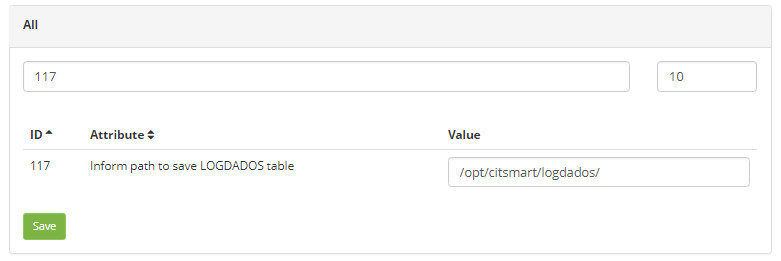
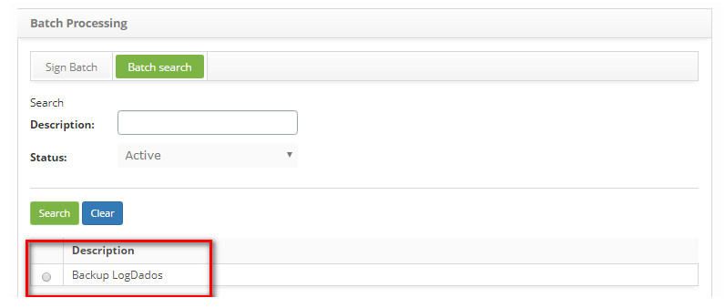
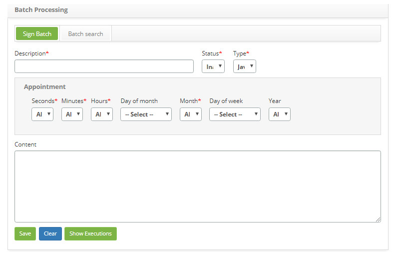
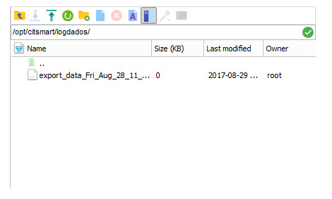

title: Logdata table backup guide

Description: This document is intended to provide guidance for configuring the LogData Table backup routine.

# Logdata table backup guide

Logdata table
-------------

It is a table that contains the relevant Citsmart event log. This record can be used to help support reestablish the original state 
of the system or for an administrator to know its behavior in the past. The LogData file can be used for auditing and diagnosing 
system problems.

The backup
------------------------

To back up the LogDados Table, proceed as described below:

1. Acess **System > Citsmart Parameters**, search the parameter "117 - Enter the path to save the LogDados table" (see knowledge 
[Parameterization rules - system][1]);

    
    
    **Figure 1 - LOGDADOS parameter**

2. Enter in the Value field the path of the directory where the LogData file will be saved and click the Save button to perform the 
operation;

    !!! info "IMPORTANT"

        If the directory path is not informed, the LogData file will be saved to the project root in the "exportXML" folder;

3. After setting the parameter, under **System > Batch Processing**, perform the search for the LogDatas Backup routine and select 
the same one, as indicated in the image below:

    
    
    **Figure 2 - BATCH processing**

4. The Batch Master Record screen will be displayed to configure the schedule of the backup routine of the LogDados Table;

    
    
    **Figure 3 - BATCH**

5. Set the desired time:

    - Inform the seconds, minutes, hours, day of the month, month, day of the week and year to execute the backup routine of the 
    LogDados Table.

6. After providing the required information, click the Save button to perform the operation;

7. Once this is done, the LogData file will be generated and recorded in the directory that was informed in parameter, as shown in 
the image below:

**Figure 4 - The file**

[1]:/en-us/citsmart-platform-7/plataform-administration/parameters-list/parametrization-system.html

!!! tip "About"

    <b>Product/Version:</b> CITSmart | 8.00 &nbsp;&nbsp;
    <b>Updated:</b>09/11/2019 – Larissa Lourenço
