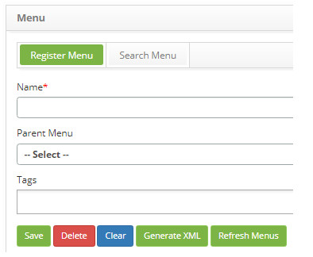
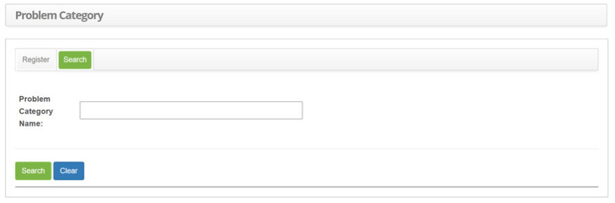
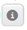
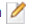
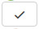
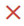
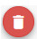
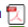

title:  How to navegate the screens using the CITSmart Enterprise ITSM controls?
Description:  The purpose of this document is to clarify some rules of navigability and usability. 
# How to navegate the screens using the CITSmart Enterprise ITSM controls?

The purpose of this document is to clarify some rules of navigability and usability that will be valid for the vast majority of the 
screens (functionalities) of this solution. These rules apply to the ITIL processes that this solution is Pink Verify certified in 
Pink Elephant, which are:

1. Portfolio Management (SPM)

2. Service Catalog Management (SCM)

3. Service Level Management (SLM)

4. Change Management (CHG)

5. Release and Deployment Management (REL)

6. Knowledge Management (KM)

7. Service Asset & Configuration Management (SACM)

8. Event Management (EV)

9. Request fulfillment (RF)

10. Incident Management (IM)

11. Problem Management (PM)

12. Continuity Management (ITSCM)

13. Availability Management (AVM)

Combining all these rules inside only onde introducing document avoids redundancy of many basic texts that once understood, do not 
add value diluted in all knowledge base documents.

Field filling requirement
--------------------------------------

On all screens there may be one or more required fields. To facilitate their visual identification, this solution adopts a red 
asterisk close to the field label.

Recording/deleting the record, or even the execution of the corresponding task to the screen, will not occur until at least one of 
these fields is empty (unfilled).

**Figure 1 - Example of field marked with asterisk**

Capacity to search with close lookup
--------------------------------------

In all the features with the "Search" tab there is a common search behavior, it does not require that the word be typed exactly, it 
can be part of the word, for example, when typing the word "lack of" the search may return these titles of Problems Category: "lack 
of toner ", "lack of disk space", e.g.

**Figure 2 - Example of screen that accepts close lookup**

Menu
-------

**Goal**

- Allow users to navigate through the main menu options

**Link options and icons**

- Icon - In this case it shows a drop-down menu with other buttons

Next/Back/Closr
-----------------------

**Goal**

- Allow users to browse through the various screens

**Link options and icons**

1. Button "Back"

2. Button "Next"

3. Button "Close"

Details
---------------

**Goal**

- Allow to show the user more details about a record/information

**Link options and icons**

1. Icon 

2. Icon 

3. Icon 

4. Icon 

5. Icon 

6. Icon 

7. Icon 

8. Icon  - View the current log history

9. Icon - View the attachments of the current record

Add
----------

**Goal**

- Allow user to register new record

**Link options and icons**

1. Icon 

2. Icon - In this specific case it is used to open a basic register

3. Icon - In this specific case this is a new record inclusion with copy of data from the current 
record

4. Button "Add"

5. Button "Save"

6. Button "Record"

Edit
----------

**Goal**

- Allow user to change data from a record

**Link options and icons**

1. Icon 

2. Icon 

3. Icon 

4. Icon 

5. Icon 

6. Icon 

7. Icon 

8. Icon 

9. Icon -  In this case specifically the amendment refers to the approval of an information

10. Icon - In this case specifically the change refers to links that the current record may have 
with other records

11. Icon - In this case specifically the change refers to links that the current record may 
have with other records

12. Icon  - In this case specifically the change refers to links that the current record may have 
with other records

13. Icon - In this case specifically the change refers to links that the current record may 
have with some situation

14. Icon - In this case specifically the change refers to links that the current record may 
have with some situation

15. Icon - In this case specifically the change refers to links that the current record may have 
with some situation

16. Icon - neste caso especificamente a alteração se refere a vínculos que o registro atual 
ter com outros registros

17. Icon -  In this case specifically the change refers to links that the current record may 
have with other records

18. Icon  - In this case specifically the removal of links that the current record may have with 
other record

19. Button "Save"

20. Button "Save data"

Delete or unlink
---------------------------

**Goal**

- Allow user to delete a record

**Link options and icons**

1. Icon 

2. Icon 

3. Icon 

4. Icon 

5. Icon  

6. Icon 

7. Icon 

8. Icon 

9. Icon 

10. Button "Delete"

11. Button "Delete Data"

Save
----------

**Goal**

- Allow the user to write (insert or change) the data of a record

**Link options and icons**

1. Icon 

2. Icon  - In this case it records with status "Filed"

3. Icon - In the case it ecords and advances the flow

Clear
----------

**Goal**

- Allow user to clear fields from a data entry form

**Link options and icons**

1. Icon 

2. Button "Clean"

3. Button "Clean Data"

Attachments
---------------

**Goal**

- Allow user to add attachments to a record

**Link options and icons**

1. Icon 

Search
----------

**Goal**

- Allow user to perform log searches using filters

**Link options and icons**

1. Icon 

2. Icon 

3. Icon 

4. Button "Search"

Export
------------

**Goal**

- Allow the user to export the result of queries and reports

**Link options and icons**

1. Icon - - In this case it exports to an format compatible with Acrobat Reader (PDF extension)

2. Icon - In this case it exports to an MS-Excel compatible format

3. Icon  -  In this case exports graphics to PDF format or image format

4. Button "Save table" - in this case exports to an MS-Excel compatible format

5. Button "Export Report (XLS)"

6. Button "Export Report (PDF)"

Graphics
------------

**Goal**

- Allow the user to view graph about the result of queries and reports

**Link options and icons**

1. Icon 

2. Button "Update Graphics"

Execution
------------

**Goal**

- Allow user to start running an activity

**Link options and icons**

1. Icon 

2. Button"Execute"

!!! tip "About"

    <b>Product/Version:</b> CITSmart | 7.00 &nbsp;&nbsp;
    <b>Updated:</b>09/11/2019 - Larissa Lourenço
