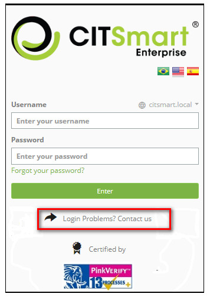
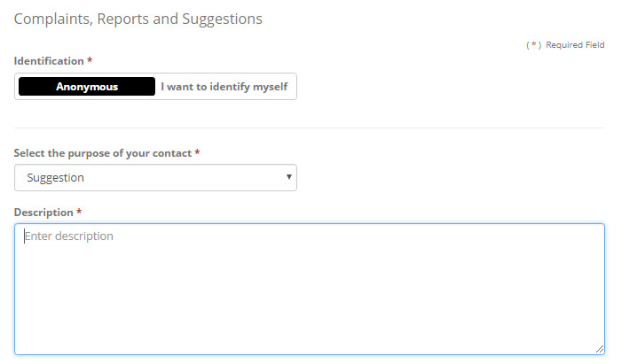
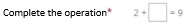

title: Ombudsman configuration and user guide

Description: This functionality aims to create a direct channel for Report, Complaint, Suggestion and Compliment

# Ombudsman configuration and user guide

This functionality aims to create a direct channel for Report, Complaint, Suggestion and Compliment records about the company's 
attendance (anonymously or otherwise), this way the organization will have enough numbers and evidence to evaluate their 
processes and professionals based on the services performed, possible deviations from conduct, etc.

Preconditions
------------------

1. At least one Portfolio must have been registered with at least one linked Service (see knowledge [Service portfolio registration][1] and [Service registration][2]);

2. At least one Service Level Agreement must be registered (see knowledge [General service level agreement registration and search][3]);

3. All typical prerequisite for creating new Activity within a Service in a Portfolio must have been met:

    - Notification e-mail template of opening/finalization/occurrences (see knowledge [Notification via e-mail registration and search][4])

    - Calendar (see knowledge [Calendar Registration and Search][5])

    - Time attendance (see knowledge [Time attendance registration and search][6])

    - User group (executor) (see knowledge [Group registration and search)]([7])

    - Flow (see knowledge [Workflow maintenance][8])

    - Contract (see knowledge [Contract registration and search][9])

4. There must be a registered form that will address the following reasons:

    - Report ;
    
    - Complaint;

    - Suggestion/Compliment;

5. The template must be configured to open the call (see knowledge [Ticket management (services)][10]);

6. There must be at least one specific Webservice Operation registered for the opening of calls (e.g.: create_request) (see knowledge [Web service operations registration and search][11]);

7. At least one Source must be registered (Contact Origin), registration available on the Tickets menu. (see knowledge [Ticket source registration and search][12]).

Steps to setup the ombudsman
---------------------------------

1. Register three activities (of the request type) linked to the Portfolio/Service appropriate to the organization, which will 
serve to attend the occurrences, one for each type of occurrence, you may use the names below as a suggestion:

    - Report;

    - Complaint;

    - Suggestion/Compliment.

2. Link and setup the link of these three activities to an existing Contract;

3. Use the ID of the three Activities created for the following parameterizations:

    - 345 - Ombudsman - Reporting service ID;

    - 346 - Ombudsman - Complaint Service ID;

    - 347 - Ombudsman - Suggestion service ID.

4. Setup the following parameters (to understand their effect see **Figure 1**):

    - 341 - Contact setup for Ombudsman on login screen

        - E.g.: Ombudsman.

    - 244 - Login Screen Message

        - E.g.: +55 62 3003-0101.

5. Register a new user to be used to create anonymous occurrences (e.g.: anonymous);

6. Setup the following parameters:

    - 344 - Ombudsman - default URL for screen logo (optional);

        - URL Suggestion: citsmart/pages/OmbusManregister/OmbusManregister.load#

    - 348 - Ombudsman - Username for authentication (required);

    - 349 - Ombudsman - Contact origin ID (required).

    
    
    **Figure 1 - Contact information**
    
    !!! note "NOTE"

         The user chosen for parameter 348 (for anonymous occurrences) must have creation permission in the flow and permission            to work on the Contract used to attend the ombudsman occurrences.

7. Setup the parameters required by the Web Service that will be used to open calls, that is, to create a Ticket of Attendance 
for Ombudsman Occurrences (**System > Web Service > Web Service Operation** option). Link on the same screen the Web Service to 
the user groups that can work with the Ombudsman feature..

!!! note "NOTE"

    The configuration of the Web Service for the Ombudsman currently allows only one Contract.

    To find out the Service Level Agreement ID (required in the Web Service configuration), you need to execute a SELECT (SQL) 
    command on the "acordonivelservico" table and identify the ID by the name given to the desired agreement.

   !!! info "IMPORTANT"

       Suggestion for web service text parameter "Default description complement": "Open via Ombudsman".

       It will appear in the "Other Information" field of the created Ticket.

Steps to register an occurrence for the ombudsman
---------------------------------------------------

1. On the system login screen, click on the "Login Problems? Contact us" link, the redirection to the service channels screen 
will occur;

    
    
    **Figure 2 - Login screen**

    
    
    **Figure 3 - Ombudsman screen**

2. Select the identification mode which are:

    - anonymous: identifies the requester as 'Anonymous';

    - I want to identify myself: identify the requester with the name that the same put on the form;

3. In the *I want to identify myself* option, the following options will be available:

    - name: required field - requesters name;

    - telephone: non-mandatory field that will store the telephone number of the requestor, if the user enters the information, 
    then the service request must have this field, as informed;

    - e-mail: non-mandatory field that will save the requestor's e-mail, if the user enters the information, then the service 
    request must have this field, as informed;

4. Select one of the purposes of the contact: Report, Complaint or Suggestion;

5. Enter the occurrence description;

6. Authenticate your request through Captcha (example:  ) so that the system has guarantees 
that it is not an attempted invasion via robot automation;

7. Send the occurrence (a successful sending message will be displayed).

!!! info "IMPORTANT"

     We recommend that the user write down the occurrence number (Ticket) that is shown in the success message.

     Possible causes of a failure message after requesting the sent occurrence : downtime database, network downtime and lack of 
     configuration in services.

Steps to attend an occurrence sent to the ombudsman
----------------------------------------------------------

1. In the main control and execution functionality of the Tickets System , it is sufficient that the attendant is part of the 
Open Activity (open call) executing group so that it can view, capture and handle the occurrences;

2. If the content (description) of the occurrence is not compatible with the type selected in the Default Activity parameter in 
the Web Service, it is sufficient for the attendant to reclassify to the appropriate Activity, examples:

    - The default ID is a "Complaint," but the text entered by the user is a compliment

    - The default ID is a "Report", but the text entered by the user is a suggestion

!!! info "IMPORTANT"

    In the "Requester" field of the Ticket will be the title "Anonymous" for when the user makes this option in the call opening 
    screen (occurrence).

[1]:/en-us/citsmart-platform-7/processes/portfolio-and-catalog/register.html
[2]:/en-us/citsmart-platform-7/processes/portfolio-and-catalog/services.html
[3]:/en-us/citsmart-platform-7/processes/service-level/register-sla.html
[4]:/en-us/citsmart-platform-7/additional-features/communication-and-notification/email/notification.html
[5]:/en-us/citsmart-platform-7/plataform-administration/time/create-calendar.html
[6]:/en-us/citsmart-platform-7/processes/service-level/time-attendance.html
[7]:/en-us/citsmart-platform-7/initial-settings/access-settings/user/group.html
[8]:/en-us/citsmart-platform-7/workflow/workflow-management.html
[9]:/en-us/citsmart-platform-7/additional-features/contract-management/use/register-contract.html
[10]:/en-us/citsmart-platform-7/processes/tickets/ticket-management.html
[11]:/en-us/citsmart-platform-7/get-started/webservice-operation.html
[12]:/en-us/citsmart-platform-7/processes/tickets/register-ticket-source.html

!!! tip "About"

    <b>Product/Version:</b> CITSmart | 8.00 &nbsp;&nbsp;
    <b>Updated:</b>09/11/2019 – Larissa Lourenço
