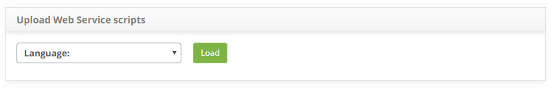
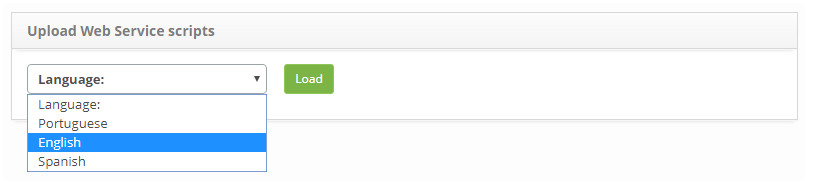
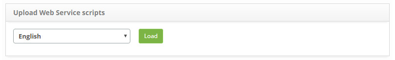
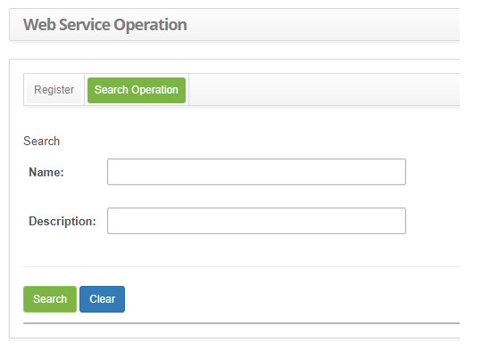
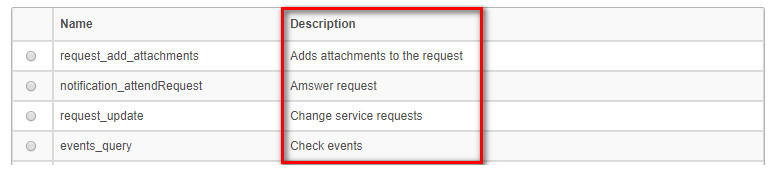

title:  Web service scripts loading
Description: The purpose is to load scripts for Web Service operations in the selected language.
# Web service scripts loading

The purpose is to load scripts for Web Service operations in the selected language.

Preconditions
----------------

1. No applicable.

Load webservice scripts
-----------------------------

*How to access*

1. Access the functionality of loading webservices scripts by browsing the main menu 
**System > Database > Upload WebService scripts**.

*Filters*

1. Not applicable.

*Items list*

1. Not applicable.

*Filling in the registration fields*

1. Not applicable.

Charging scripts
--------------------

1. The **Load WebService Scripts** screen containing a list of languages will be displayed, as shown in the figure below:

    
    
    **Figure 1 - Language loading screen**
    
2. Select the desired language and click the *Load* button;

3. A message confirming the success of the language load or a previously loaded load will be displayed asking if you want to 
overwrite data.

*Example*

**Figure 2 - Language loading screen**

**Figure 3 - Language loading screen**

Checking loading languages
------------------------------

*How to access*

1. Access the functionality of loading webservices scripts by navigating in the main menu 
**System > WebService > WebService Operation**.

*Filters*

1. The following filters enables the user to restrict the participation of items in the standard feature listing, making it 
easier to find the desired items:
 
    - Name;
    - Description.
    
    
    
    **Figure 4 - Webservice search screen**
    
*Items list*

1. The following cadastral fields are available to the user to facilitate the identification of the desired items in the standard 
feature listing: **Name** and **Description**.

    
    
    **Figure 5 - Operation listing screen**
    
*Filling in the registration fields*

1. Not applicable.

!!! tip "About"

    <b>Product/Version:</b> CITSmart | 7.00 &nbsp;&nbsp;
    <b>Updated:</b>09/11/2019 - Larissa Lourenço
