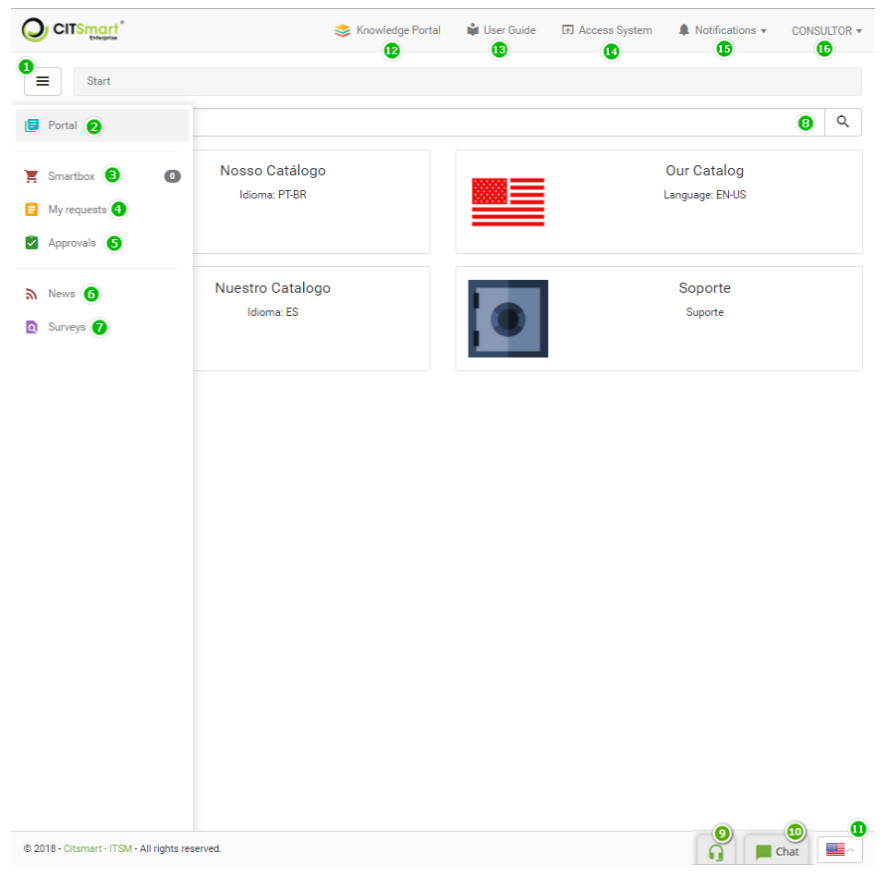

title:  Smart Portal (Service Portal)
Description: Smart Portal is a feature of the solution that makes the Service Catalog. 
# Smart Portal (Service Portal)

Smart Portal is a feature of the solution that makes the Service Catalog (Business and Support) available to system users and 
other information, such as:

- Service Requests;
- News about the system;
- Chat.

Preconditions
-----------------

1. To enable Smart Portal as your system homepage, you must enable the "**Enable Portal as CITSmart home screen**" parameter.

Knowing the Smart Portal
---------------------------

1. After enabling Smart Portal, when you log in, the same will be displayed, as shown in the figure below:

    
    
    **Figure 1 - Smart Portal**
    
     **Menu Button**: clicking this button allows you to hide/display the Smart Portal menu;
    
     **Navigation bar**: navigates between services;
    
     **Portal**: Allows return to the Smart Portal's start window;
    
     **My requests**: allows the logged in user to view their service requests and perform some actions on 
    them;
    
     **Approvals**: allows the logged in user to view only those service requests that require approval;
    
     **News**: where the news is made available, for example, concerning the organization, the system, 
    e.g;
    
     **Surveys**: allows to send / accompany registered activities;
    
     **Search**: allows you to search the services available in the portal;
    
     **WebRTC**: allows the user to call the helpdesk using Real-Time Communications (RTC) technology, 
    visible only if Voip parameters is setup;
    
     **Chat**: allows you to create a service request and interact with the attendant about it;
    
     **Language**: allows you to choose the language you want for the system (Portuguese, English or 
    Spanish), which is represented by the country flag.
    
     **Knowledge Portal**: clicking on this option will present the knowledge portal screen, where you 
    can search for relevant information, for example, about the use of the system;
    
     **User Guide**: clicking on this option will present the knowledge portal screen, where you can 
    search for relevant information, for example, about the one specific product;
    
     **Access System**:allows enter the system;
    
     **Notifications**: location where system alert messages are displayed;
    
     **User Identification**: clicking this option displays the functions to change the access password 
    and exit the system.
    
!!! tip "About"

    <b>Product/Version:</b> CITSmart | 7.00 &nbsp;&nbsp;
    <b>Updated:</b>11/09/2019 - Larissa Lourenço
