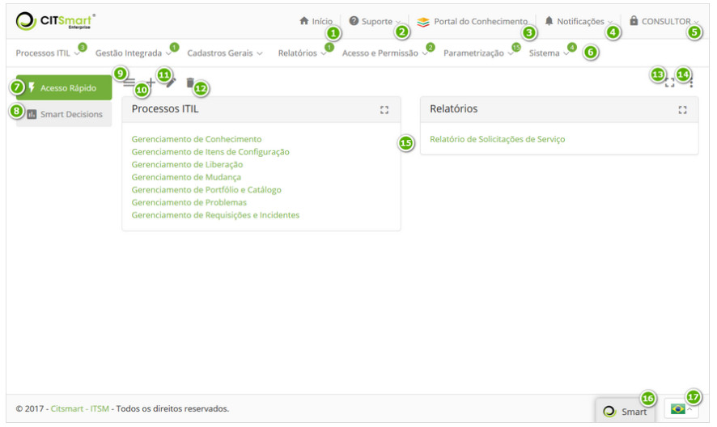
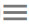
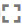

title:  Sistema
Description: É uma das telas principais da solução. 
# Sistema

É uma das telas principais da solução, que visa habilitar ao operador (usuário ou administrador) o acesso às funcionalidades 
operacionais do mesmo.

**Figura 1 - Tela Inicial do sistema**

 **Início**: ao clicar nesta opção, leva você de volta à tela inicial do sistema, independente do que
estiver fazendo;

 **Suporte**: ao clicar nesta opção, apresenta as informações para contato com o suporte do sistema;

 **Portal do Conhecimento**: ao clicar nesta opção, será apresentada uma das telas principais do sistema,
Portal do conhecimento, onde permite realizar a busca de informações relevantes, como por exemplo, a respeito do uso do sistema;

 **Notificações**: local onde apresenta as mensagens de notificação do sistema;

 **Identificação do usuário logado**: ao clicar nesta opção, são exibidas as funções para alterar a senha
de acesso e sair do sistema;

 **Menu principal**: estruturado em módulos e funcionalidades do sistema. E sempre quando há uma 
funcionalidade nova no sistema, é indicado no menu a quantidade;

 **Acesso Rápido**: dashboard que apresenta os links de atalho das funcionalidades para acesso rápido;

 **Smart Decisions**: dashboard que apresenta os gráficos com informações relevantes;

 : exibe/esconde a descrição do menu no painel gerencial;

 : ao clicar neste ícone, permite adicionar um novo dashboard;

 : ao clicar neste ícone, permite editar as informações do dashboard
selecionado;

 : ao clicar neste ícone, permite excluir o dashboard selecionado;

 : ao clicar neste ícone, permite expandir o painel gerencial;

 : ao clicar neste ícone, permite habilitar o modo de edição para
adicionar novos widget ao dashboard selecionado;

 **Painel Gerencial**: exibe o dashboard selecionado;

 **Smart Button**: ao clicar neste botão, permite realizar a busca de conhecimentos. Esse botão é
apresentado em todas as funcionalidades do sistema, pois facilita a busca de conhecimentos relacionados à uma determinada 
funcionalidade. Por exemplo, ao configurar as tags no registro do item de menu “Cadastro de Usuário” e no registro do 
conhecimento de “Cadastro de Usuário”, quando estiver navegando na tela de Cadastro de Usuário e clicar no Smart Button, o mesmo 
indica o conhecimento referente à funcionalidade;

 **Idioma**: permite escolher o idioma que deseja para o sistema (Português, Inglês ou Espanhol), o 
qual é representado pela bandeira do país.

!!! tip "About"

    <b>Product/Version:</b> CITSmart | 7.00 &nbsp;&nbsp;
    <b>Updated:</b>07/29/2019 - Larissa Lourenço
