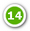

title:  System
Description: It is one of the main screens of the solution. 
# System

It is one of the main screens of the solution, which aims to enable the operator (user or administrator) to access the operating 
features of the same.

**Figure 1 - System Initial screen**

 **Start**: clicking this option takes you back to the system home screen, regardless of what you're 
doing;

 **Support**: clicking this option displays information for contacting system support;

 **Knowledge Portal**: clicking on this option will display one of the main screens of the system, 
Knowledge Portal, where you can search for relevant information, such as regarding the use of the system;

 **Notifications**: location where you display system notification messages;

 **Identification of the logged in user**: when clicking this option, the functions to change the access 
password and exit the system are displayed;

 **Main menu**: a menu structured in modules and system features. And whenever there is new functionality 
in the system, the quantity is indicated in the menu;

 **Quick Access**: dashboard that displays the shortcut links of the features for quick access;

 **Smart Decisions**: dashboard that displays the charts with relevant information;

 : displays / hides the menu description in the management panel;

 : ao clicar neste ícone, permite adicionar um novo dashboard;

 : clicking this icon allows you to add a new dashboard;

 : clicking this icon allows you to edit the information of the 
selected dashboard;

 : clicking on this icon allows you to expand the management panel;

 : clicking this icon allows you to enable editing mode to add new 
widgets to the selected dashboard;

 **Management Pane**: displays the selected dashboard;

 **Smart Button**: clicking this button allows you to search for knowledge. This button is displayed in 
all the system's functionalities, since it facilitates the search of knowledge related to a certain functionality. For example, 
when configuring the tags in the "User Registration" menu item record and in the "User Registration" knowledge record, when you 
are browsing the User Registration screen and clicking on the Smart Button, it indicates the knowledge Functionality;

 **Language**: allows you to choose the language you want for the system (Portuguese, English or 
Spanish), which is represented by the country flag.

!!! tip "About"

    <b>Product/Version:</b> CITSmart | 7.00 &nbsp;&nbsp;
    <b>Updated:</b>09/11/2019 - Larissa Lourenço
