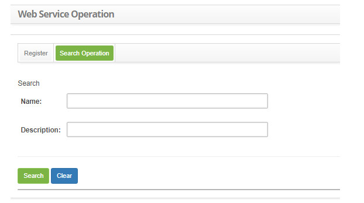
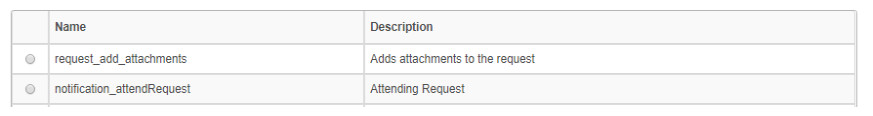
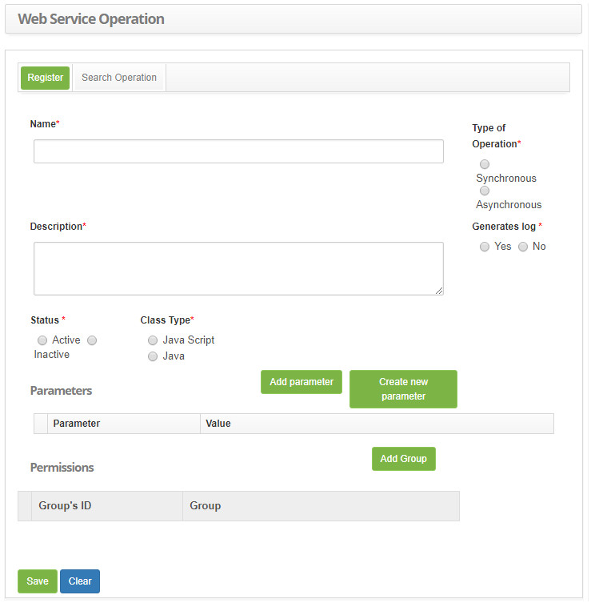
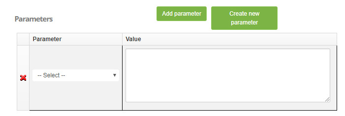
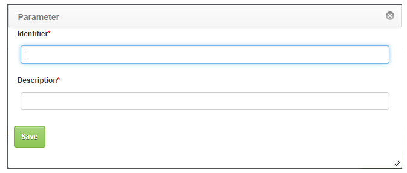

title: Web service operations registration and search
Description: Web service is a solution used in systems integration and communication between different applications.

# Web service operations registration and search

Web service is a solution used in systems integration and communication between different applications, which allows the sending 
and receiving of data without XML format. The CTSmart ITSM Web Services are configured to include, update, query, and cancel 
service requests (incidents and requests).

How to access
--------------------

1. Access the web service operation functionality through navigation in the main menu 
**System > Web Service > Web Service Operation**.

Preconditions
----------------

1. No applicable.

Filters
-----------

1. The following filters enables the user to restrict the participation of items in the standard feature listing, making it 
easier to find the desired items:

    - Name;

    - Description.

2. On the **Web Service Operation** screen, click the **Operations Search** tab, the search screen will be displayed as shown in 
the figure below:

    
    
    **Figure 1 - Operations search screen**

3. Perform the operation search.

4. Enter the name and/or description of the operation and click the *Search* button. After that, the record will be displayed 
according to the data entered;

5. If you want to list all the operations logs, just click directly on the *Search* button;

Items list
----------------

1. The following cadastral fields are available to the user to facilitate the identification of the desired items in the standard 
feature listing: **Name** and **Description**.

    
    
    **Figure 2 - Web service operation listing screen**

2. After searching, select the desired record. Once this is done, it will be directed to the registration screen displaying the 
contents of the selected registry;

3. To change the operation data, simply modify the desired information and click the *Save* button.

Filling in the registration fields
--------------------------------------

1. The **Web Service Operation** screen will be displayed to perform the web service operation register, as shown in the figure 
below:

    
    
    **Figure 3 - Web service operation registration screen**

2. Fill in the fields as directed below:

    - **Name**: enter the name of the operation;

    - **Type of operation**: inform the type of operation, marking one of the options: Synchronous or Asynchronous;

    - **Description**: enter the description of the operation;

    - **Generates log**: inform if log will be generated, selecting one of the options: Yes or No;

    - **Status**: select the situation of the operation, marking one of the options: Active or Inactive;

    - **Class Type**: enter the class type by checking one of the options: Java Script or Java;

    - **Parameters**: if there are, set the operation parameters.

3. To add a parameter, click the *Add Parameter* button, and the table will be displayed to fill it, as shown below:

    
    
    **Figure 4 - Parameter filling**

    - Select the desired parameter;

    - Enter a value for the parameter;

    - If you want to delete the parameter, simply click the  and confirm the deletion;

    - To register a new parameter, click the *Create new parameter* button, and the screen for registering a new parameter will 
    be displayed, as shown below:

    
    
    **Figure 5 - Parameter register screen**

    - **Identifier**: enter the parameter identifier;

    - **Description**: enter the description of the parameter;

4. Click the *Save* button to register the new parameter.

    - **Permissions**: link the group (s) that will be able to execute the web service operation;

5. Click the *Add Group* button. Once this is done, a screen for group search will be displayed;

6. Perform the search, select the group and it will be displayed in the permissions box;

7. To delete the group link with the permission, click the group's link.

8. Click the *Save* button to register, where the date, time and user will be saved automatically for a future audit.

!!! note "NOTE"
   
     To insert the default web service operations into the system, you must load the web service scripts.

!!! tip "About"

    <b>Product/Version:</b> CITSmart | 8.00 &nbsp;&nbsp;
    <b>Updated:</b>09/12/2019 – Larissa Lourenço
    
