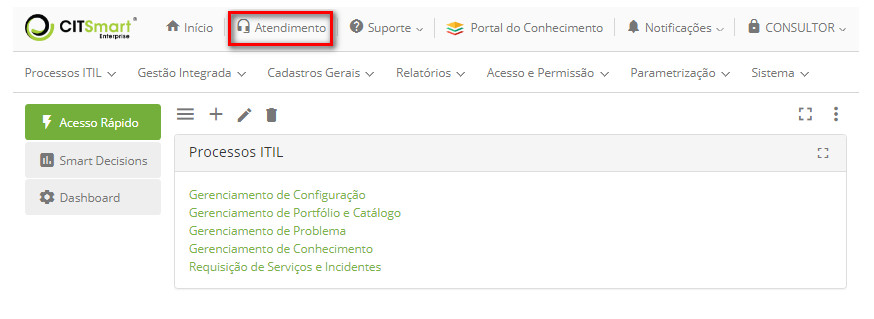
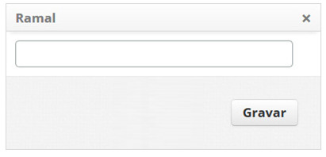
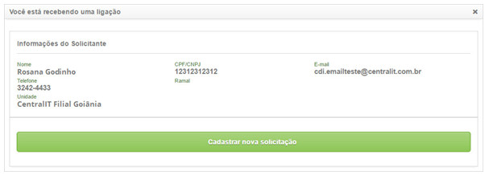
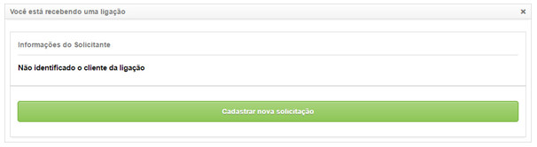
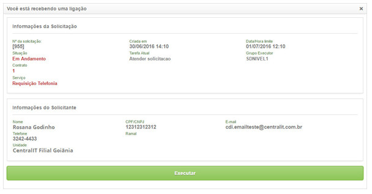
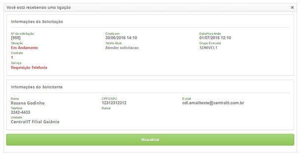

title:  Manual de configuração e uso de web services para integração com sistemas de telefonia.
Description: Tem o objetivo de fornecer orientações a respeito da configuração e utilização dos web services. 
# Manual de configuração e uso de web services para integração com sistemas de telefonia.

Este documento tem o objetivo de fornecer orientações a respeito da configuração e utilização dos web services para integração com 
sistemas de telefonia.

Pré-condições
---------------

1. Informe o conteúdo abaixo nos parâmetros (ver conhecimento [Regras de parametrização - Smart portal][1]):

    - Parâmetro 281: com valor "S";
    - Parâmetro 282: com valor "S";
    - Parâmetro 283: informar o número de identificação do serviço de requisição, o qual será utilizado para lançar a solicitação 
    filha referente à visualização de informações de uma solicitação já existente.
    
2. É importante que o solicitante, ou seja, a pessoa que efetuar a ligação, já possua cadastro no CITSmart.

Configuração da telefonia
----------------------------

Para utilizar a funcionalidade de telefonia é necessário registrar o ramal a ser utilizado para o atendimento, conforme os passos
descritos abaixo:

1. Na tela inicial do CITSmart, clique em "Atendimento", conforme indicado na imagem abaixo:

    
    
    **Figura 1 - Funcionalidade de atendimento**
    
2. É apresentada a tela Ramal contendo um campo, no qual se informa o número do ramal a ser utilizado para o atendimento;

    
    
    **Figura 2 - Tela de Configuração do Ramal**
    
    - Informe o número do ramal e clique no botão Gravar para efetuar a operação.

3. Após a inserção do número do ramal, o sistema irá monitorá-lo, quando ocorrer uma chamara recebida, ou seja, quando uma ligação
for direcionada para o número do ramal configurado.

!!! info "IMPORTANTE"

    É importante que o requerente, ou seja, a pessoa que faz a conexão, já tenha um registro no CITSmart.
    
Webservice de registro de nova solicitação
---------------------------------------------

1. Após a ligação ser direcionada para o número do ramal configurado, o webservice novaSolicitacao recebe o CPF do solicitante e 
apresenta uma tela para visualização dos dados do solicitante e permitir a abertura de uma nova solicitação, conforme exemplo 
ilustrado na figura abaixo:

    
    
    **Figura 3 - Tela para registro de nova solicitação**
    
2. Caso o solicitante não tenha o CPF registrado no CITSmart, ao apresentar a tela para abertura de nova solicitação, será exibida uma mensagem informando que o solicitante não possui identificação, conforme exemplo ilustrado na figura abaixo:

    
    
    **Figura 4 - Tela para registro de nova solicitação**
    
Webservice de visualizar solicitação
---------------------------------------

1. Após a ligação direcionada para o número do ramal configurado, o webservice visualizarSolicitacao recebe o ID da solicitação,
CPF do solicitante e apresenta a tela de visualização/execução da solicitação, conforme exemplo ilustrado nas figuras abaixo:

    
    
    **Figura 5 - Tela para execução da solicitação**
    
    
    
    **Figura 6 - Tela para visualização da solicitação**
    
2. Para execução da solicitação é necessário que o usuário tenha permissão.

3. Quando é clicado no botão visualizar da solicitação, caso o parâmetro "A telefonia deve lançar uma solicitação filha, referente
à visualização de informações de uma solicitação já existente?" esteja ativado, será feito o lançamento de uma solicitação de 
serviço relacionada à solicitação visualizada. Essa será encerrada automaticamente.

Webservice de obter quantidade de solicitações
-----------------------------------------------

O webservice obterQtdeSolicitacoes recebe o CPF do solicitante e retorna à quantidade de solicitações de serviço “em andamento” na
forma de texto.

Esse webservice é requisitado pelo sistema de telefonia para que ele devolva a quantidade de solicitações, em andamento do usuário
que possui o CPF passado como parâmetro.

Quando o solicitante possuir apenas uma solicitação, será retornado o texto “1?” seguido do número da solicitação de serviço “em 
andamento”, exemplo: 1?34534. Do contrário será a quantidade estabelecida. E quando o solicitando não possuir solicitação, será 
retornado vazio.

Webservice de obter dados da solicitação
-------------------------------------------

O webservice obterDadosSolicitação recebe o ID da solicitação e retorna os dados da solicitação: ID, data de abertura, prazo limite,
situação e se está dentro do prazo.

!!! tip "About"

    <b>Product/Version:</b> CITSmart | 7.00 &nbsp;&nbsp;
    <b>Updated:</b>08/07/2019 - Larissa Lourenço

[1]:/pt-br/citsmart-platform-7/plataform-administration/parameters-list/parametrization-smart-portal.html

