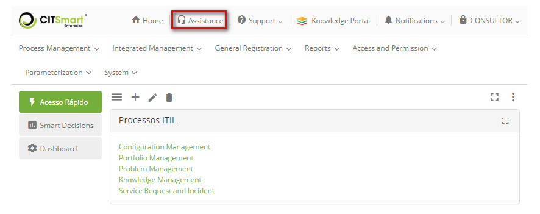
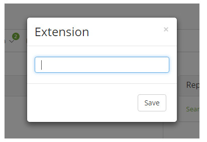
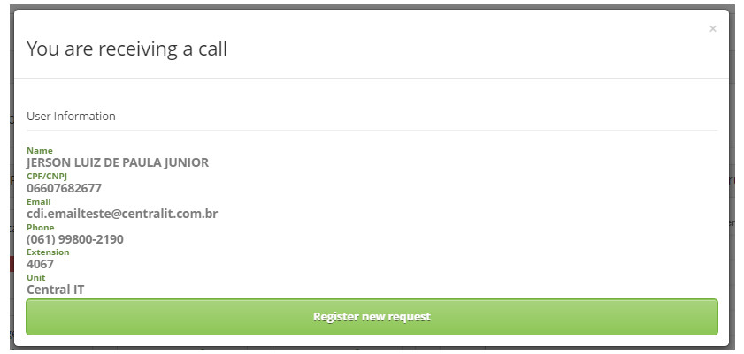
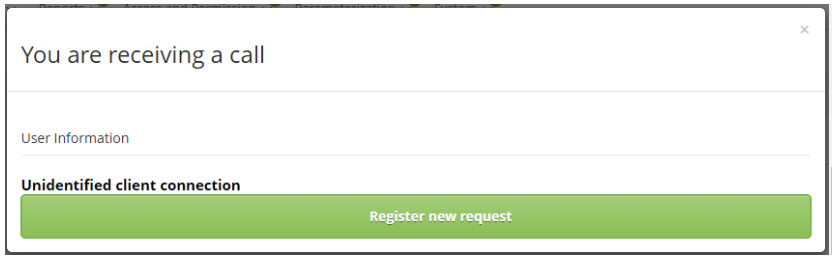
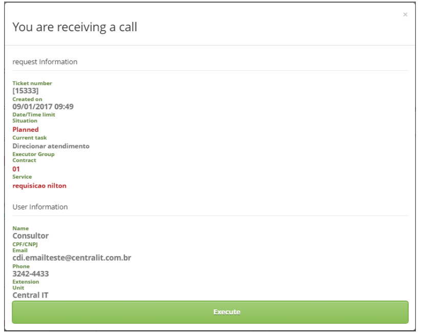
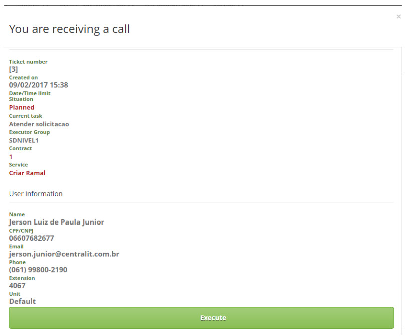

title:  Web services for integration with telephone systems setup and user guide
Description: This document is intended to provide guidance on the configuration and use of web services for integration. 
# Web services for integration with telephone systems setup and user guide

This document is intended to provide guidance on the configuration and use of web services for integration with telephony 
systems.

Preconditions
---------------

1. Enter the content below into the parameters (see knowledge [Parameterization rules - Smart portal][1]):

    - Parameter 281: with the value "Y";
    - Parameter 282: with the value "Y";
    - Parameter 283: enter the identification number of the request service, which will be used to launch the request for the 
    daughter to view information of an existing request.
    
2. It is important that the applicant, that is, the person making the call, already has a CITSmart registration.

Configuration
----------------------------

To use the telephony feature, it is necessary to register the extension to be used for the service, according to the steps described below:

1. From the CITSmart home screen, click *Assistance*, as shown in the image below:

    
    
    **Figure 1 - Attendance functionality**
    
2. The Extension screen containing a field is displayed, which tells you the extension number to be used for the service;

    
    
    **Figure 2 - Extension configuration screen**
    
    - Enter the extension number and click the *Save* button to perform the operation.

3. After inserting the extension number, the system will monitor it when a received call has occurred, that is, when a call is 
directed to the configured extension number.

!!! info "IMPORTANT"

    It is important that the applicant, that is, the person making the connection, already has a registration in CITSmart.
    
New request registration webservice
---------------------------------------------

1. After the connection is directed to the configured extension number, the webservice novaSolicitacao receives the SSN from the 
requestor and displays a screen to view the data of the requestor and allows the opening of a new request, as shown in the figure 
below:

    
    
    **Figure 3 - Screen for new request registration**
    
2. If the applicant does not have the SSN registered in CITSmart, when presenting the screen to open a new request, a message 
will be displayed stating that the applicant has no identification, according to the example shown in the figure below:

    
    
    **Figure 4 - Screen for new request registration**
    
Request view webservice
---------------------------------------

1. After the call is directed to the configured extension number, the webservice visualizarSolicitacao is given the request ID, 
requestor's SSN and displays the request display/execution screen, as shown in the figures below:

    
    
    **Figure 5 - Screen to execute the request**
    
    
    
    **Figure 6 - Screen for request visualization**
    
2. To execute the request, the user must have permission.

3. When the request view button is clicked, should the "The telephony should launch a child request, referring to display 
information from an existing service request? " Is activated, a service request related to the displayed request will be 
launched. This will exit automatically.

Get number of requests webservice
-----------------------------------------------

The webservice obterQtdeSolicitacoes receives the requestor's SSN and returns the number of "in progress" service requests in 
text form.

This webservice is requested by the telephone system to return the amount of requests, in progress of the user who has the SSN 
passed as a parameter.

When the requestor has only one request, the text "1?" Will be returned followed by the "in progress" service request number, for 
example: 1?34534. Otherwise it will be the amount set. And when the requesting has no request, it will be returned empty.

Get request data webservice
-------------------------------------------

The webservice obterDadosSolicitação receives the request ID and returns the request data: ID, opening date, deadline, situation 
and if it is on time.

!!! tip "About"

    <b>Product/Version:</b> CITSmart | 7.00 &nbsp;&nbsp;
    <b>Updated:</b>09/12/2019 - Larissa Lourenço

[1]:/en-us/citsmart-platform-7/plataform-administration/parameters-list/parametrization-smart-portal.html

