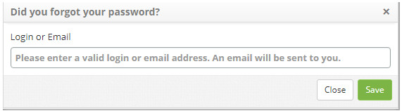

title: Authentication (login)
Description: This functionality is intended to explain the authentication of users in different environments.

# Authentication (login)

This functionality is intended to explain the authentication of users in
different environments.

How to access
-------------

1.  Enter URL of the instance you want to access, for example:
    https://itsm.citsmartcloud.com\\citsmart

Preconditions
-------------

1.  Have at least one active user on the system (see knowledge [User
    registration and search][1]).

Logging in the environment
--------------------------

**Figure 1 - Authentication screen**

- **1**: allows the user to choose from a list in which environment the authentication
will be done:

     -   citsmart.local: default environment where users are registered in the
        application database;

     -   \<domain1\>

     -   \<domain2\>

     -   ...

     -   \<domainN\>

!!! warning "ATTENTION"

    This list of custom domains will contain items if and only if: (i) the
    administrator creates custom at least one LDAP authentication domain
    (see **[LDAP connections registration and search][2]);
    and (ii) parameter 383 - Enable domain listing in login is configured to
    show the list.

- **2**: login previously registered by an administrator.

- **3**: previously registered by an administrator.

- **4**: allows the user to recover their password.

**Figure 2- Password recovery screen**

- **5**: provides the means of contact with the administrator.

**Figure 3 - Contact information screen**

I forgot my password
--------------------

This is an important option because it is not uncommon we forget our password,
because there are many in many applications.

Preconditions
-------------

1.  There must be at least one e-mail template (see [E-mail template
    configuration registration and search][3])

2.  The keywords you enter to enter the e-mail template are:

    -   \${NOMEEMPREGADO} - Returns the name of the user who requested the
        password reset;

    -   \${LOGIN} - User login that requested password reset;

    -   \${NOVASENHA} - New password generated by the system.

3.  The parameter must be configured: 116 - E-mail template ID to change the
    access password to CITSmart

How to restore the password
---------------------------

1.  Access the CITSmart login screen;

2.  Click on the link I forgot my password;

3.  Inform the e-mail where the new password will be sent;

4.  After these steps, the system assigns new provisional content to the user's
    password and sends it by e-mail according to the registered e-mail template.

!!! warning "ATTENTION"

    If the integration of CITSmart is with LDAP, it will not be possible to
    assign contents to the user's password. In this case, the user must be sent
    the means to request the password reset.

[1]:/en-us/citsmart-platform-7/initial-settings/access-settings/user/user-register.html
[2]:/en-us/citsmart-platform-7/plataform-administration/authentication/ldap.html
[3]:/en-us/citsmart-platform-7/plataform-administration/email-settings/configure-email-template.html
   
   
!!! tip "About"

    <b>Product/Version:</b> CITSmart | 7.00 &nbsp;&nbsp;
    <b>Updated:</b>09/12/2019 - Anna Martins
