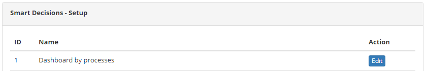
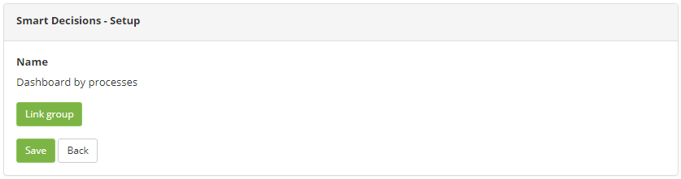

title: Smart Decisions access permission
Description: The Smart Decisions Access Permission feature allows you to define who will have access to widgets for insertion into the dashboard which is displayed on the main screen of the system.

# Smart Decisions access permission

The Smart Decisions Access Permission feature allows you to define who will have
access to widgets for insertion into the dashboard which is displayed on the
main screen of the system.

How to access
-------------

1.  Access the Smart Decisions Access Permission feature by navigating the main
    menu **Access and Permission > SmartDecision**.

Preconditions
-------------

1.  No applicable.

Filters
-------

1.  No applicable.

Items list
----------

1.  The following cadastral fields are available to the user to facilitate the
    identification of the desired items in the standard feature
    listing: **ID** and **Name**.

2.  There is an action button available to the user for each item in the
    listing, it is: *Edit*

**Figure 1 - Access permission screen - Smart decisions**

Filling in the registration fields
----------------------------------

1.  No applicable.

Defining the access permission
------------------------------

1.  The screen for **Defining the Access Permission for the Widgets** will be
    displayed, as shown in the figure below;

2.  Click the *Edit* button of the widget to define who will have access to it.
    Once this is done, the group link screen will be displayed, as shown in the
    figure below:

**Figure 2 - Definition of the type of access**

-   Click the *Link Group* button. Once this is done, the group search screen
    will be displayed, search for the group you want, select it and
    click *Add* to make the link.

3.  After setting the access permission, click the *Save* button to register,
    where the date, time and user are automatically saved for a future audit.

!!! tip "About"

    <b>Product/Version:</b> CITSmart | 8.00 &nbsp;&nbsp;
    <b>Updated:</b>09/12/2019 – Anna Martins
