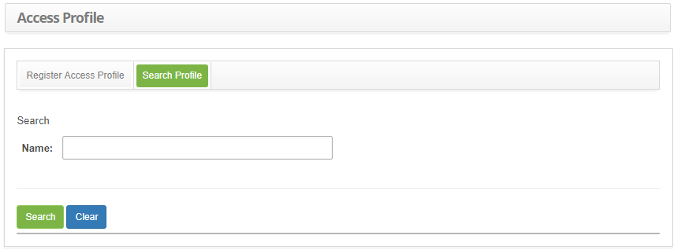
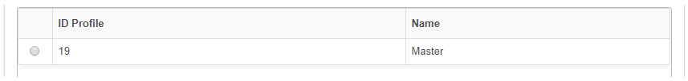
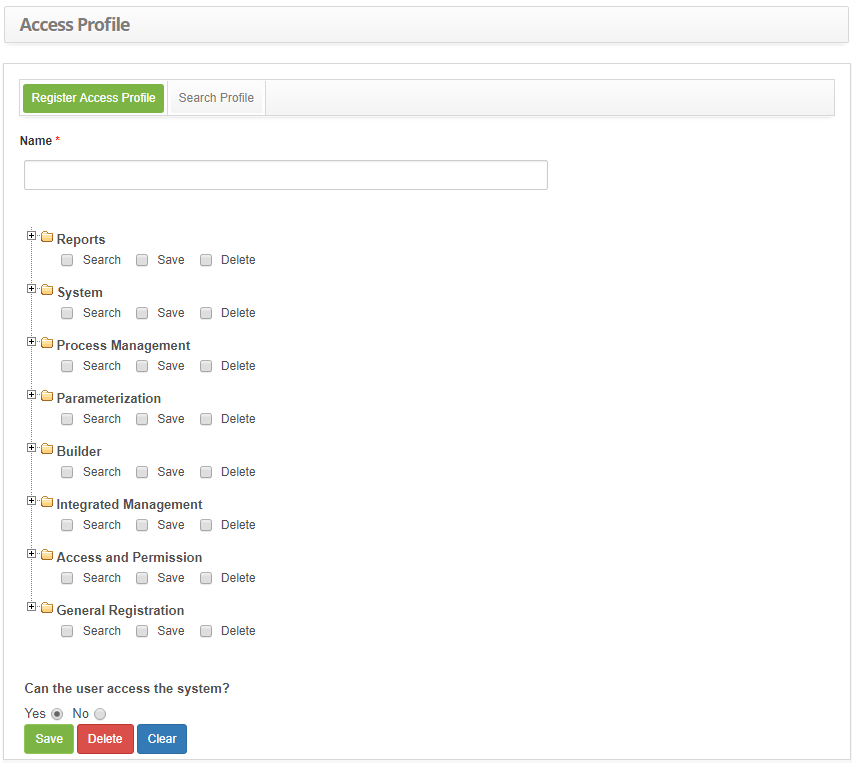

title: Access profile registration and search
Description:The access profile establishes the permissions and rights of a system user.

# Access profile registration and search

The access profile establishes the permissions and rights of a system user.

After authenticating the user, the access definition process determines what can
be done within the system.

How to access
-------------

1.  Navigate to the Access Profile feature through the main menu **Access and
    Permission > Access Profile**.

Preconditions
-------------

1.  Not applicable.

Filters
-------

1. The following filter enable the user to restrict the participation of items
    in the standard feature listing, making it easier to locate the desired
    items as shown in the figure below:

    -   Name

2. On the access profile search screen, click on the **Search Profile** tab.
    The search screen will be displayed, as illustrated on image bellow:

    

    **Figure 1 - Access profile search screen**

3. Search the access profile;

    -   Insert the intended access profile name and click on
        the *Search* button. Afterwards, the matching access profile will be
        displayed.

    -   In case all the entries are intended to be listed, just click directly
        on the *Search* button;

Items list
----------

1.  The following cadastral fields are available to the user to facilitate the
    identification of the desired items in the standard listing of the
    functionality: **ID* Profile** and **Name**.

    

    **Figure 2 - Access profile listing screen**

2.  After searching, select the intended entry; then, the user will be
    redirected to the registry screen displaying the content of the selected
    entry.

3.  To edit the data in the access profile, just modify the information of the
    intended fields and click on the *Save* button in order to register the
    change made to the database.

4.  To delete an access profile entry, just click on the *Delete* button to
    confirm the exclusion.

Filling in the registration fields
----------------------------------

1. The **Register Access Profile** will be displayed, as illustrated below:

    

    **Figure 3 - Access profile entry screen**

2. Fill out the fields as instructed below:

    -   **Name**: insert the access profile's name;

    -   Select the menu items that the profile will have access to by checking
        what the profile can perform on each item:

    -   **Search**: the user with this profile can make queries and view the data;

    -   **Save**: the user with this profile can do the "Search" also include and
    change the data;

    -   **Delete**: the user with this profile can "Save" and delete the system
    data;

!!! info "IMPORTANT"

     The exclusions executed in the product are logical (and not physical), so
     in extreme cases there is how to recover something excluded, but this will
     require technical support from an analyst/consultant.

!!! note "NOTE"

     When determining the type of access profile, by marking/unmarking a
     checkbox, all checkboxes that are subordinate to it in the structure are
     also marked/unmarked cascade.

!!! note "NOTE"

     The access profiles will be disabled (the checkboxes of all pre-existing
     access profiles will be unchecked), by default, when new features are
     created, thus requiring the administrator to explicitly enable this for the
     profiles you want, making it available for the desired profiles.

   -   **Can the user access the system**: determine if the profile will be able to
    access the system through the portal;

3. After inserting the data, click on the  button to confirm the entry, where
    the date, time and user will be stored for a future audit.

!!! tip "About"

    <b>Product/Version:</b> CITSmart | 8.00 &nbsp;&nbsp;
    <b>Updated:</b>09/12/2019 – Anna Martins
