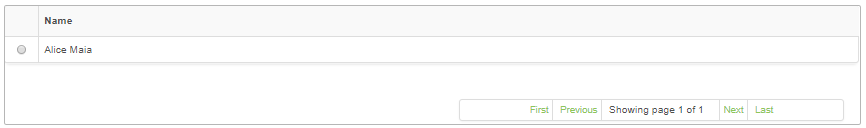

title: Staff registration and search
Description: This feature allows registering every person who has any ties to the organization, such as: an employee, an associate, etc.

# Staff registration and search

This feature allows registering every person who has any ties to the
organization, such as: an employee, an associate, etc.

How to access
-------------

1.  Access the staff feature navigating through the main menu **General
    Registration > Staff Management > Staff**.

Preconditions
-------------

1.  Register the unit (see knowledge [Unit registration and
    search][1]);

2.  Register a position (see knowledge [Position registration and
    search][2]).

Filters
-------

1. The following filters enables the user to restrict the participation of
    items in the standard feature listing, making it easier to find the desired
    items:

     -  Name;

     -  ID;

     -  Status.

2. Click on the **Search Staff** tab, the **Staff Search** screen will be
    displayed as shown in the figure below:

**Figure 1 - Staff member search**

3. Conduct a staff member search;

    -  Insert the name, identification number and/or the staff member's current
    status and click on the *Search* button;

    -  To list all the staff member entries, just click directly on
    the *Search* button, if needed.

Items list
----------

1.  The following cadastral field is available to the user to facilitate the
    identification of the desired items in the standard feature
    listing: **Name**.

**Figure 2 - Staff list screen**

2.  After searching, select the intended entry. Afterwards, they will be
    redirected to the registry screen displaying the content belonging to the
    selected entry.

3.  To edit a staff member's information, just edit the data on the intended
    fields and click on the *Save* button to confirm the changes to the
    database, at which the date, time and user will be stored automatically for
    a future audit.

Filling in the registration fields
----------------------------------

1.  Click on the **Register Staff** tab, the **Staff Registration** screen will
    be displayed, as shown in the figure below:

**Figure 3 - Staff entry screen**

2.  Fill out the fields as instructed below:

    -   **Name**: insert the staff member name;

    -   **Partner type**: insert the staff member's type of ties to the company;

    -   **Status**: insert if the staff member currently works or not at the
    company, if it is so select "Active", if not or if the member is on leave
    for some reason select "Inactive";

    -   **E-mail**: insert the staff member's e-mail address to establish a means of
    communication;

    -   **Phone**: insert the area code and the staff member's phone number;

    -   **Extension**: insert the extension (internal division of a telephone
    system) number of the staff member;

    -   **Unit**: insert the unit where the staff member is assigned to. If the unit
    cannot be found, perform a quick registration from this screen by simply
    clicking the  button;

    -   **Position**: select the staff member's position. If the position cannot be
    found, a quick entry can be created on this screen by clicking on the  button ;

-   Fill out the information concerning the staff member's payment:

    -   **Salary**: insert the staff member's salary;

    -   **Average Productivity Cost**: insert the staff member average
        productivity cost;

    -   **Health Care Plan**: insert the health care plan cost paid by the
        company;

    -   **Transportation Benefits**: insert the cost of the transportation
        benefits paid by the company to the staff member;

    -   **Food Benefits**: insert the cost of the food benefits paid by the
        company to the staff member;

    -   **Cost per Hour and Total Monthly Cost (Calculated by the system)**:
        these fields will be filled out after the system calculations;

    -   **Bank Agency**: insert the staff member's bank agency number;

    -   **Bank Account**: insert the staff member's bank account number;

-   Insert the staff member's personal data

    -   **ID (Social Security or Company ID Number)**: insert the staff member's
        social security number or company ID number;

    -   **Date of Birth**: insert the staff member's date of birth;

    -   **Gender**: check the option related to the staff member's gender: Male
        or Female;

    -   **Identification Number (ID Number)**: insert the staff member's ID
        number ;

    -   **ID Issue Date**: insert the ID issue date ;

    -   **ID Issue Bureau**: insert the government branch responsible for
        issuing the ID;

    -   **State Issued**: insert the state where the ID was issued;

    -   **Working Card Number**: insert the number of the staff member's working
        card;

    -   **Issue Date**: insert the issue date of the staff member's working
        card;

    -   **Series**: insert the series of the CTPS (working card) ;

    -   **State**: select the state where the CTPS (working card) was issued;

    -   **Enrollment - NIT**: insert the staff member's employment ID number ;

    -   **Issue date**: insert the staff member's hiring date;

    -   **Date of Termination**: insert the staff member's termination date, the
        moment they are discharged ;

    -   **Partner**: insert the name of the staff member's spouse, that is, the
        name of the person married to the employee;

    -   **Marital Status**: select the staff member's marital status;

    -   **Father's Name**: insert the name of the staff member's father;

    -   **Mother's Name**: insert the name of the staff member's mother;

    -   **Observation**: insert relevant information about the staff member;

3.  After inserting the information, click on the *Save* button to confirm the
    entry, at which date, time and user will be store automatically for a future
    audit.

[1]:/en-us/citsmart-platform-7/plataform-administration/region-and-language/register-unit.html
[2]:/en-us/citsmart-platform-7/plataform-administration/region-and-language/register-locations.html

!!! tip "About"

    <b>Product/Version:</b> CITSmart | 8.00 &nbsp;&nbsp;
    <b>Updated:</b>09/12/2019 – Anna Martins
