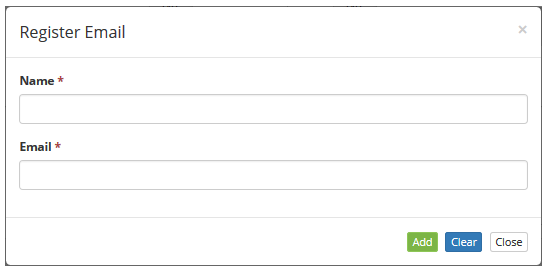

title: Group registration and search
Description: This feature allows you to register groups and their link with users, a profile, contracts and e-mails for notification.

# Group registration and search

A group is a set of one or more employees who have the same goals related to
their functions.

The two most common uses for groups created are:

1.  Automatic notification scheduling based on some specific event/situation;

2.  Security management / secrecy of access to various types of registries (eg:
    knowledge base folders, service portfolios, etc.).

This feature allows you to register groups and their link with users, a profile,
contracts and e-mails for notification.

How to access
-------------

1.  Access the **Group** feature navigating through the main menu **Access and
    Permission > Group**.

Preconditions
-------------

1.  Register an access profile (see knowledge [Access profile registration and
    search][1]);

2.  Register the employee (see knowledge [Staff registration and
    search][2]).

Filters
-------

1.  The following filters enables the user to restrict the participation of
    items in the standard feature listing, making it easier to find the desired
    items:

-   Name;

-   Acronym.

2.  On the Group register screen, group list screen will be displayed and
    filters that allow to conduct a specific search are displayed, as needed.

**Figure 1 - Group search screen**

3.  To conduct a search for a specific group, insert the name and/or acronym of
    the intended group. Afterwards, the database will be displayed according to
    the data provided.

Items list
----------

1.  The following cadastral fields are available to the user to facilitate the
    identification of the desired items in the standard feature
    listing: **Group's ID, Name** and **Acronym**.

**Figure 2 - Group listing screen**

2.  There are action buttons available to the user for each item in the listing,
    they are: *Edit* and *Delete;*

!!! info "IMPORTANT"

    The group exclusion depends on there being no portfolios, staff and
    contracts linked to it.

3.  To edit a group's registry, click on the *Edit* button. Afterwards, they
    will be redirected to the entry screen displaying the selected group's
    information.

Filling in the registration fields
----------------------------------

1.  Click on the *New* button. Afterwards, the **Register Group** screen
    will be displayed, as illustrated below:

**Figure 3 - Group creation screen**

2.  Fill out the fields as instructed below:

-   **Name**: insert the name of the group;

-   **Acronym**: insert an acronym to identify the group;

-   **Leader**: insert the leader of the group, that is, the person responsible
    for the group;

-   **Access Profile**: select the access profile, which will determine the
    features available to the group and its members;

-   **Service Desk Group**: determine if it is a Service Desk group (Support
    Services Branch), if so, it can be viewed to address the performer group
    during a service request;

-   **Chat Requester**: allows the group to be registered whether it is a chat
    requestor or not;

-   **Change Advisory Board**: determine if it is a [Change Advisory
    Board](http://itsm.citsmart.com/citsmart/pages/knowledgeBasePortal/knowledgeBasePortal.load#/knowledge/1056) group,
    that is, a group of people assembled to approve changes on the IT Service;

-   **Suspension/Reactivation**: determine if the group will have permission to
    discontinue or reactivate mutiple services requests;

-   **E-mail Notifications Required**: select the options (opening, progress
    and / or closing), if you want e-mail notifications referring to service
    requests to be mandatory;

!!! note "NOTE"

    When you register a service request, the e-mail notification options are
    already selected, not allowing you to change them.

-   **Description**: insert a brief description about the purpose of the group;

-   **Contracts**: bind the contracts belonging to the group.

       -   Click on *Add*. Afterwards, the contract search screen will be displayed.

       -   Search, select the contracts contracts to be linked to the group and click
      on *Add* to confirm the procedure.

       -   To remove a contract from a group, select the contract and click
    on *Remove.*

-   **Permission in all Workflows**: determines the workflow activities of a
    group.

       -   Click on *Add*. Afterwards, the workflow permissions screen will be
       displayed, as illustrated below:

**Figure 4 - Workflow permissions determination**

-   **Name**: insert the name of the workflow so it can be searched, if
    necessary;

-   Select the activities a group will be able to perform:

    -   **Create**: the group can create permissions on the workflows;

    -   **Execute**: the group can execute permissions on workflows;

    -   **Delegate**: the group can delegate permissions on workflows;

    -   **Suspend**: the group can suspend permissions on workflows;

    -   **Reactive**: the group can reactivate permissions on workflows;

    -   **Change SLA**: the group can change the permissions SLA in the
        workflows;

    -   **Reopen**: the group can reopen permissions on workflows;

    -   **Cancel**: the group can cancel permissions on workflows.

-   Select the workflows, at which the users may perform the selected
    activities;

-   Click on *Add*. Afterwards, the chosen workflow permissions will be
    displayed on the group's screen, as illustrated below:

**Figure 5 - Workflow permissions**

-   To remove an activity allowed in the workflow, just click on the  button;

-   To remove a permission from the workflow, select it and click on *Remove;*

-   To edit any permission in all Workflows information click on .
-   **Employees**: add the group employees;

-   Insert the name and SSN of the employee so they can be searched, then select
    them to be added to the group.

-   After adding the employee to the group, tick the e-mail box so they can
    receive notifications related to the group;

-   To remove a employee from a group, select them and click on *Remove*.

-   **E-mail**: add the e-mail addresses which will receive notifications
    related to the group;

-   Insert the name or SSN of the employee to search and select
    them. Afterwards, the employee's e-mail will be added to the registry.

-   If an external e-mail address needs to be included, click on *Add*. An
    e-mail entry screen will be displayed, as illustrated below:

**Figure 6 - External e-mail entry**

-   Insert the name of the e-mail address' owner, the e-mail address and click
    on the *Add* button to confirm the operation.

-   An e-mail address added to a group can be removed, if needed, by clicking on
    it and then clicking on *Remove*.

3.  After inserting all data, click on the *Save* button to register the
    information, at which the date, time and user will be stored automatically
    for a future audit.

[1]:/en-us/citsmart-platform-7/initial-settings/access-settings/profile/user-profile.html
[2]:/en-us/citsmart-platform-7/initial-settings/access-settings/user/employee.html

!!! tip "About"

    <b>Product/Version:</b> CITSmart | 8.00 &nbsp;&nbsp;
    <b>Updated:</b>09/12/2019 – Anna Martins
