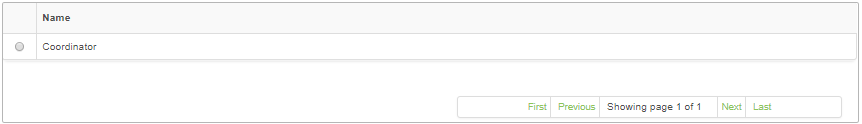

title: Position registration and search
Description: The goal of this feature is to register the existing positions within the organization.

# Position registration and search

The goal of this feature is to register the existing positions within the
organization.

How to access
-------------

1.  Access the profile feature navigating through the main menu **General
    Registration > Staff Management > Position**.

Preconditions
-------------

1.  Not applicable.

Filters
-------

1.  The following filter enables the user to restrict the participation of items
    in the standard feature listing, making it easier to find the desired items:

    -  Name

2.  On the **Position** screen, click on the **Search** tab. A search screen
    will be displayed as illustrated on the image below:

   

   **Figure 1 - Position search screen**

3.  Conduct a position search.

   -   Insert the name of the intended profile and click on *Search*

   -   Afterwards, the entry will be displayed according to the inserted
    information

   -   To list all positions entries, just click directly on the *Search* button,
    if needed.

Items list
----------

1.  The following registration field is available to the user to facilitate the
    identification of the desired items in the standard listing of the
    functionality: **Name**.

   

   **Figure 2 - Position listing screen**

2.  After searching, select the intended entry. Afterwards, they will be
    redirected to the entry screen displaying the content regarding the selected
    entry

3.  To edit a profile entry information, just edit the intended fiels an click
    on the *Save* button to confirm the changes to the entry, at which date,
    time and user will be stored automatically for a future audit

Filling in the registration fields
----------------------------------

1.  Click on the **Register** tab, then the **Position Registration** screen
    will be displayed, as illustrated on the image below:

   

   **Figure 3 - Position entry screen**

2.  Fill out the field as instructed below:

   -  **Name**: insert the position's name, e.g: Systems Analyst.

3.  Click the *Save* button to register, where the date, time and user will be
    automatically saved for a future audit.

!!! tip "About"

    <b>Product/Version:</b> CITSmart | 8.00 &nbsp;&nbsp;
    <b>Updated:</b>09/12/2019 – Anna Martins
