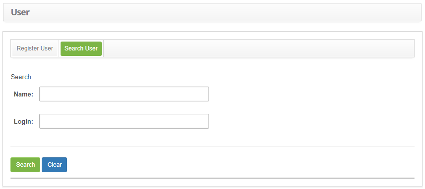

title: User registration and search
Description: In order to allow the staff member to access the system, it is necessary to create a user entry to receive the credentials and create their access profile.

# User registration and search

In order to allow the staff member to access the system, it is necessary to
create a user entry to receive the credentials and create their access profile.

How to access
-------------

1.  Access the user feature navigating through the main menu **General
    Registration > Staff Management > User.**

Preconditions
-------------

1.  Have an access profile (see knowledge [Access profile registration and
    search][1]).

2.  The staff member needs to be registered (see knowledge [Staff registration
    and search][2]).

Filters
-------

1.  The following filters enables the user to restrict the participation of
    items in the standard feature listing, making it easier to find the desired
    items:

    - Name;

    - Login.

2.  Click on the **Search User** tab. The search screen will be displayed as
    illustrated on the image below:

    

    **Figure 1 - User search screen**

3.  Conduct a user search:

    - Insert the name of the intended user and click on the *Search* button.
    Afterwards, the user entry will be displayed according to the description
    provided.

    - To list all users, just click directly on the *Search* button, if needed.

Items list
----------

1.  The following cadastral fields are available to the user to facilitate the
    identification of the desired items in the standard feature listing: **Name,
    Login** and **LDAP User**.

    

    **Figure 2 - User listing screen**

2.  After searching, select the intended entry. Afterwards, they will be
    redirected to the registry screen displaying the content belonging to the
    selected entry;

3.  To edit a user entry, just modify the information on the intended fields and
    click on the *Save* button to confirm the changes to the database, at which
    date, time and user will be stored automatically for a future audit.

Filling in the registration fields
----------------------------------

1.  The **Register User** screen will be displayed, as illustrated on the image
    below:

    !!! note "NOTE"

        In cases of LDAP authentication, when the user logs in for the first time,
        the "access profile" of the LDAP will be defined by the system, which is
        configured in parameter "39" - LDAP - Id of the access profile that will be
        set automatically if user does not have any "(see knowledge [Parameterization rules - LDAP][3]).

    

    **Figure 3 - User registration screen**

2.  Fill out the fields as instructed below:

    -  **Staff**: insert the name of the staff member accessing the system;

    -  **Login**: insert the login which will be used to log in the system.

    -  **Access Profile**: select the acess profile to determine the activies the
    user will be able to perform within the system;

    -  **Password**: insert a password to log in the system.

    -  **Confirm Password**: insert the password again;

!!! note "NOTE"

    Typing in the 'Password' and 'Confirm Password' fields should be literally
    the same to accept the registration, include capital letter and low case.

   -  **Group**: select the groups the user will be a part of, so they have
    permission to work on the Management Processes Workflow;
                                                                                                                                      -  Click on the   icon . A search screen will be displayed so a group can be linked
       to the user;

   -  Perform a search for the intended group and select it. Afterwards, the group will be added to the user's registry.

3.  The system imports the load into the employee table and the user into the
    user table via the *Import* button (see knowledge [Employee
    import][4])

4.  Click on the *Save* button to create the entry, at which date, time and user
    will be automatically stored for a future audit.

[1]:/en-us/citsmart-platform-7/initial-settings/access-settings/profile/user-profile.html
[2]:/en-us/citsmart-platform-7/initial-settings/access-settings/user/employee.html
[3]:/en-us/citsmart-platform-7/plataform-administration/parameters-list/parametrization-ldap.html
[4]:/en-us/citsmart-platform-7/plataform-administration/data-and-import/employee-import.html

!!! tip "About"

    <b>Product/Version:</b> CITSmart | 8.00 &nbsp;&nbsp;
    <b>Updated:</b>09/12/2019 – Anna Martins
