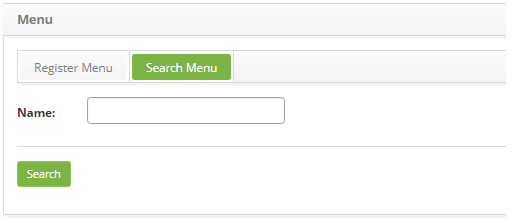
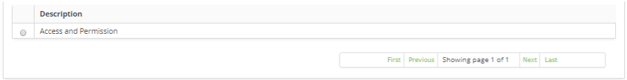
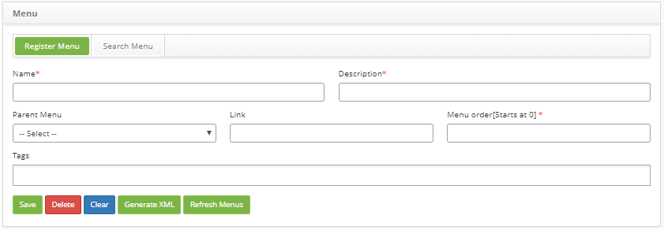

title: Menu registration and search
Description:The goal of this feature is to allow the user to configure the menu items according to their preferences and improve the menu accessibility, where items can be arranged according to their needs.

# Menu registration and search

The goal of this feature is to allow the user to configure the menu items
according to their preferences and improve the menu accessibility, where items
can be arranged according to their needs.

How to access
-------------

1.  Access the unit feature navigating through the main menu **General
    Registration > Menu.**

Preconditions
-------------

1.  No applicable.

Filters
-------

1.  The following filter enables the user to restrict the participation of items
    in the standard feature listing, making it easier to find the desired items:

    -  Name.

    

    **Figure 1 - Menu search screen**

2.  Perform a menu search;

    - Insert the name of the intended menu and click on the *Search* button.
    Afterwards, the menu entry will be displayed according to the description
    provided.;

    - To list all menus, just click directly on the *Search* button, if needed.

Items list
----------

1.  The following cadastral field is available to the user to facilitate the
    identification of the desired items in the standard feature
    listing: **Description**.

    

    **Figure 2 - Menu listing screen**

2.  After searching, select the intended entry. Afterwards, they will be
    redirected to the registry screen displaying the content belonging to the
    selected entry.

3.  To edit a unit entry, just modify the information on the intended fields and
    click on the *Save* button to confirm the changes to the database, at which
    date, time and user will be stored automatically for a future audit.

Filling in the registration fields
----------------------------------

1.  The **Menu Registration** screen will be displayed, as illustrated on the
    image below:

    

    **Figure 3 - Menu entry screen**

2.  Fill out the fields as instructed below:

    -   **Name**: insert the keyword of the menu item , e.g.: \$menu.name.Menu;

    -   **Description**: insert the description of the menu item, e.g.: Menu Entry;

    -   **Parent Menu**: select a parent menu, in case the new item is a
    submenu;

    -   **Link**: insert the access link of the new menu item, e.g.:
    /menu/menu.load;

    -   **Menu Order**: insert the menu position, e.g.: 5;

    -   **Tags**: insert the menu item tags (feature). Tags are keywords that act as
    labels and assist in organizing information, joining those who have the same
    label, making it easier to find other related items.

3.  After inserting the data, click on the *Save* button to create the entry, at
    which date, time and user will be automatically stored for a future audit.

    -   The *Generate XML* button generates a ".xml" extension menu.

    -   The *Refresh Menus* button is for updating menus.

!!! warning "ATTENTION"

    It is necessary to be very careful about executing the Update
    Menus button, because all the cadastral changes of the menus will be lost
    since the last generation of XML. It is recommended, therefore, the
    following execution sequence: (1) Generate XML button and (2) Refresh
    Menus button.

!!! tip "About"

    <b>Product/Version:</b> CITSmart | 8.00 &nbsp;&nbsp;
    <b>Updated:</b>09/12/2019 – Anna Martins
