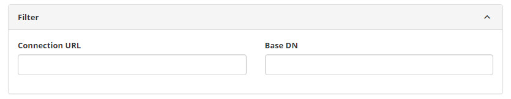
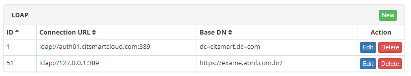
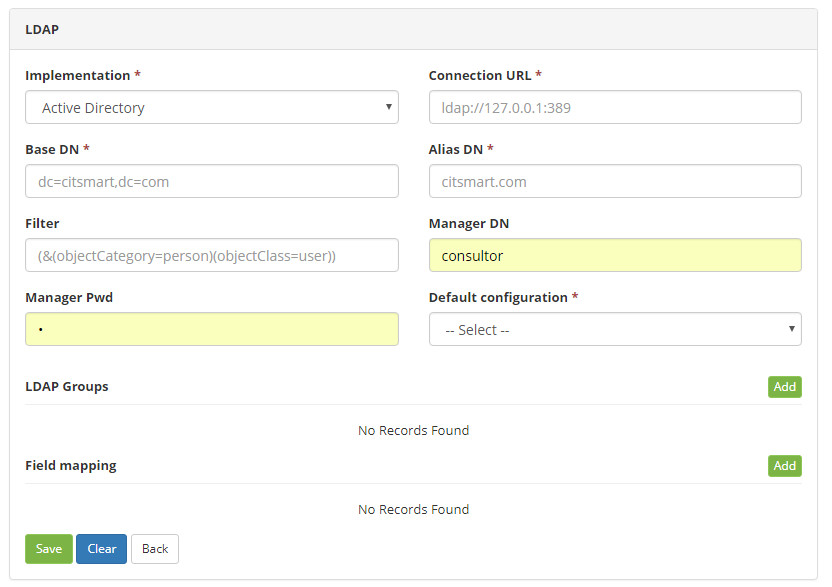
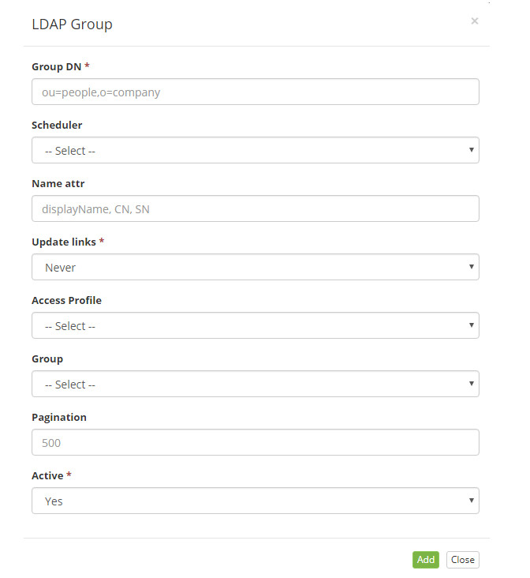
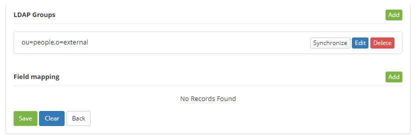

title: LDAP connections registration and search
Description: LDAP (Lightweight Directory Access Protocol) is a standard protocol that allows you to manage directories.
# LDAP connections registration and search

LDAP (*Lightweight Directory Access Protocol*) is a standard protocol that allows you to manage directories, that is, access 
databases of users on a network through TCP/IP protocols.

This feature allows you to register multiple LDAP connections and configure the settings for each LDAP connection.

How to access
-----------------

1. Access the main menu **Parameterization > LDAP Setup**.

Preconditions
---------------

1. Enter schedules for scheduling automatic synchronization (see knowledge [Schedule registration and search][1])

Filters
----------

The following filters enable the user to restrict the participation of items in the standard feature listing, making it easier to 
locate the desired items:

- Connection URL;
- DN Base.
    

**Figure 1 - LDAP connection search screen**

Items list
--------------------

1. The following cadastral fields are available to the user to make it easier to identify the desired items in the default listing 
of the functionality: **ID, URL Connection**, and **Base DN**.

2. There are action buttons available to the user for each item in the listing, they are: *Edit* and *Delete*.

**Figure 2 - LDAP connections list screen**

Filling in the registration fields
------------------------------------

!!! warning "WARNING"

    All fields are equally relevant to enable LDAP connection, while the test is not successful the configuration procedure can not 
    be considered complete.
    
1. The LDAP screen will be displayed;

2. Click the *New* button (according to the previous figure). Once this is done, the LDAP Connection Master screen will be 
displayed, as shown in the following figure:

    
    
    **Figure 3 - LDAP connection master data sheet**
    
3. Fill in the fields as directed below:

    - **Implementation**: enter the type of LDAP implementation: AD or OpenLDAP;
    - **Connection URL**: enter the connection URL with the corresponding port. It is responsible for synchronizing with LDAP;
    - **Base DN**: enter the DN (Distinguished Name) of the domain;
    - **Filter**: set the filter to search for information;
    - **Manager DN**: inform the user with administrator permission in LDAP;
    - **Manager Pwd**: enter the password of the user mentioned in the field above
    
4. Click the *Add new group* button and after that, the data record screen will be displayed, as shown in the figure below:

    
    
    **Figure 4 - LDAP Group master register screen**
    
    !!! note "NOTE"
    
        Iif there are no LDAP groups, fill in the "DN Group" field with only one asterisk. This will cause the system to scan the 
        entire domain.
        
    - **Group DN**: report the LDAP group, where the subfolders are, where the users are located;
    - **Scheduler**: select the desired time. This option is only available if the quartz configuration is correct;
    - **Name attr**: enter the LDAP attribute that will be set as the CITSmart user name;
    - **Update links**: the following options will be displayed:
        - Always: the system updates the Access Profile and Group links whenever the system synchronizes LDAP;
        - Never: the system never updates the Access Profile and Group links even in the first creation, that is, the employee load 
        is made, however, no user will be in a pre-established Group or Access Profile;
        - Creation only: the system updates the Access Profile and Group links only when creating a new user when the system 
        synchronizes with LDAP.
    - **Access profile**: select the access profile that will be automatically assigned to each synchronization;
    
    !!! info "IMPORTANT"
    
        The system does not allow you to delete a user that originates in LDAP.
        
    - **Group**: inform the group that the users will be linked;
    - **Pagination**: set the maximum number of users that the synchronization routine will return;
    - **Active**: set whether the LDAP group is enabled. By default the selected value is "YES";
    - After the data is entered, click the *Add* button. The LDAP group will be added in the LDAP connection screen, with the 
    example shown in the figure below:
    
    
    
    **Figure 5 - LDAP groups**
    
5. After the data is entered, click on the *Save* button to save the LDAP connection, where the date, time and user will also be 
saved automatically for a future audit.

6. Test the connection by clicking the **Test Connection** button.

    !!! warning "WARNING"
    
        Note that before asking to test MUST be clicked on the Save button to save the setting, otherwise the test will use the 
        data prior to the changes made on the screen.
        
7. Click the **Synchronize** button to perform the synchronization with LDAP

!!! abstract "KNOW MORE"

    Wwhen an authentication request is made on the system identification screen (login and password) a search cycle of the correct 
    connection is executed based on this configuration, ie, there is an authentication attempt for each domain registered here (if 
    there is more than one).
    
!!! tip "About"

    <b>Product/Version:</b> CITSmart | 7.00 &nbsp;&nbsp;
    <b>Updated:</b>02/09/2019 – Larissa Lourenço
    
[1]:/en-us/citsmart-platform-7/initial-settings/access-settings/profile/user-profile.html
