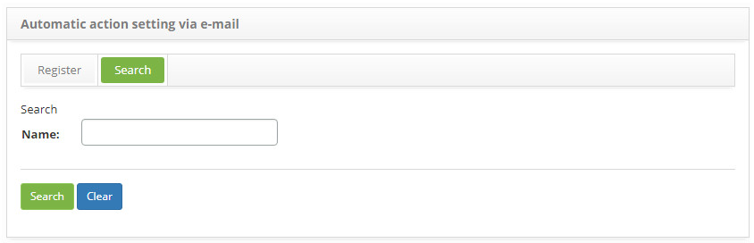
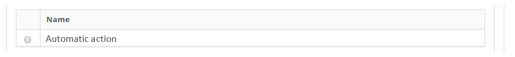
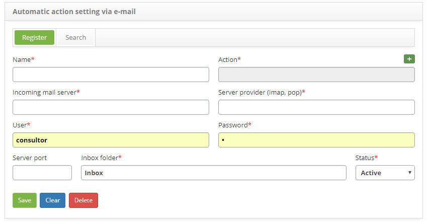

title: Automatic actions via e-mail setup guide
Description: The purpose of this feature is to automatically open service requests via e-mail.
# Automatic actions via e-mail setup guide

The purpose of this feature is to automatically open service requests via e-mail.

How to access
-----------------

1. Access the automatic action configuration feature via e-mail via navigation in the main menu 
**System > Settings > Automatic action setting via e-mail**.

Preconditions
----------------

1. Register automatic incident/request/procedure action (see knowledge [Automatic actions registration and search[1], 
section "Automatic Actions - Incidents/Requests/Procedures").

Filters
---------

1. The following filter enable the user to restrict the participation of items in the standard feature listing, making it easier to 
locate the desired items as shown in the figure below:

    - Name.
    
2. In the **E-mail Automatic Action Configuration** screen, click on the **Search** tab, the respective search screen will be 
displayed as shown in the figure below:

    
    
    **Figure 1 - E-mail automatic action configuration search screen**
    
3. Perform automatic action configuration search via e-mail;

4. Enter the name of the automatic action via e-mail that you want to search and click the *Search* button. After this, the record 
will be displayed according to the name entered;

5. If you want to list all the records, just click directly on the *Search* button;

Items list
-------------------

1. The following cadastral field is available to the user to facilitate the identification of the desired items in the standard 
listing of the functionality: **Name**.

    
    
    **Figure 2 - E-mail automatic action configuration listing screen**
    
2. After searching, select the desired record. Once this is done, it will be directed to the registration screen displaying the 
contents of the selected registry;

3. To change the automatic action registration data via e-mail, simply modify the information you want and click the *Save* button.

Filling in the registration fields
-------------------------------------

1. The **Automatic action setup via e-mail** screen will appear, where you can register the automatic action configuration via e-
mail, as shown in the figure below:

    
    
    **Figure 3 - E-mail automatic action configuration screen**
    
2. Fill in the fields as directed below:

    - **Name**: enter the name of the automatic action;
    - **Action**: inform the automatic action of incidents / requests / procedures. This action will be used as a template for the 
    opening of the service request, since it has information relevant to the opening of a service request;
    - **Incoming mail server**: inform the incoming mail server, as mentioned in parameter 23;
    - **Server Provider (impas, pops, imap, pop)**: Inform the provider of the mail server, as mentioned in parameter 26;
    - **User**: inform the user of the e-mail account, as mentioned in parameter 24;
    - **Password**: enter the password for the e-mail access, as mentioned in parameter 25;
    - **Server port**: enter the port of the mail server, as mentioned in parameter 27;
    - **Inbox folder**: enter the e-mail inbox folder as mentioned in parameter 28;
    - **Status**: report the status of the automatic action via e-mail;
    
3. After completing the fields, click the *Save* button to register, where the date, time and user will be saved automatically for 
a future audit.

!!! tip "About"

    <b>Product/Version:</b> CITSmart | 7.00 &nbsp;&nbsp;
    <b>Updated:</b>09/02/2019 – Larissa Lourenço
    
[1]:/en-us/citsmart-platform-7/plataform-administration/configuring-automatic-actions/automatic-actions.html
