title: Automatic actions registration and search
Description: Automatic actions are associated in the event manager database.
# Automatic actions registration and search

Automatic actions are associated in the event manager database. These actions will be related according to the type of the desired 
event and triggered whenever a significant event is recognized.

- Automatic Actions;
- Notification;
- News;
- Problem;
- Incidents/Requests/Procedures.

This functionality is intended to relate incident/Request and/or notification actions to automatic actions. It is important to note 
that a single event can start any one or combination of these processes for example, a fault is logged as an incident, and a 
notification is logged to inform those concerned.

How to access
-----------------

1. Access the functionality through navigation in the main menu **System > Automatic Actions > Automatic Actions**.

Preconditions
----------------

1. Register automatic notification action (see section "Automatic Actions - Notification");

2. Register automatic change action (see section "Automatic Actions - Change");

3. Enter automatic problem action (see section "Automatic Actions - Problem");

4. Register automatic action of incidents/Requests/procedures (see section "Automatic Actions - Incidents/Requests/Procedures").

Filters
---------

1. The following filter enables the user to restrict the participation of items in the standard feature listing, making it easier 
to find the desired items:

    - Name.
    
    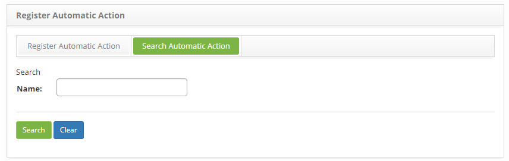
    
    **Figure 1 - Automatic action search**
    
2. Perform automatic action search:

    - Enter the name of the automatic action you want to search for and click the *Search* button. After that, the automatic action 
    record will be displayed according to the name entered;
    
    - If you want to list all the automatic action records, simply click the *Search* button directly;
    
Items list
-------------------

1. The following cadastral field is available to the user to facilitate the identification of the desired items in the standard feature listing: **Name**.

    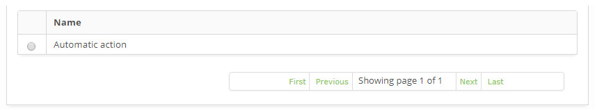
    
    **Figure 2 - Automatic action listing**
    
2. Search and select the action you want according to your need and it will be added and displayed on the registration screen;

3. Click the *Save* button to register, where the date, time and user will be saved automatically for a future audit.

Filling in the registration fields
-------------------------------------

1. On Register Automatic Action guide, fill in the fileld, as the figure below:

    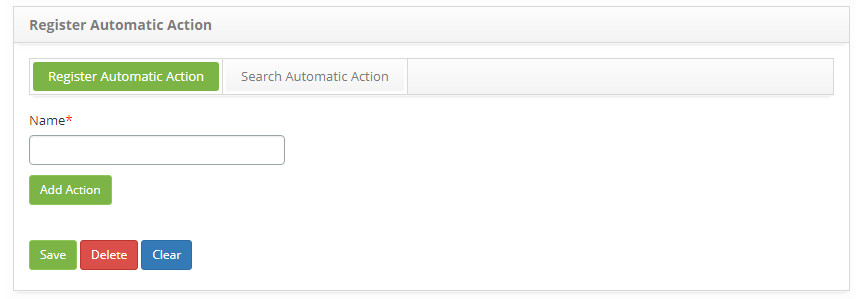
    
    **Figure 3 - Notification action search screen**
    
2. Click on the *Save* button to finish the registration.

Automatic actions - notification
-----------------------------------

This functionality is intended to record automatic notification actions. The notification formalizes and communicates information 
about the event and it is important that information about an event is described and completed to facilitate decision making later. 
This registration will be associated with the automatic actions, and will be used in the registrations of event managers of 
CITSmart Nagios, Zabbix, Inventory and Correlated Events.

Preconditions
----------------

1. Register a user (see knowledge [User registration and search](/en-us/citsmart-platform-7/initial-settings/access-settings/user/user-register.html));

2. Register a group (see knowledge [Group registration and search](/en-us/citsmart-platform-7/initial-settings/access-settings/user/group.html));

How to access
----------------

1. Access the functionality through navigation in the main menu **System > Automatic Actions > Notification Actions**.

!!! note "NOTE"

    It is recommended that event notifications be sent only to those responsible for handling related actions or decisions. This 
    avoids unnecessary notifications to those who are not directly involved in the event process.
    
Filters
-----------

1. The following filter enables the user to restrict the participation of items in the standard feature listing, making it easier 
to find the desired items:

    - Name.

2. On the **Notification Action** screen, click the **Notification Action Search** tab. The search screen will be displayed as 
shown in the figure below:

    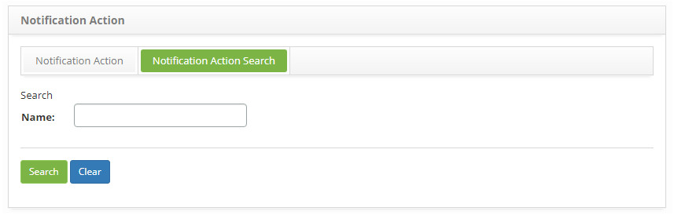
    
    **Figure 4 - Notification action search screen**
    
3. Perform automatic notification action search;

    - Enter the name of the automatic notification action you want to search and click the *Search* button. After this, the 
    automatic notification action record according to the name entered will be displayed;
    
    - If you want to list all automatic notification action records, simply click the *Search* button directly;
    
Items list
-------------------

1. The following cadastral field is available to the user to facilitate the identification of the desired items in the standard feature listing: **Name**.

    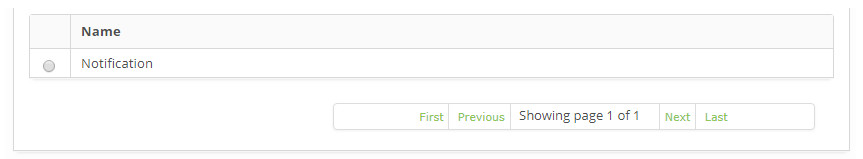
    
    **Figure 5 - Notification action listing screen**
    
2. After searching, select the desired record. Once this is done, it will be directed to the registration screen displaying the 
contents of the selected registry;

3. To change the automatic notification action record data, simply modify the information of the desired fields and click the 
*Save* button to save the change made to the record, where the date, time and user will be saved automatically for a future audit.

Filling in the registration fields
-------------------------------------

1. The **Notification Action** screen will be displayed, as shown in the figure below:

    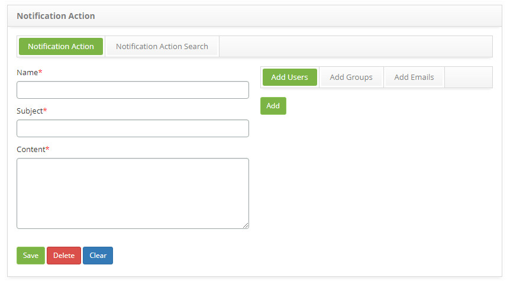
    
    **Figure 6 -Notification action registration screen**
    
2. Fill in the fields as directed below:

    - **Name**: enter the name you want for the automatic notification action;
    - **Subject**: enter the subject of the notification;
    - **Content**: please provide a description of the reasons for the notification;
    - The notifications should be sent to the responsible and interested people, being able to choose between users, and/or groups 
    and/or e-mail:
        - To add users, click the **Add Users** tab, click the *Add* button, and the screen for user search and selection will be 
        displayed;
        - To add groups, click the **Add Groups** tab, click the *Add* button, the screen for group search and selection will be 
        displayed;
        - To add e-mail, click the **Add E-mails** tab, enter the e-mail in the available field and click the Add button;
    - Click the *Save* button to register, where the date, time and user will be saved automatically for a future audit.
    
Automatic actions - change
------------------------------

Some events will present a situation where the appropriate action will need to be addressed by the change management process, that 
is, this functionality aims to register automatic change actions. This register will be associated with the automatic actions, 
where it will be used in the event managers records of CITSmart Nagios, Zabbix, Inventory and Correlated Events.

Preconditions
----------------

1. Register contract (see knowledge [Contract registration and search](/en-us/citsmart-platform-7/additional-features/contract-management/use/register-contract));

2. Register unit (see knowledge [Unit registration and search](/en-us/citsmart-platform-7/plataform-administration/region-and-language/register-unit.html));

3. Register applicant (collaborator) (see knowledge [Staff registration and search](/en-us/citsmart-platform-7/initial-settings/access-settings/user/employee.html));

4. Register "Change Advisory Committee" (group) to be listed on the change request screen (see knowledge [Group registration and search](/pt-br/citsmart-platform-7/initial-settings/access-settings/user/group.html));

5. Register type of change, which should have the link with the flow referring to the request for change (see knowledge [Change Type registration and search](/en-us/citsmart-platform-7/processes/change/change-type.html));

6. Configure the parameters (see knowledge [Parameterization rules - change](/en-us/citsmart-platform-7/plataform-administration/parameters-list/parametrization-change.html)):

    - Parameter 47;
    - Parameter 279;
    - Parameter 280.
    
7. Link the group to the contracts, associating the Applicants (collaborators) already registered to this group, so that the 
contracts and the related applicants are listed on the change request screen. If it is necessary to create a new employee, it is 
necessary to include it to the Applicant Group in which it is related to the contract so that it can carry out a change request, 
that is, to have its name listed on the change Request screen (see knowledge [Contract registration and search](/en-us/citsmart-platform-7/additional-features/contract-management/use/register-contract));

8. Link drive to contract so the drive is listed on the change Request screen (see knowledge [Contract registration and search](/en-us/citsmart-platform-7/additional-features/contract-management/use/register-contract)).

How to access
--------------

1. Access the feature by navigating through the main menu **System > Automatic Actions > Change Actions**.

Filters
---------

1. The following filter enables the user to restrict the participation of items in the standard feature listing, making it easier 
to find the desired items:

    - Name.
    
    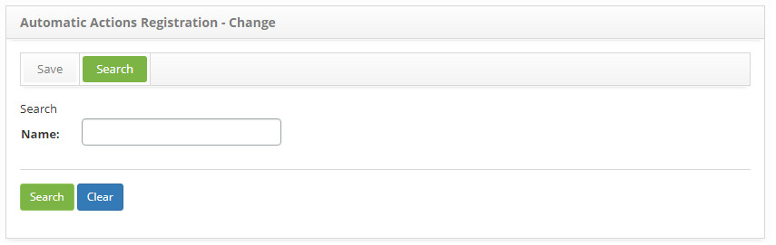
    
    **Figure 7 - Change action search screen**
    
2. Perform automatic change action search;

    - Enter the name of the automatic change action you want to search and click the *Search* button. After this, the automatic 
    change action record will be displayed according to the name entered;
    
    - If you want to list all the automatic change action records, just click directly on the *Search* button;
    
Items list
-------------------

1. The following cadastral field is available to the user to facilitate the identification of the desired items in the standard feature listing: **Name**.

2. On the **Automatic Actions Registration - Change** screen, click on the **Search** tab. The search screen will be displayed as 
shown in the figure below:

    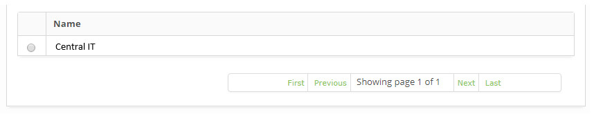
    
    **Figure 8 - Change action listing screen**
    
3. After searching, select the desired record. Once this is done, it will be directed to the registration screen displaying the 
contents of the selected registry;

4. To change the data of the automatic change action record, simply modify the information of the desired fields and click the 
*Save* button to save the change made in the record, where the date, time and user will be automatically saved for a future audit.

Filling in the registration fields
-------------------------------------

1. The Automatic Change Action Register screen will be displayed, as shown in the figure below:

    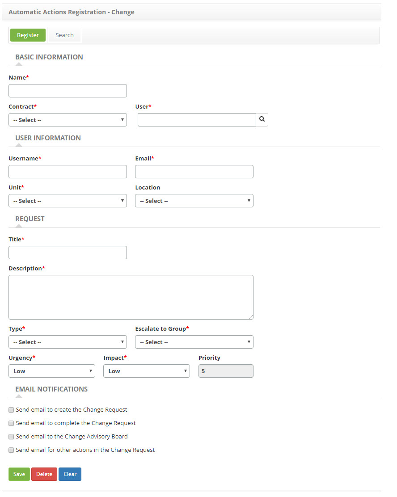
    
    **Figure 9 - Change action registration screen**
    
2. Fill in the fields as directed below:

    - **Name**: enter the name of the automatic action for change request;
    - **Contract**: select the contract for which the change request will be made;
    - **User**: enter the name of the applicant, that is, the name of the person requesting the change request;
    - **Username**: enter the name of the contact person about the change request;
    - **E-mail**: inform the contact e-mail;
    - **Unit**: enter the contact unit;
    - **Location**: state the physical location of the contact;
    - **Title**: enter the title for the change Request;
    - **Description**: enter the description for the change request;
    - **Type**: report the type of change request;
    - **Escalate to Group**: select the group to which the request for change to the service will be directed;
    - **Urgency**: indicate the speed at which the change needs to be performed;
    - **Impact**: indicate the degree of impact of the change;
    - **Priority**: this field is for simple conference. Priority shall be defined by the system, after reporting urgency and 
    impact.
    - If you have set in the group register, that the e-mail notification options will be selected when registering the change 
    request, check the e-mail notification options so that the requestor receives the notifications about the change request;
    
3. Click the *Save* button to register, where the date, time and user are automatically saved for a future audit.

Automatic acions - problem
------------------------------

Some events will present a situation where the appropriate action will need to be handled by the problem management process, that 
is, this functionality aims to register the automatic actions of the problem type. This register will be associated with the 
automatic actions, where it will be used in the event managers records of CITSmart Nagios, Zabbix, Inventory and Correlated Events.

Preconditions
----------------

1. Register contract (see knowledge [Contract registration and search](/en-us/citsmart-platform-7/additional-features/contract-management/use/register-contract));

2. Register unit (see knowledge [Unit registration and search](/en-us/citsmart-platform-7/plataform-administration/region-and-language/register-unit.html));

3. Register applicant (collaborator) (see knowledge [Staff registration and search](/en-us/citsmart-platform-7/initial-settings/access-settings/user/employee.html));

4. Group membership (see knowledge [Group registration and search](/en-us/citsmart-platform-7/initial-settings/access-settings/user/group.html));

5. Enter category of problem, which should have the link with the flow referring to the problem (see knowledge [Problem category registration and search](/en-us/citsmart-platform-7/processes/problem/category.html));

6. Link drive to contract so that the drive is listed on the problem log screen (see knowledge [Contract registration and search](/en-us/citsmart-platform-7/additional-features/contract-management/use/register-contract));

7. Link the group to the contracts, associating the applicants (collaborators) already registered to this group, so that the 
contracts and related applicants are listed on the problem log screen. If it is necessary to create a new employee, it is necessary 
to include it in the group of the applicant in which it is related to the contract so that it can register a problem, that is, to 
have its name listed on the problem registration screen (see knowledge [Contract registration and search](/en-us/citsmart-platform-7/additional-features/contract-management/use/register-contract)).

How to access
-----------------

1. Access the feature by navigating through the main menu **System > Automatic Actions > Problem Actions**.

Filters
---------

1. The following filter enables the user to restrict the participation of items in the standard feature listing, making it easier 
to find the desired items:

    - Name.
    
    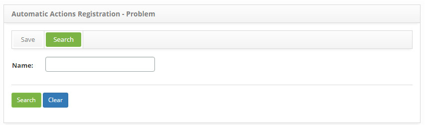
    
    **Figure 10 - Problem action search screen**
    
2. Perform automatic problem action search;

    - Enter the name of the automatic problem action you want to search for and click the *Search* button. After this, the 
    automatic problem action record will be displayed according to the name entered;
    
    - If you want to list all the automatic action action logs, just click directly on the *Search* button.
    
Items list
-------------------

1. The following cadastral field is available to the user to facilitate the identification of the desired items in the standard 
feature listing: **Name**.

    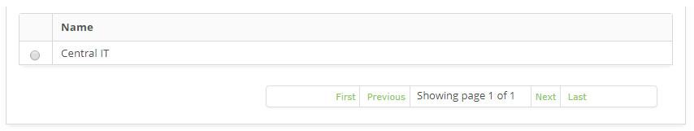
    
    **Figure 11 - Problem action listing screen**
    
2. After searching, select the desired record. Once this is done, it will be directed to the registration screen displaying the 
contents of the selected registry;

3. To change the automatic action action record data, simply modify the information of the desired fields and click the *Record* 
button to save the change made to the record, where the date, time and user will be saved automatically for a future audit.

Filling in the registration fields
-------------------------------------

1. The Automatic Actions Registration screen will be displayed, as shown in the figure below:

    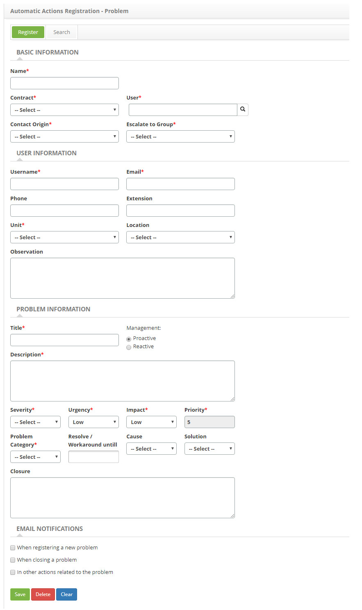
    
    **Figure 12 - Automatic problem action record screen**
    
2. Fill in the fields as directed below:

    - **Name**: enter the name of the automatic action for problem request;
    - **Contract**: select the contract for which the problem request will be made;
    - **User**: state the name of the applicant, that is, the name of the person requesting the problem request;
    - **Contact Origin**: inform the source of the problem request;
    - **Escalate to group**: select the group to which the problem request for assistance will be directed;
    - **Username**: enter the name of the contact person about the problem request;
    - **Phone**: inform the contact telephone number;
    - **Telefone**: informe o telefone do contato;
    - **Extension**: enter the extension of the contact;
    - **Unit**: enter the contact unit;
    - **Location**: state the physical location of the contact;
    - **Observation**: describe the additional details about the contact, if necessary;
    - **Title**: report the title to the problem;
    - **Management**: select the type of management of the problem.
        - **Proactive: Proactive Problem Management for the prevention of the occurrence of Incidents. Worries about preventing 
        incidents from occurring. Responsible for addressing similar issues before they happen, ensuring that such scenarios are 
        addressed as well.
        - **Reactive**: from the Incident Management process. Worries about solving problems in response to one or more incidents. 
        Performs incident review and analysis to identify which groups should be addressed and what actions are required to address 
        them.
    - **Description**: enter the description for the problem request;
    - **Severity**: indicate the severity of the problem;
    - **Urgency**: indicate the urgency to solve the problem;
    - **Impact**: indicate the degree of impact of the problem;
    - **Priority**: this field is for simple conference. The priority is from 1 to 5, with 1 being the highest priority and 5 being 
    the lowest priority, and is defined by the system after reporting severity, urgency, and impact.
    - **Problem Category**: select the category of the problem;
    - **Resolve/Workaround until**: set the deadline for solving the problem;
    - **Cause**: select the cause of the problem;
    - **Solution**: select the solution category of the problem;
    - **Closure**: enter the description of the solution or outline of the problem;
    
3. If you have set in the group register, that the e-mail notification options will be selected when registering the problem 
request, check the e-mail notification options so that the requestor receives the notifications about the problem request;

4. Click the *Save* button to register, where the date, time and user are automatically saved for a future audit.

Automatic actions - incidentes/requests/procedures
----------------------------------------------------------

Some events will present a situation where the appropriate action will need to be handled by the incident management process, ie, 
this functionality aims to register the incident/request/procedure type automatic actions. This register will be associated with 
the automatic actions, where it will be used in the event managers records of CITSmart Nagios, Zabbix, Inventory and Correlated 
Events.

Preconditions
----------------

1. Register group (see knowledge [Group registration and search](/en-us/citsmart-platform-7/initial-settings/access-settings/user/group.html));

2. Register contract (see knowledge [Contract registration and search)](/en-us/citsmart-platform-7/additional-features/contract-management/use/register-contract));

3. Link the group to the contracts, associating the applicants (collaborators) already related to this group, so that the contracts 
and the related applicants are listed in the request screen. If it is necessary to create a new employee, it is necessary to 
include it in the group in which it is related to the contract so that it can open a request, that is, to have its name listed on 
the request registration screen (see knowledge [Contract registration and search](/en-us/citsmart-platform-7/additional-features/contract-management/use/register-contract));

4. Link unit to contracts so that it is listed on the request screen (see knowledge [Contract registration and search)](/en-us/citsmart-platform-7/additional-features/contract-management/use/register-contract));

5. Define portfolio of services (see knowledge [Service portfolio registration](/en-us/citsmart-platform-7/processes/portfolio-and-catalog/register.html));

6. Define service time for services (see knowledge [Time attendance registration and search](/en-us/citsmart-platform-7/processes/service-level/time-attendance.html));

7. Define a first level group to fulfill the request, if it is not directed to a Group;

8. Register periodic activity groups to schedule the activities of the request (see knowledge [Periodic activity group registration and search](/en-us/citsmart-platform-7/additional-features/automation-of-operation/configuration/periodic-activity-group.html)).

How to access
----------------

1. Access the feature by navigating through the main menu System → Automatic Actions → Incidents/Requests/Procedures Actions.

!!! abstract "KNOW MORE"

    Event management supports the incident management process, since it can detect faults early in the service and act quickly to 
    prevent downtime of the service to the end user.
    
Filters
---------

1. The following filter enables the user to restrict the participation of items in the standard feature listing, making it easier 
to find the desired items:

    - Name.
    
    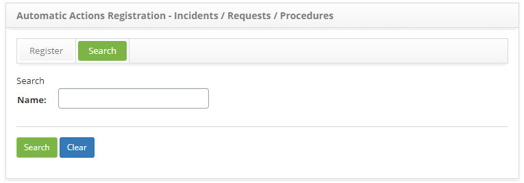
    
    **Figure 13 - Incident/Request/Procedure action search screen**
    
2. Perform automatic incident/request/procedure action search;

    - Enter the name of the automatic incident/request/procedure action you want to search for and click the *Search* button. After 
    that, the automatic action/incident/procedure action record will be displayed according to the name entered;
    
    - If you want to list all records of automatic action of incidents/requests/procedures, just click directly on the *Search* 
    button;
 
Items list
-------------------

1. The following cadastral field is available to the user to facilitate the identification of the desired items in the standard feature listing: **Name**.

    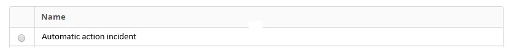
    
    **Figure 14 - Incident/ Request/Procedure action listing screen**
    
2. After searching, select the desired record. Once this is done, it will be directed to the registration screen displaying the 
contents of the selected registry;

3. To change the data of the automatic action record of incidents/requests/procedures, simply modify the information of the desired 
fields and click the *Save* button to save the change made in the registry, where the date, time and user will be automatically 
saved to a Future audit.

Filling in the registration fields
-------------------------------------

1. The automatic action screen of incidents/requests/procedures will be displayed, as shown in the figure below:

    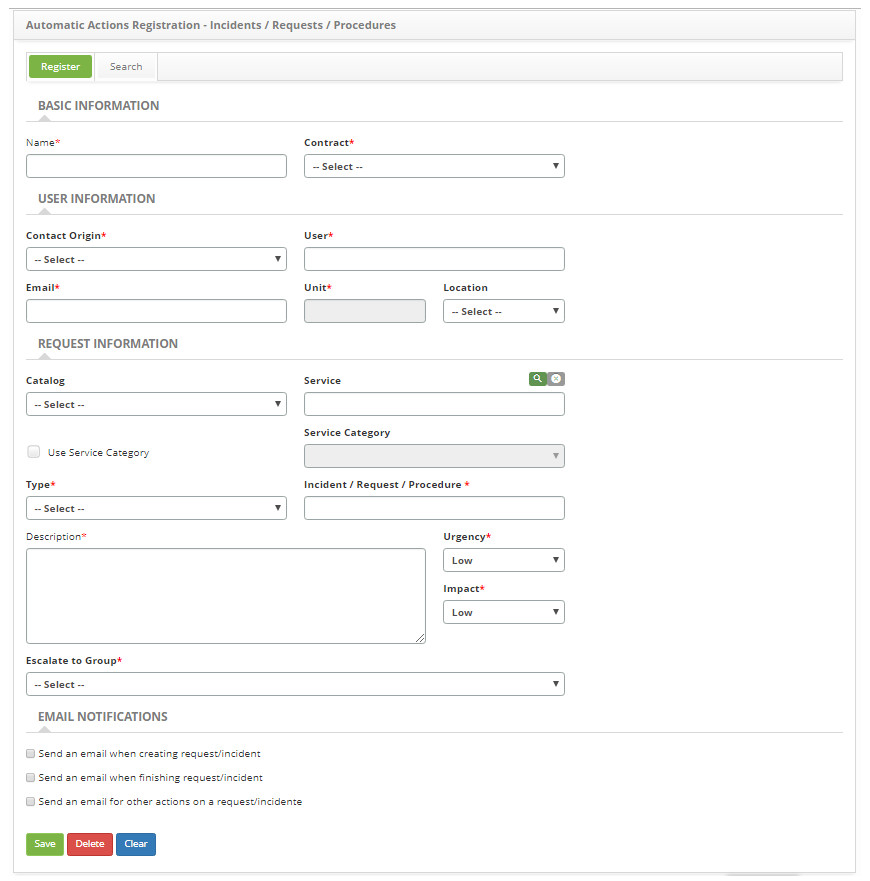
    
    **Figure 15 - Incident/Requests/Procedures Automatic Actions record screen**
    
2. Fill in the fields as directed below:

    - **Name**: enter the name you want for the automatic incident/request/procedure action;
    - **Contract**: select the contract for which the incident/request/procedure opening will be made;
    - **Contact Origin**: select the origin of the request;
    - **User**: select the name of the applicant, ie the name of the person who is requesting the opening of an incident or service 
    request;
    - **E-mail**: inform the requestor's e-mail;
    - **Unit**: report the unit of the applicant;
    - **Location**: state the physical location of the applicant;
    - **Catalog**: If you have selected the "contract" type contract, the "Business" service catalog information will be displayed 
    in this field and if you have selected the contract of type "support agreement" or "operational level agreement", In this field 
    the information of the "Technical" Service Catalog;
    - **Service**: inform the service regarding the service catalog. If the service catalog is a "business", the business services 
    for selection will be available in this field, but if the service catalog is "technical", the support/technical services for 
    selection will be available in this field;
    - **Use Service Category**: check this field if you choose to search the services by category;
    - **Service Category**: If you chose to search for services by category, enter the service category you want. The service 
    category will identify the nature of the service, positioning it within similar groups of service, placing it in the hierarchy 
    of its category;
    - **Type**: select the type of request, whether it is an incident opening, service request or procedure;
        - **Incident**: indicate if the situation presented is an unplanned outage, a reduction in the quality of the service or 
        failure of any configuration item that has not yet impacted an IT service. Eg: The network link is out, the network is 
        slow, the server inaccessible, etc;
        - **Request**: are requests for demands made by users within the Information Technology environment. They can range from 
        access requests to suggestions for improvement at low cost. e.g.: Request to configure some equipment, request to add some 
        software to the workstation, etc.
        - **Procedure**: refers to the IT service continuity process / procedure, in case of a critical incident. It is with the 
        procedure that you will determine the method that will put the process into practice, that is, determine the steps of the 
        execution, create a checklist, define when each person should perform each activity and what resources should be used for 
        the Delivery of the product or service as expected.
    - **Incident/Request/Procedure**: select the service to be performed;
    - **Description**: enter the description of the incident/request/procedure. The description must be objective, including all 
    the information necessary to fulfill the request;
    - **Urgency**: indicate the speed at which the service needs to be performed;
    - **Impact**: indicate the impact of the service;
    - **Escalate to Group**: select the group to which the request for the call will be directed.
    - **E-mail Notifications**: if you have defined the group registration, that the e-mail notification options will be selected 
    when registering the request, check the "E-mail Notification" options so that the requester receives notifications about the 
    solicitation.
    
3. Click on the *Save* button to register, where the date, time and user will be saved automatically for a future audit.

!!! tip "About"

    <b>Product/Version:</b> CITSmart | 7.00 &nbsp;&nbsp;
    <b>Updated:</b>09/02/2019 – Larissa Lourenço
