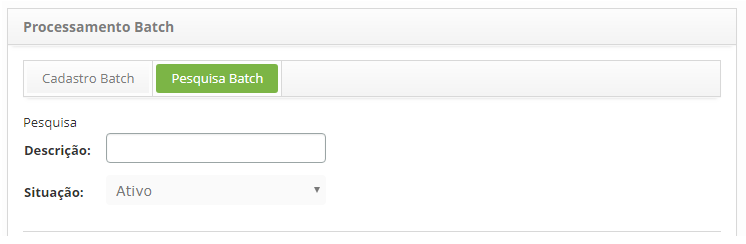
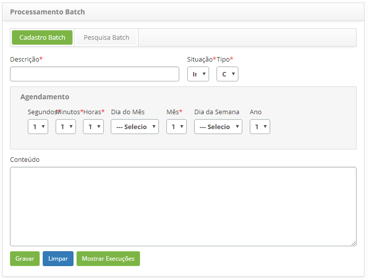

title: Cadastro e pesquisa de processamento batch
Description: Esta funcionalidade tem o objetivo de registrar o processamento batch, que poderá ser utilizado em outras rotinas 
# Cadastro e pesquisa de processamento batch

Esta funcionalidade tem o objetivo de registrar o processamento batch, que poderá ser utilizado em outras rotinas do sistema.

Como acessar
-------------

1. Acesse a funcionalidade de Processamento Batch através da navegação no menu principal **Sistema > Processamento Batch**.

Pré-condições
---------------

1. Não se aplica.

Filtros
---------

1. Os seguintes filtros possibilitam ao usuário restringir a participação de itens na listagem padrão da funcionalidade, facilitando
a localização dos itens desejados:

    - Descrição;
    - Situação.
    
2. Na tela de Processamento Batch, clique na guia **Pesquisa Batch**, será apresentada a tela de pesquisa conforme ilustrada na
figura abaixo:

    
    
    **Figura 1 - Tela de pesquisa de processamento batch**
    
3. Realize a pesquisa do processamento batch:

    - Informe a descrição e/ou situação do processamento batch e clique no botão "Pesquisar". Após isso, será exibido o registro 
    conforme os dados informados;
    
    - Caso deseje listar todos os registros de processamento batch, basta clicar diretamente no botão "Pesquisar".
    
Listagem de itens
--------------------

1. O seguinte campo cadastral está disponível ao usuário para facilitar a identificação dos itens desejados na listagem 
padrão da funcionalidade: **Descrição**.

    
    
    **Figura 2 - Tela de listagem de processamento batch**
    
2. Para alterar os dados do processamento batch, basta modificar as informações desejadas e clicar no botão "Gravar";

3. Para mostrar as execuções do processamento batch, basta clicar no botão "Mostrar Execuções" e será aberta uma janela
mostrando as últimas execuções.

Preenchimento dos campos cadastrais
--------------------------------------

1. Será apresentada a tela de **Cadastro de Processamento Batch**, conforme ilustrada na figura abaixo:

    
    
    **Figura 3 - Tela de cadastro de processamento batch**
    
2. Preencha os campos conforme orientações abaixo:

    - **Descrição**: informe a descrição do processamento batch;
    - **Situação**: informe a situação do processamento batch;
    - **Tipo**: para esse cadastro o tipo deverá ser Classe Java;
    
3. Selecione o(s) **segundos, minutos, horas, dia do mês, mês, dia da semana** e **ano** para o processamento batch:

    - **Conteúdo**: descreva o conteúdo do processamento batch.
    
4. Clique no botão "Gravar" para efetuar o registro, onde a data, hora e usuário serão gravados automaticamente para uma futura
auditoria.

!!! tip "About"

    <b>Product/Version:</b> CITSmart | 7.00 &nbsp;&nbsp;
    <b>Updated:</b>07/19/2019 – Larissa Lourenço
