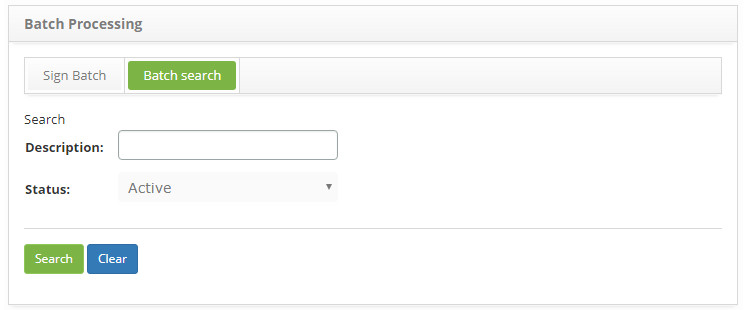
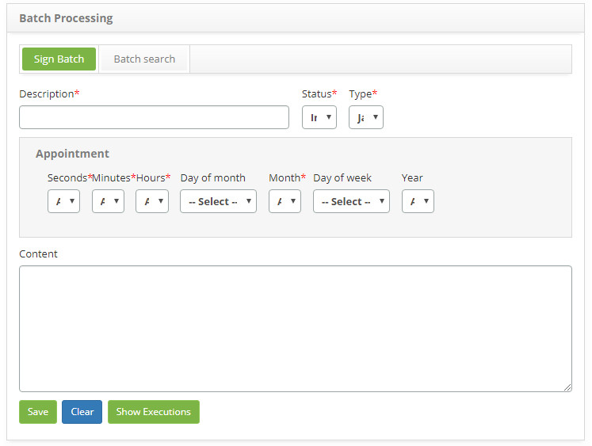

title: Batch processing registration and search
Description: Esta funcionalidade tem o objetivo de registrar o processamento batch, que poderá ser utilizado em outras rotinas 
# Batch processing registration and search

This functionality is intended to record batch processing, which can be used in other system routines.

How to access
----------------

1. Access the Batch Processing feature by navigating in the main menu **System > Batch Processing**.

Preconditions
---------------

1. No applicable.

Filters
---------

1. The following filter enables the user to restrict the participation of items in the standard feature listing, making it easier 
to find the desired items:

    - Description;
    - Status.
    
2. On the **Batch Processing** screen, click the **Batch Search** tab, the search screen will be displayed as shown in the figure 
below:

    
    
    **Figure 1 - Batch processing search screen**
    
3. Perform batch processing search;

    - Enter the description and/or batch processing status and click the *Search* button. After that, the record will be displayed 
    according to the data entered.
    
    - If you want to list all the batch processing records, simply click the *Search* button directly.
    
4. After searching, select the desired record. Once this is done, it will be directed to the registration tab displaying the 
contents of the selected record;
    
Items list
--------------------

1. The following cadastral field is available to the user to facilitate the identification of the desired items in the standard 
feature listing: **Description**.

    
    
    **Figure 2 - Batch processing listing screen**
    
2. To change the batch processing data, simply modify the desired information and click the *Save* button;

3. To show the batch processing runs, simply click the *Show Executions* button and a window will open showing the latest 
executions.

Filling in the registration fields
--------------------------------------

1. The **Batch Processing Master** screen will be displayed, as shown in the figure below:

    
    
    **Figure 3 - Batch processing master screen**
    
2. Fill in the fields as directed below:

    - **Description**: enter the description of batch processing;
    - **Situation**: inform the batch processing situation;
    - **Type**:for this register the type should be Java Class;
    
3. Select the **seconds, minutes, hours, day of the month, month, day of the week** and **year for batch processing**;

    - **Content**: describe the content of batch processing.
    
4. Click the *Save* button to register, where the date, time and user will be saved automatically for a future audit.

!!! tip "About"

    <b>Product/Version:</b> CITSmart | 7.00 &nbsp;&nbsp;
    <b>Updated:</b>02/09/2019 – Larissa Lourenço
