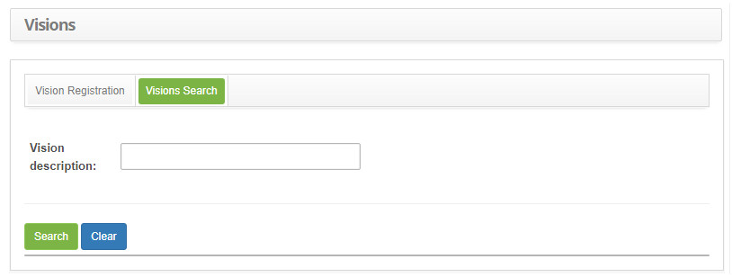
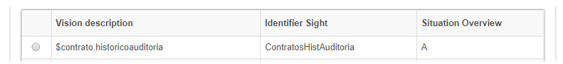
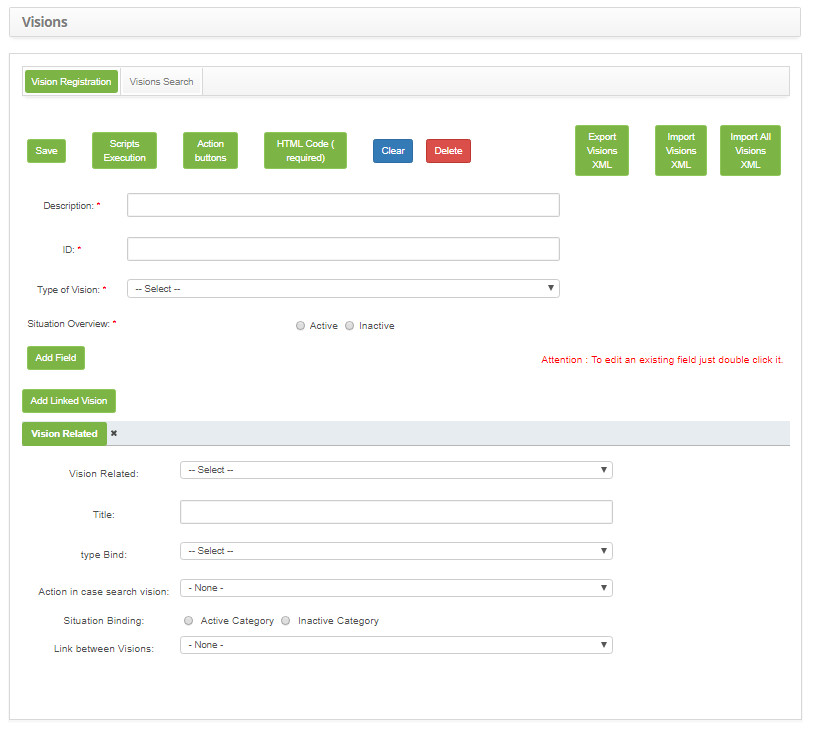
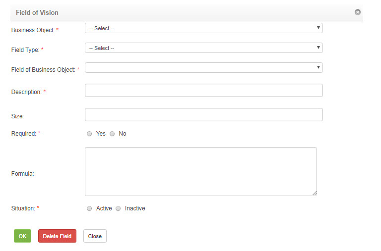
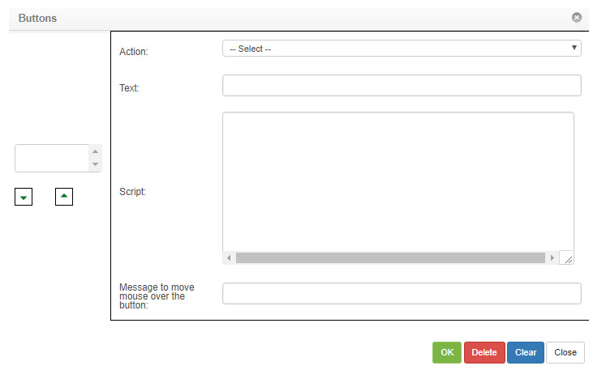

title: Visions (metadata) setup guide
Description: This functionality is intended to allow the creation of different views (screens) of the system.
# Visions (metadata) setup guide

This functionality is intended to allow the creation of different views (screens) of the system, with possibility of association 
with linked views (sub-tiles).

How to access
-----------------

1. Access the view maintenance feature by navigating in the main menu **System > Visions and Metadata > Visions Maintenance**.

Preconditions
----------------

1. No applicable.

Filters
---------

1. The following filter enables the user to restrict the participation of items in the standard feature listing, making it easier 
to find the desired items:

    - Vision description.
    
2. On the **View** screen, click the **View Search** tab, the search screen will be displayed as shown in the figure below:

    
    
    **Figure 1 - View search screen**
    
3. Perform vision search. Enter the description of the view you want to search and click the *Search* button. After this, the 
record will be displayed according to the name entered. If you want to list all the view records, simply click the *Search* button 
directly.

Items list
-------------------

1. The following cadastral fields are available to the user to facilitate the identification of the desired items in the standard 
feature listing: **Vision description, Identifier Sight** and **Situation Overview**.

    
    
    **Figure 2 - Vision listing screen**
    
2. After searching, select the desired record. Once this is done, it will be directed to the registration tab displaying the 
contents of the selected record;

3. To change the view log data, simply modify the desired information and click on the *Save* button.

Filling in the registration fields
-------------------------------------

1. The **View Register** screen will be displayed, as shown in the figure below:

    
    
    **Figure 3 - Vision registration screen**
    
2. Fill in the fields as shown below:

    - **Description**: Enter the vision description (screen);
    - **ID**: enter the identifier in the view;
    - **Type of Vision**: select the type of view;
    - **Situation Overview**: Tell the vision situation whether it is Active or Inactive;
    
3. Click the *Add Field* button to add fields in the view (screen) that is being created. A window will open to describe the field 
you want to add in the view;

    
    
    **Figure 4 - Vision field**
    
    - **Business Object**: select the business object (field table belonging);
    - **Field Type**: select the field type;
    - **Field of the Business Object**: select the field of the business object (field of the table, referring to the field being 
    created);
    - **Description**: enter the description of the field;
    - **Size**: enter the size of the field;
    - **Required**: enter whether the field is required by ticking Yes or No;
    - **Formula**: describe the formula of the field;
    - **Situation**: inform the situation of the field whether it is Active or Inactive;
    
4. Click the *Ok* button to enter the field in the view.

5. If you want to edit or delete some existing field in the view, simply double click on the field you want;

6. The window with the description of the field will be opened;

7. Edit the information you want and click the *Ok* button or if you want to delete, click the *Delete Field* button to delete the 
field from the view.

8. Click the *Add Bound View* button to add a sub-screen to the view, if you like;

9. A **Related View** tab will open below the *Add Bound View* button, with fill fields as below:

    - Select the related **view**;
    - Enter the **title** of the linked view;
    - Select the **type** of binding;
    - Select **action** in case of search view;
    - State the linkage **situation**;
    - Select the **link** between views;
    
10. Click the *Action Buttons* button to add buttons in the view you are creating;

11. Clicking on the button will open a window to describe information about the button you want to create;

    
    
    **Figure 5 - Buttons**
    
    - **Action**: select the button action;
    - **Text**: enter the text of the button;
    - **Script**: describe Button Script;
    - **Message to move mouse over the button**: enter a message that will be displayed when you hover the mouse over the button;
    
12. Click the *Ok* button to insert the button into the view;

13. The *Close* button serves to close the window and return to the **View Maintenance** screen.

14. If you wanted to edit or delete any existing button in the view, click the *Action button*;

15. The button window will open;

16. Select the button you want to edit the information or delete it;

17. Edit the information you want and click the *Ok* button or if you want to delete click the *Delete* button to delete the view 
button.

18. Click the *Save* button to register the view (screen);

19. The *Script* button is for including JavaScript instructions / codes;

20. The *HTML Code* button is meant to include HTML instructions/codes;

!!! tip "About"

    <b>Product/Version:</b> CITSmart | 7.00 &nbsp;&nbsp;
    <b>Updated:</b>09/02/2019 – Larissa Lourenço

