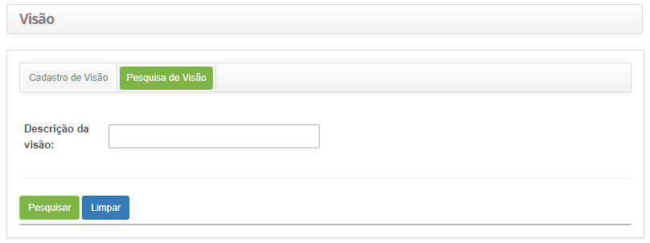
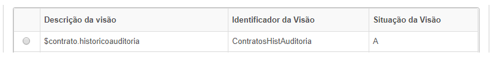
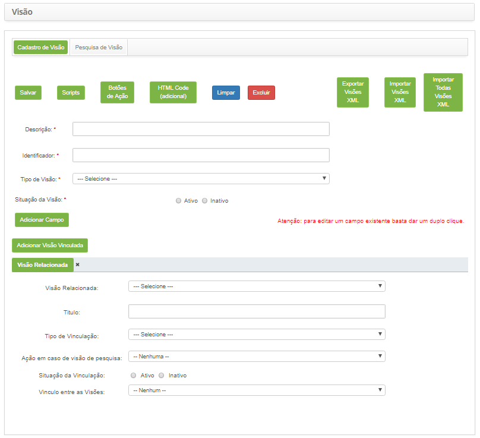
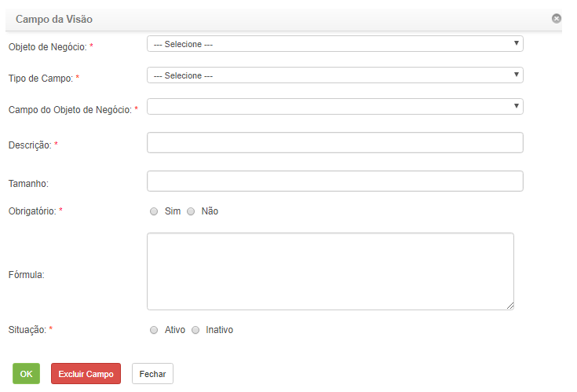
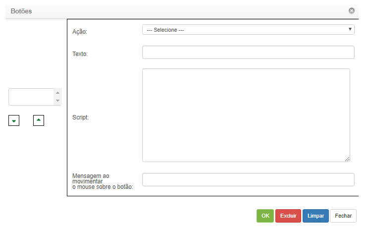

title: Manual de configuração de visões (meta dados)
Description: Esta funcionalidade tem por objetivo permitir a criação de visões (telas) diversas do sistema.
# Manual de configuração de visões (meta dados)

Esta funcionalidade tem por objetivo permitir a criação de visões (telas) diversas do sistema, com possibilidades de associação 
com visões vinculadas (subtelas).

Como acessar
--------------

1. Acesse a funcionalidade de manutenção de visões através da navegação no menu principal 
**Sistema > Visões e Meta dados > Manutenção de Visões**.

Pré-condições
----------------

1. Não se aplica.

Filtros
---------

1. O seguinte filtro possibilita ao usuário restringir a participação de itens na listagem padrão da funcionalidade, facilitando a 
localização dos itens desejados:

    - Descrição da Visão.
    
2. Na tela de **Visão**, clique na guia **Pesquisa de Visão**, será apresentada a tela de pesquisa conforme ilustrada na figura 
abaixo:

    
    
    **Figura 1 - Tela de pesquisa de visão**
    
3. Realize a pesquisa de visão. Informe a descrição da visão que deseja pesquisar e clique no botão "Pesquisar". Após isso, será 
exibido o registro conforme o nome informado. Caso deseje listar todos os registros de visão, basta clicar diretamente no botão 
"Pesquisar".

Listagem de itens
-------------------

1. Os seguintes campos cadastrais estão disponíveis ao usuário para facilitar a identificação dos itens desejados na listagem
padrão da funcionalidade: **Descrição da visão, Identificador da Visão** e **Situação da Visão**.

    
    
    **Figura 2 - Tela de listagem de visão**
    
2. Após a pesquisa, selecione o registro desejado. Feito isso, será direcionado para a aba de cadastro exibindo o conteúdo 
referente ao registro selecionado;

3. Para alterar os dados do registro de visão, basta modificar as informações desejadas e clicar no botão "Salvar".

Preenchimento dos campos cadastrais
-------------------------------------

1. Será apresentada a tela de **Cadastro de Visão**, conforme ilustrada na figura abaixo:

    
    
    **Figura 3 - Tela de cadastro de visões**
    
2. Preencha os campos conforme orientações abaixo:

    - **Descrição**: informe a descrição da visão (tela);
    - **Identificador**: informe o identificador na visão;
    - **Tipo de Visão**: selecione o tipo de visão;
    - **Situação da Visão**: informe a situação da visão se é Ativo ou Inativo.
    
3. Clique no botão "Adicionar Campo", para adicionar campos na visão (tela) que está sendo criada. Será aberta uma janela para 
escrever sobre o campo que deseja adicionar na visão;

    
    
    **Figura 4 - Campo da visão**
    
    - **Objeto de Negócio**: selecione o objeto do negócio (tabela do campo pertencente);
    - **Tipo de Campo**: selecione o tipo de campo;
    - **Campo do Objeto de Negócio**, selecione o campo do objeto de negócio (campo da tabela, referente ao campo que está sendo 
    criado);
    - **Descrição**: informe a descrição do campo;
    - **Tamanho**: informe o tamanho do campo;
    - **Obrigatório**: informe se o campo será de preenchimento obrigatório, marcando Sim ou Não;
    - **Fórmula**: descreva a fórmula do campo;
    - **Situação**: informe a situação do campo se é Ativo ou Inativo.
    
4. Clique no botão "Ok" para efetuar a inserção do campo na visão;

5. Caso queira editar ou excluir algum campo existente na visão, basta dar um duplo clique no campo desejado;

6. Será aberta a janela com a descrição sobre o campo;

7. Edite as informações que deseja e clique no botão "Ok" ou se desejar excluir, clique no botão "Excluir Campo" para exclusão
do campo da visão;

8. Clique no botão "Adicionar Visão Vinculada" para adicionar uma subtela na visão, caso queira;

9. Será aberta uma aba **Visão Relacionada** abaixo do botão "Adicionar Visão Vinculada", com campos para preenchimento conforme
segue abaixo:

    - Selecione a **visão** relacionada;
    - Informe o **título** da visão vinculada;
    - Selecione o **tipo** da vinculação;
    - Selecione a **ação** em caso de visão de pesquisa;
    - Informe a **situação** da vinculação;
    - Selecione o **vínculo** entre as visões.
    
10. Clique no botão "Botões de Ação" para adicionar botões na visão que está sendo criada;

11. Ao clicar no botão será aberta uma janela para descrever informações sobre o botão que deseja criar;

    
    
    **Figura 5 - Botões**
    
    - **Ação**: selecione a ação do botão;
    - **Texto**: informe o texto do botão;
    - **Script**: descreva o Script do botão;
    - **Mensagem ao movimentar o mouse sobre o botão**: informe uma mensagem que será exibida quando posicionar o mouse sobre o
    botão.
    
12. Clique no botão "Ok" para efetuar a inserção do botão na visão;

13. O botão "Fechar" serve para fechar a janela e retornar para tela de **Manutenção de Visões**.

14. Caso queria editar ou excluir algum botão existente na visão, clique no botão "Botões de Ação";

15. Será aberta a janela de botões;

16. Selecione o botão que deseja editar as informações ou excluí-lo;

17. Edite as informações que deseja e clique no botão "Ok" ou se desejar excluir clique no botão "Excluir" para exclusão do 
botão da visão;

18. Clique no botão "Salvar" para efetuar o cadastro da visão (tela);

19. O botão "Script" serve para incluir instruções/códigos JavaScript;

20. O botão "HTML Code (adicional)" serve para incluir instruções/códigos HTML.

!!! tip "About"

    <b>Product/Version:</b> CITSmart | 7.00 &nbsp;&nbsp;
    <b>Updated:</b>07/22/2019 – Larissa Lourenço

