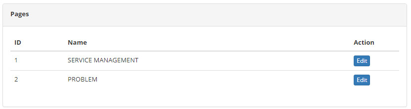
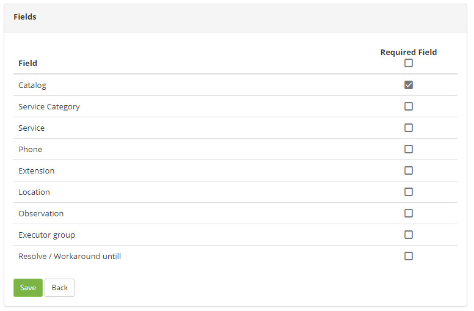

title: Mandatory fields configuration
Description: This functionality is intended to configure fields that may be required.
# Mandatory fields configuration

This functionality is intended to configure fields that may be required.

How to access
--------------

1. Access the field configuration feature by navigating in the main menu **System > Settings > Pages - Field configuration**.

Preconditions
---------------

1. No applicable.

Filters
---------

1. No applicable.

Items list
--------------------

1. The following cadastral fields are available to the user to facilitate the identification of the desired items in the standard 
feature listing: **ID** and **Name**.

2. There are action buttons available to the user for each item in the listing, they are: *Edit*.

**Figure 1 - Pages**

Filling in the registration fields
--------------------------------------

1. Click the *Edit* button (as shown in the previous figure). Once this is done, the screen for configuring the fields will be 
displayed, as shown in the following figure:

    
    
    **Figure 2 - Fields**
    
2. Check the field (s) that you wish to fill out.

3. Click the *Save* button to register, where the date, time and user will be saved automatically for a future audit.

!!! tip "About"

    <b>Product/Version:</b> CITSmart | 7.00 &nbsp;&nbsp;
    <b>Updated:</b>09/02/2019 – Larissa Lourenço
