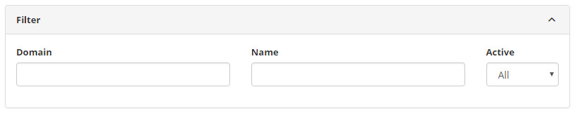
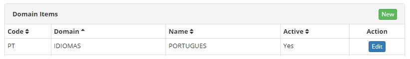
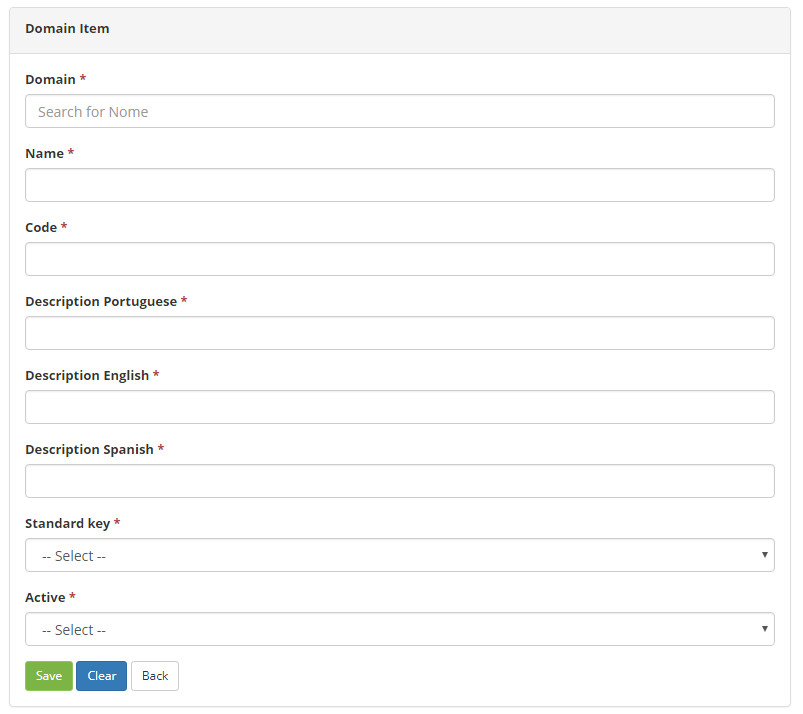

title: Domain Items registration and search
Description: The Domain Items functionality is intended to allow the customization of the field options of a particular screen.
# Domain Items registration and search

The Domain Items functionality is intended to allow the customization of the field options of a particular screen of the system. To 
use it, you should be aware of system coding.

How to access
-----------------

1. Access the domains itens feature navigating through the main menu **System > Domains Configuration > Domain Items**.

Preconditions
---------------

1. Have the domain registered (see knowledge [Domain registration and search](/en-us/citsmart-platform-7/plataform-administration/customizable-fields/register-domain.html)).

Filters
----------

1. The following filters enables the user to restrict the participation of items in the standard feature listing, making it easier 
to find the desired items:

    - Domain;
    - Name;
    - Active.
    
2. On the **Domains Items** screen, the domains item records listed are shown, as shown in the figure below:

    
    
    **Figure 1 - Domain items search**
    
3. To search for a specific domain item record, simply fill in the filters as needed.  

Items list
-------------------

1. The following cadastral fields are available to the user to facilitate the identification of the desired items in the standard 
feature listing: **Code, Domain, Name** and **Active**.

2. To change domain registration data, click the *Edit* button.

    
    
    **Figure 2 - Domains items list screen**
    
Filling in the registration fields
------------------------------------

1. Access the main menu After that, the Domain Items screen will be displayed;

2. Click the New button (as shown in figure 2). Once this is done, the corresponding **Domain Item Master** screen will be 
displayed, as shown in the figure below:

    
    
    **Figure 3 - Domain item master**
    
3. Fill in the fields as directed below:

    - **Domain**: inform the domain, in which you will insert the new item;
    - **Name**: enter the name of the domain item, that is, description of the option to be inserted in the field for the selected 
    domain;
    - **Code**: enter the code of the domain item;
    - **Description Portuguese**: enter the name of the domain name in Portuguese;
    - **Description English**: enter the name of the English domain name for insourcing;
    - **Description Spanish**: enter the name of the domain name in Spanish for insourcing;
    - **Default key**: tell whether the domain item is a default key;
    - **Active**: select the status of the domain item.
    
4. After the data is entered, click the *Save* button to perform the operation.

!!! tip "About"

    <b>Product/Version:</b> CITSmart | 7.00 &nbsp;&nbsp;
    <b>Updated:</b>02/09/2019 – Larissa Lourenço
