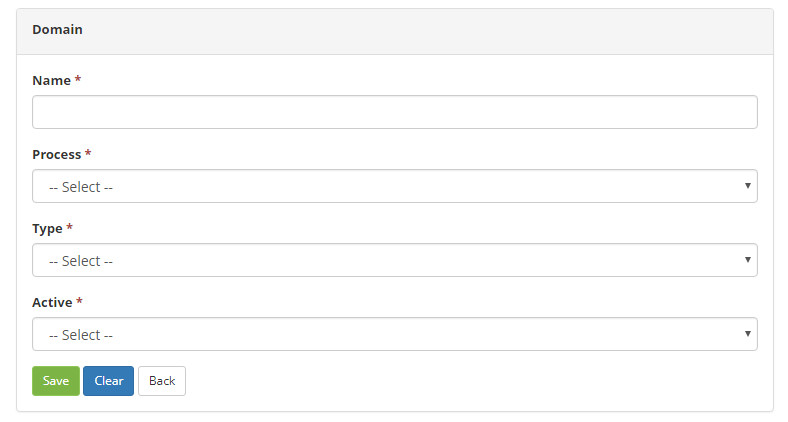

title: Domain registration and search
Description: The Domain feature is intended to allow the registration of domains for insertion of new domain items.
# Domain registration and search

The Domain feature is intended to allow the registration of domains for insertion of new domain items, that is, new options in the 
field of a particular screen of the system. To use it, you should be aware of system coding.

How to access
------------------

1. Access the main menu **System > Domain Configurations > Domains**.

Preconditions
-----------------

1. No applicable.

Filters
---------

1. The following filters enables the user to restrict the participation of items in the standard feature listing, making it easier 
to find the desired items:

    - Name;
    - Process;
    - Active.
    
2. In the **Domains** screen, the listed domain records are displayed, as shown in the figure below:

    
    
    **Figure 1 - Domains search screen**
    
3. To search for a specific domain registration, simply fill in the filters as needed.

Items list
-------------------

1. The following cadastral fields are available to the user to facilitate the identification of the desired items in the standard 
feature listing: **Name, Process** and **Active**.

    
    
    **Figure 2 - Domain listing screen**
    
2. There is an action button available to the user for each item in the listing, it is: *Edit*.

Filling in the registration fields
-------------------------------------

1. The **Domains** screen will be displayed. Click the *New* button. Once this is done, the respective **Domain Registration** 
screen will be displayed, as shown in the figure below:

    
    
    **Figure 3 - Domain registration**
    
2. Fill in the fields as follows:

    - **Name**: enter the domain name. It should have a relationship with some enumerated specified in the system code;
    - **Process**: select the process related to the domain;
    - **Type**: select the domain type;
    - **Active**: select the domain situation.
    
3. After the data is entered, click the *Save* button to perform the operation.

!!! tip "About"

    <b>Product/Version:</b> CITSmart | 7.00 &nbsp;&nbsp;
    <b>Updated:</b>08/03/2019 – Larissa Lourenço
