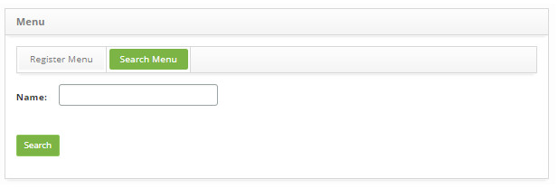
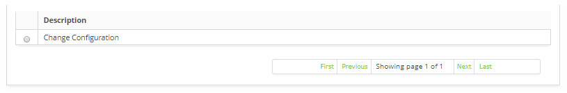
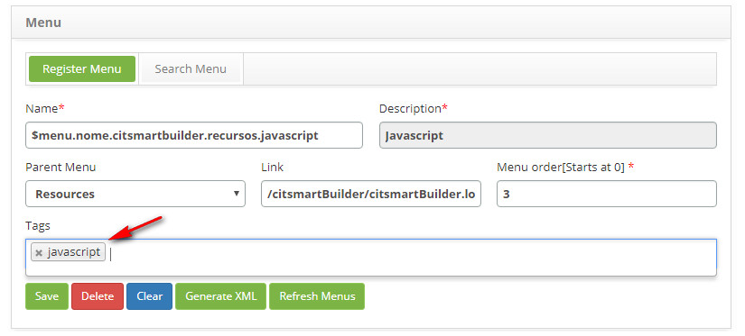
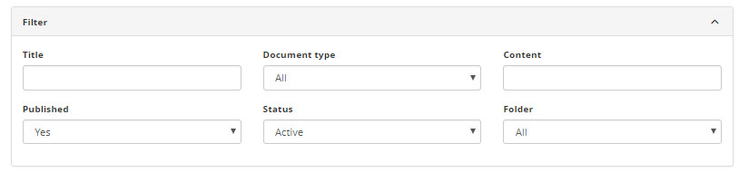
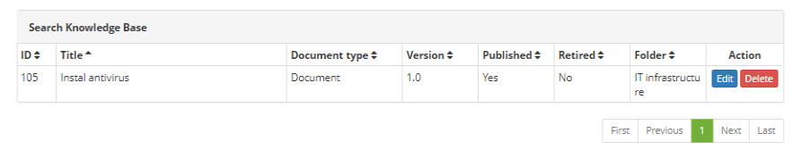
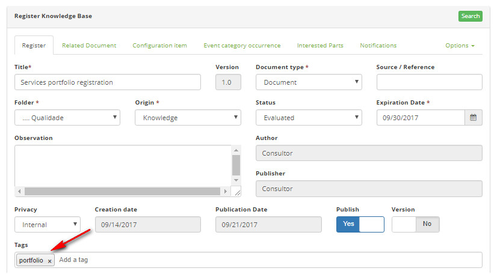
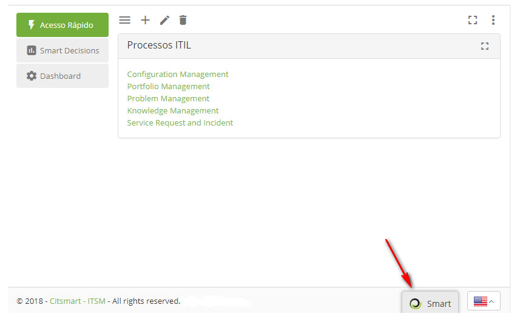
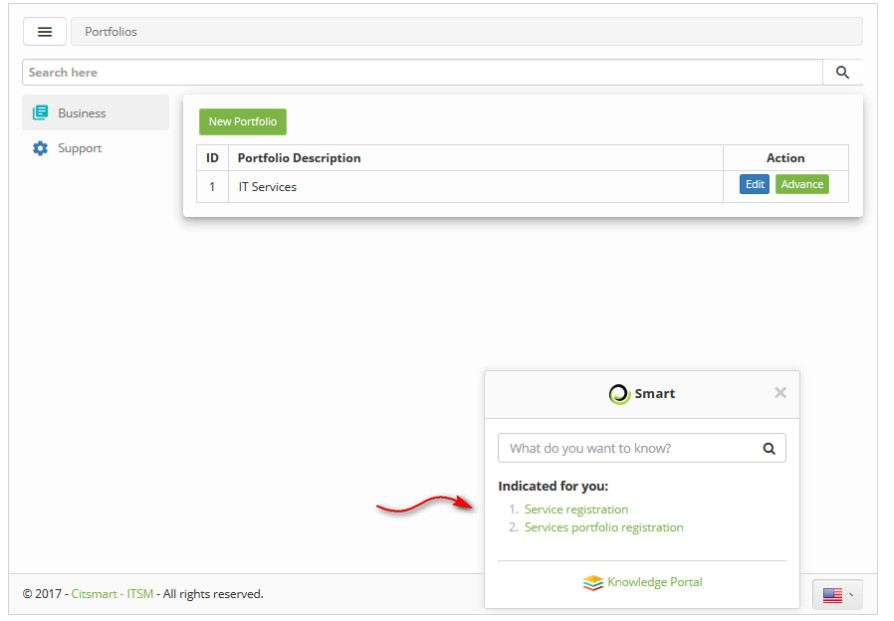

title:  Smart Button
Description: The Smart Button facilitates the search of knowledge related to a certain functionality. 
# Smart Button

The **Smart Button** facilitates the search of knowledge related to a certain functionality. This is why it is displayed in all 
system features.

When configuring the tags in the registry of the menu item of a certain functionality and in the registration of the knowledge 
related to the certain functionality, when navigating in the certain functionality and clicking on the Smart Button, the indicated 
knowledge regarding the functionality will be presented. The following is a step-by-step guide on how to configure these tags.

Preconditions
---------------

1. No applicable.

Filling in the registration fields
---------------------------------------

1. No applicable.

Configure the tags to use the Smart Button
--------------------------------------------------------

How to access
----------------

1. Go to main menu **General Registration > Menu**.

Filters
----------

1. The following filter enables the user to restrict the participation of items in the standard feature listing, making it easier 
to find the desired items:

    - Name.
    
    
    
    **Figure 1 - Menu search screen**
    
Items list
------------------

1. The following cadastral field is available to the user to facilitate the identification of the desired items in the standard 
feature listing: **Description**.

    
    
    **Figure 2 - Item listing screen**
    
Configuring the tags
------------------------

1. Configure the tags in the registry of the menu item of the given functionality;

    - On the **Menu Search** tab, search for the menu item record for the desired feature. Once this is done, the menu item record 
    will be displayed;
    - Enter the desired tags, as shown in the figure below:
    
    
    
    **Figure 3 - Menu item**
    
Seetting the referential knowledge tags to a given functionality
--------------------------------------------------------------------------------

How to access
--------------

1. Access the main menu **ITIL Processes > Knowledge Management > Knowledge Management**.

Filters
----------

1. The following filter enables the user to restrict the participation of items in the standard feature listing, making it easier 
to find the desired items:

    - Title;
    - Document Type;
    - Content;
    - Published;
    - Status;
    - Folder.
    
    
    
    **Figure 4 - Knowledge search screen**
    
Items list
---------------------

1. The following cadastral fields are available to the user to facilitate the identification of the desired items in the standard 
feature listing: **Title, Document type, Version, Published, Retired** and **Folder**.

2. There are action buttons available to the user for each item in the listing, they are: *Edit* and *Delete*.

**Figure 5 - Knowledge listing screen**

Configuring the tags
-----------------------

1. When you access the feature, the Knowledge Management screen will be displayed:

- Search for the desired knowledge;
- Enter the tag as it was entered in the feature menu entry record. The figure below illustrates an example:

**Figure 6 - Knowledge registry**

!!! warning "WARNING"

    When you configure the tags in the menu item record and in the knowledge record, you must wait for the synchronization time 
    (you may have to log out and log back in) so that the knowledge is displayed on the Smart Button.
    
Checking the tags of knowledge regarding certain functionality
---------------------------------------------------------------------------------------------

1. After setting the tags, when entering the certain functionality, just click on the **Smart Button** as indicated in the figure 
below:

    
    
    **Figure 7 - Smart button**
    
2. The indicated knowledge regarding the functionality will be presented, as shown in the figure below:

    
    
    **Figure 8 - Indicated knowledge**
    
3. To view the knowledge content, simply click on it.

!!! tip "About"

    <b>Product/Version:</b> CITSmart | 7.00 &nbsp;&nbsp;
    <b>Updated:</b>08/03/2019 - Larissa Lourenço
