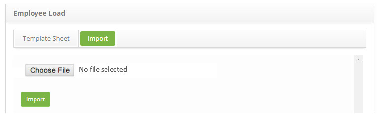

title: Employee import
Description: This functionality is intended to optimize the creation of new employee records.
# Employee import

This functionality is intended to optimize the creation of new employee records.

How to access
------------------

1. Access the employee load functionality by navigating the main menu **System > Import and Data Loading > Load of employee**.

Preconditions
----------------

1. No applicable.

Filters
----------

1. No applicable.

Items list
-------------------

1. No applicable.

Filling in the registration fields
-------------------------------------

1. The **Employee Load** screen for spreadsheet template record for import will be displayed, as shown in the figure below:

    
    
    **Figure 1 - Spreadsheet template registration screen for import**
    
 2. The template is structured according to the employee register, indicating the mandatory and optional fields that can be 
 excluded before generating the template.
 
 3. To generate ".xls" spreadsheet template, simply click the *Generate Model .xls* button;
 
 4. To generate spreadsheet template in ".xlsx" format, just click the *Generate Model .xlsx* button ;
 
 5. The worksheet template will have fill fields and some allowable value information.
 
Performing employee importation
---------------------------------------

1. In the **Employee Load** screen, in the **Import** tab, the respective screen is displayed, as shown below:

    
    
    **Figure 2 - Employee import**
    
2. Click the *Choose File* button and a window will appear to choose the file;

3. Select the file, which should be in ".xls" or ".xlsx;

4. Click the *Import* button;

5. The imported data can be viewed in the employee registration survey.

!!! info "IMPORTANT"

    When performing the import, if there is any inconsistency between the values adopted in the system and the values entered in 
    the worksheet, the system will display an alert.
    
!!! tip "About"

    <b>Product/Version:</b> CITSmart | 7.00 &nbsp;&nbsp;
    <b>Updated:</b>09/03/2019 – Larissa Lourenço
