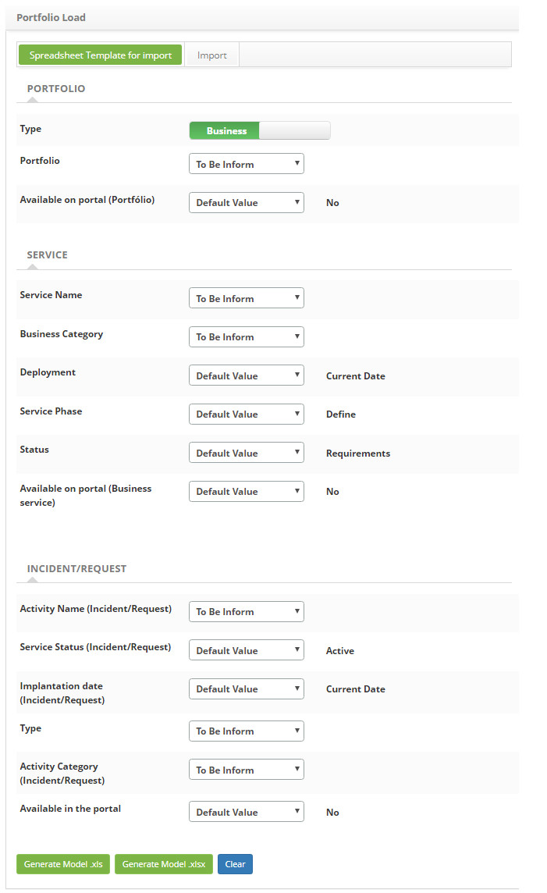
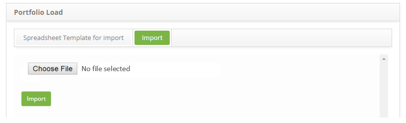

title: Service portfolio import
Description: The purpose of this functionality is to optimize the creation of various services and consequently their activities.
# Service portfolio import

The purpose of this functionality is to optimize the creation of various services and consequently their activities within one or 
more service portfolios.

How to access
-----------------

1. Access the service portfolio loading functionality by navigating the main menu 
**System > Import and Data Upload > Service Portfolio Upload**.

Preconditions
----------------

1. Create the type of service (see knowledge [Service Type registration and search](/en-us/citsmart-platform-7/processes/portfolio-and-catalog/type-service.html));

2. Create the category service (see knowledge Service [Category registration and search](/en-us/citsmart-platform-7/processes/portfolio-and-catalog/service-category.html)).

Filtros
---------

1. Not applicable.

Items list
-------------------

1. Not applicable.

Registering spreadsheet template for import - filling in the registration fields
---------------------------------------------------------------------------------------

1. The **Service Port Loading** screen will appear for spreadsheet template registration for import, as shown in the figure below:

    
    
    **Figure 1 - Spreadsheet template registration screen for import**
    
2. The spreadsheet for import is structured step by step to create a portfolio of services with the *Portfolio, Service* and *Activity* (*Incident/Request*) steps. According to the field, the values to be filled in can be:

    - **Default Value**: an already pre-defined default value will be displayed;
    - **To be Inform**: when generating the worksheet this field will be available for completion;
    - **Informed**: a field will be displayed to choose the value with which to fill.
    
    - Portfolio:
        - **Type**: select whether the portfolio type, which can be "Business" or "Support";
        - **Portfolio**: select the field fill option;
        - **Available on portal (Portfolio)**: select the option to fill the field.
        
    - Service:
        - **Service Name**: select the field fill-in option;
        - **Business Category**: select the field fill option;
        - **Deployment**: select the field fill option;
        - **Service Phase**: select the field fill option;
            - If the option chosen is "To inform", the option *Add classification fields* will be displayed. Only the 
            classification fields are required if the user enters the Service Phase field as "Analyze" and the Service Status as 
            "Analysis".
            - If the option chosen is "Informed", the phases to choose will be displayed. When entering the value, if the option 
            chosen for the phase is Analyze will be displayed the fields to select the desired option, as shown below:
        - **Status**: select the field fill option;
        - **Available on portal (Business Service)**: select the option to fill the field.
        
    - Incident/Request:
        - **Activity Name (Incident/Request)**: select the field fill option;
        - **Service Status (Incident/Request)**: select the option to fill the field;
        - **Implantation date (Incident/Request)**: select the field fill option;
        - **Type**: select the field fill option;
        - **Activity Category (Incident/Request)**: select the field fill option;
        - **Available in the Portal**: select field fill option.
        
3. To generate ".xls" spreadsheet template, simply click the *Generate Model .xls* button;

4. To generate spreadsheet template in ".xlsx" format, just click the *Generate Model .xlsx* button.

!!! note "NOTE"

    When generating spreadsheets regardless of format, the user will find fields with hyperlink. These fields retrieve the 
    enumerated reference with the field description. In these cases the user will use the enumerated one to fill the correct list.
    
Realizing service portfolio import
------------------------------------------------

1. In the Service Portfolio Load screen, in the Import tab, the respective screen is displayed, as shown below:

    
    
    **Figure 2 - Import of portfolio of services**
    
2. Click the *Choose File* button and a window will appear to choose the file;

3. Select the file, which should be in ".xls" or ".xlsx;

4. Click the *Import* button;

5. The imported data can be viewed in the Service Portfolio.

!!! info "IMPORTANT"

    When performing the import, if there is any inconsistency between the values adopted in the system and the values entered in 
    the worksheet, the system will display an alert.
    
!!! tip "About"

    <b>Product/Version:</b> CITSmart | 7.00 &nbsp;&nbsp;
    <b>Updated:</b>09/03/2019 – Larissa Lourenço
