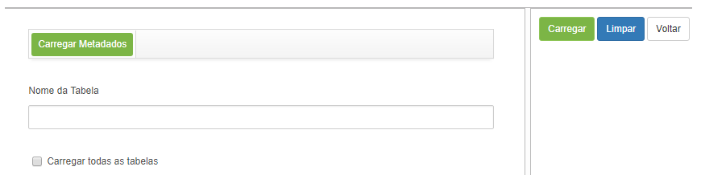
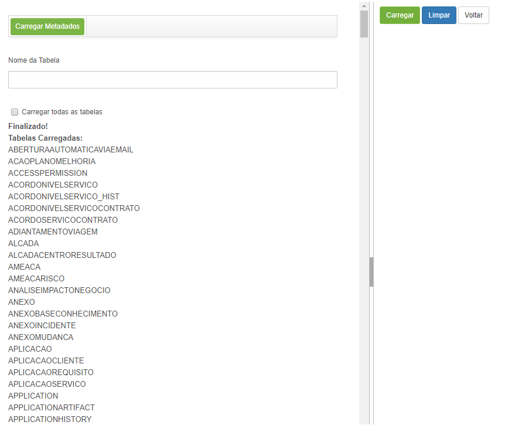

title: Carga de metadados
Description: Esta funcionalidade tem o objetivo de carregar as informações de tabelas do banco de dados.
# Carga de metadados

Esta funcionalidade tem o objetivo de carregar as informações de tabelas do banco de dados.

Como acessar
-------------

1. Acesse a funcionalidade de carregar meta dados através da navegação no menu principal 
**Sistema > Visões e Meta dados > Carrega Metadados**.

Pré-condições
---------------

1. Não se aplica.

Filtros
---------

1. Não se aplica.

Listagem de itens
-------------------

1. Não se aplica.

Preenchimento dos campos cadastrais
--------------------------------------

1. Não se aplica.

Carregando meta dados
----------------------

1. Será apresentada a tela onde poderá ser carregada as tabelas armazenadas no banco de dados, conforme ilustrada na figura abaixo:

    
    
    **Figura 1 - Tela de metadados**
    
2. Informe o **Nome da Tabela** e clique no botão "Carregar";

3. Será carregada a tabela, conforme o nome informado;

4. Se preferir carregar todos os meta dados, basta marcar o campo **Carregar todas as tabelas** e clicar no botão "Carregar". 
Serão carregadas todas as tabelas, conforme exemplo apresentado na figura abaixo:

**Figura 2 - Metadados**

!!! tip "About"

    <b>Product/Version:</b> CITSmart | 7.00 &nbsp;&nbsp;
    <b>Updated:</b>07/22/2019 – Larissa Lourenço
