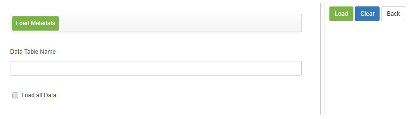
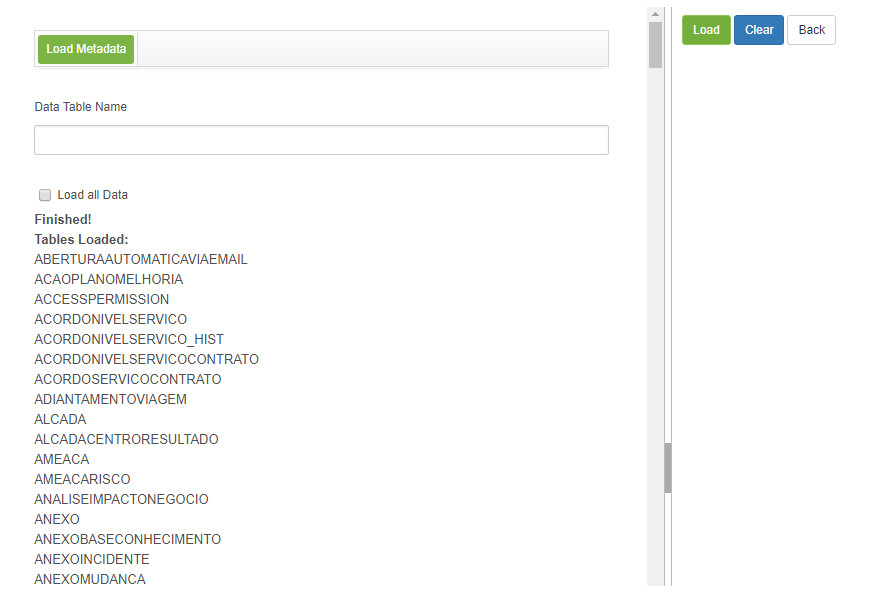

title: Metadata loading
Description: This functionality is intended to load the information from database tables.
# Metadata loading

This functionality is intended to load the information from database tables.

How to access
-----------------

1. Access the functionality of loading metadata through navigation in the main menu 
**System > Visions and Metadata > Load Metadata**.

Preconditions
---------------

1. Not applicable.

Filters
---------

1. Not applicable.

Items list
-------------------

1. Not applicable.

Filling in the registration fields
--------------------------------------

1. Not applicable.

Loading Metadata
----------------------

1. The screen will be displayed where you can load the tables stored in the database, as shown in the figure below:

    
    
    **Figure 1 - Metadata screen**
    
2. Enter the **Name of the Table** and click the *Load* button;

3. The table will be loaded, according to the name entered;

4. If you prefer to load all the metadata, simply check the **Load all tables field** and click on the *Load* button. All tables 
will be loaded, as shown in the figure below:

**Figure 2 - Metadata**

!!! tip "About"

    <b>Product/Version:</b> CITSmart | 7.00 &nbsp;&nbsp;
    <b>Updated:</b>09/03/2019 – Larissa Lourenço
