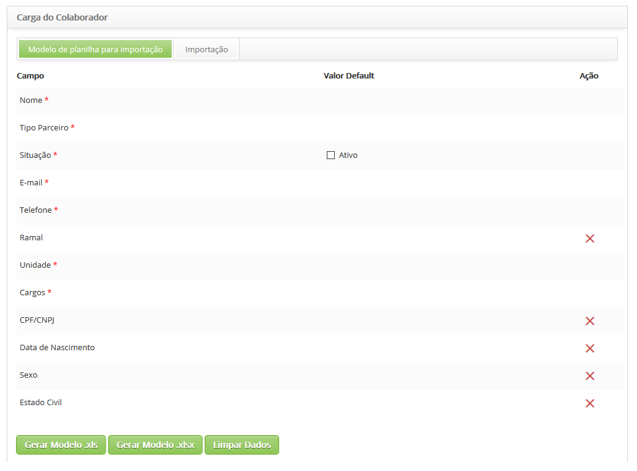
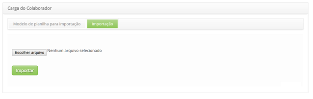

title: Importing
Description: This functionality is intended to optimize the creation of new employees registration.
# Importing

This functionality is intended to optimize the creation of new employees registration.

Registering spreadsheet template for importing
---------------------------------------------

1.  Access the functionality of employee load through the mani navigation menu 
(**System > Data Importing and Loading > Employee Load**). After that, it'll be presented the screen of **Employee Load** to
register spreadsheet template to importing, according to the figure below:

    
    
    **Figure 1 - Screen of spreadsheet template registration for importing**
    
2. The template is structured according to the employee registration, indicating the required and optional fields that are possible to delete before generating the spreadsheet template.

3. To create the spreadsheet template in ".xls", just click on "Generate .xls template";

4. To create the spreadsheet template in ".xlsx", just click on "Generate .xlsx template";

5. The spreadsheet template will have fields to complete, and some allowed value information.

Importing employee
------------------

1. In the screen of **Employee load**, the tab **Import**, will present its screen, according to the figure below:

    
    
    **Figure 2 - Employee Importing**
    
2. Click on "Choose file" and will be presented the window to choose the file;

3. Select the file, which have to be ".xls" or ".xlsx;

4. Click on "Import";

5. Imported data can be viewed in the employee registration search.

!!! info "IMPORTANT"

    When importing, if there are any inconsistencies between the values adopted in the system and the values informed in the            
    spreadsheet, the system will display an alert.
    
!!! tip "About"

    <b>Product/Version:</b> CITSmart | 7.00 &nbsp;&nbsp;
    <b>Updated:</b>07/22/2019 – Larissa Lourenço
