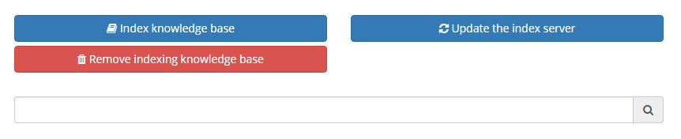
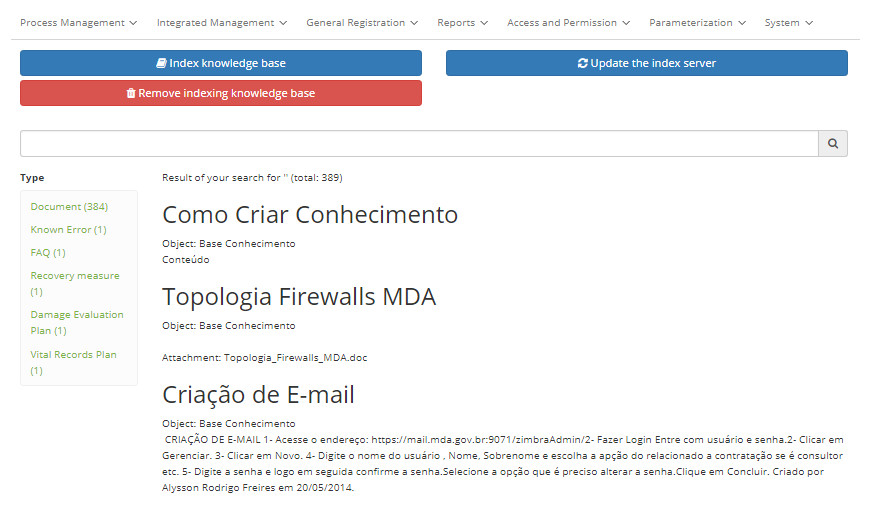

title:  Knowledge Indexing
Description: The Knowledge Indexing functionality aims to create indexes. 
# Knowledge Indexing

The Knowledge Indexing functionality aims to create indexes, that is, to know the content of the knowledge published in the 
knowledge base, identifying terms that represent its subject, to refer them and ensure a precise return of knowledge, when 
searched.

How to access
---------------

1. Access the main menu **System > Configuration > Knowledge Management [Indexing]**.

Preconditions
-----------------

1. Configure the parameters bellow (see knowledge [Parameterization rules - knowledge][1]):

- Parameter 304;
- Parameter 308;
- Parameter 332.

Indexing knowledge
----------------------------

1. After that, the screen for **Indexing Knowledge** will be displayed, as shown in the figure below:

    
    
    **Figure 1 - Knowledge indexing screen**
    
2. Click the *Index knowledge base* button and confirm the operation to index knowledge published in the Knowledge Base. After 
this, the knowledge that has been indexed will be displayed, as shown in the figure below:

    
    
    **Figure 2 - Indexed knowledge**
    
    !!! info "IMPORTANT"
    
        The amount of knowledge as configured in the parameter "Total items to be imported at a time when indexing documents in 
        Solr (Ex: 1000)" will be indexed.
        
3. To remove knowledge indexing, simply click the *Remove indexing knowledge base* button and confirm the operation.

!!! note "NOTA"

    When publishing new knowledge, it is not necessary to remove the current indexing and index again, the procedure is automatic.
    
!!! tip "About"

    <b>Product/Version:</b> CITSmart | 7.00 &nbsp;&nbsp;
    <b>Updated:</b>03/09/2019 - Larissa Lourenço

[1]:/en-us/citsmart-platform-7/plataform-administration/parameters-list/parametrization-knowledge.html
