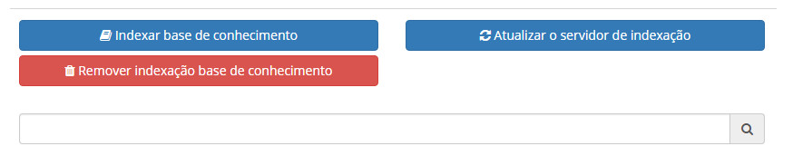
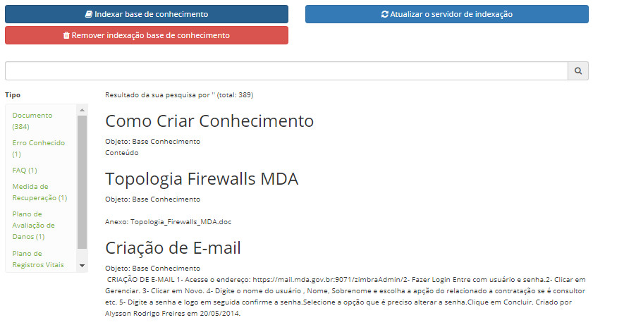

title:  Indexação de conhecimentos
Description: A funcionalidade de Indexação de Conhecimentos tem por objetivo criar índices. 
# Indexação de conhecimentos

A funcionalidade de Indexação de Conhecimentos tem por objetivo criar índices, ou seja, conhecer o conteúdo dos conhecimentos 
publicados na base de conhecimento, identificando termos que representem seu assunto, para referenciá-los e garantir um retorno
preciso do conhecimento, quando pesquisado.

Como acessar
---------------

1. Acesse o menu principal **Sistema > Configurações > Gerência do Conhecimento [Indexação]**.

Pré-condições
-----------------

1. Configure os parâmetros abaixo (ver conhecimento [Regras de parametrização - conhecimento][1]):

- Parâmetro 304;
- Parâmetro 308;
- Parâmetro 332.

Indexando conhecimentos
----------------------------

1. Será apresentada a tela para **Indexação de Conhecimentos**, conforme ilustrada na figura abaixo:

    
    
    **Figura 1 - Tela de indexação de conhecimentos**
    
2. Clique no botão "Indexar Base de Conhecimento" e confirme a operação para realizar a indexação dos conhecimentos publicados na 
Base de Conhecimento. Após isso, serão exibidos os conhecimentos que foram indexados, conforme exemplo ilustrado na figura abaixo:

    
    
    **Figura 2 - Conhecimento indexado**
    
    !!! info "IMPORTANTE"
    
        Será indexado a quantidade de conhecimentos conforme configurado no parâmetro “Total de itens a serem importados por vez ao 
        indexar documentos no Solr (Ex: 1000)”.
        
3. Para remover a indexação dos conhecimentos, basta clicar no botão "Remover Indexação de Base de Conhecimento" e confirmar a
operação.

!!! note "NOTA"

    Ao publicar novos conhecimentos, não é necessário remover a indexação atual e indexar novamente, o procedimento é automático.
    
!!! tip "About"

    <b>Product/Version:</b> CITSmart | 7.00 &nbsp;&nbsp;
    <b>Updated:</b>08/05/2019 - Larissa Lourenço

[1]:/pt-br/citsmart-platform-7/plataform-administration/parameters-list/parametrization-knowledge.html
