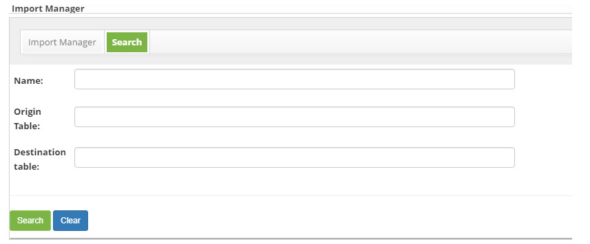
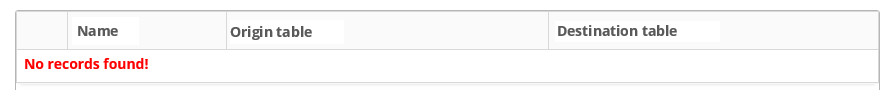
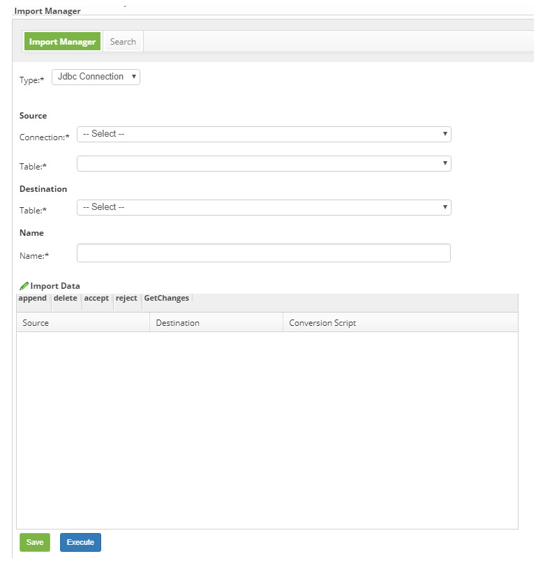

title: Import Management (execution)
Description: Import Management (execution)
# Import Management (execution)

How to access
----------------

1. Access the import management functionality through navigation in the main menu **System > Import Management**.

Preconditions
----------------

1. Not applicable.

Filters
---------

1. The following filters enables the user to restrict the participation of items in the standard feature listing, making it easier 
to find the desired items:

    - Name;
    - Origin Table;
    - Destination table.
    
2. The screen for **Import Management** will be displayed, as shown in the figure below:

    
    
    **Figure 1 - Import management**
    
3. Perform import search;

    - Enter the name, source table, and/or import target table and click the *Search* button. After this, the record will be 
    displayed according to the data entered;
    
    - If you want to list all import records, simply click the *Search* button directly.
    
Items list
--------------------

1. The following cadastral fields are available to the user to facilitate the identification of the desired items in the standard 
feature listing: **Name, Origin Table** and **Destination table**.

    
    
    **Figure 2 - Import listing screen**
    
2. After the search, select the desired record. Once this is done, it will be directed to the registration tab displaying the 
contents of the selected record;

3. To change the import data, simply modify the desired information and click the *Save* button;

Filling in the registration fields
-------------------------------------

1. The **Import Management** screen will be displayed, as shown in the figure below:

    
    
    **Figure 3 - Import management**
    
2. Fill in the fields as directed below:

    - **Type**: select the type of import;
    
3. Enter the Import Source data:

    - **Connection**: select the connection;
    - **Table**: select the table;
    
4. Enter Import Destination data:

    - **Table**: select the table;
    - **Name**: enter the name of the import;
    
5. Enter the data for Import:

    - Click **append**;
    - Will be listed some fields below to fill;
    - Enter **source, destination**, and **conversion** script for import;
    
6. Click the *Execute* button to run the data import;

7. Click on the *Save* button to register, in this case the date, time and user will be stored automatically for a future audit.

!!! tip "About"

    <b>Product/Version:</b> CITSmart | 7.00 &nbsp;&nbsp;
    <b>Updated:</b>03/09/2019 – Larissa Lourenço
