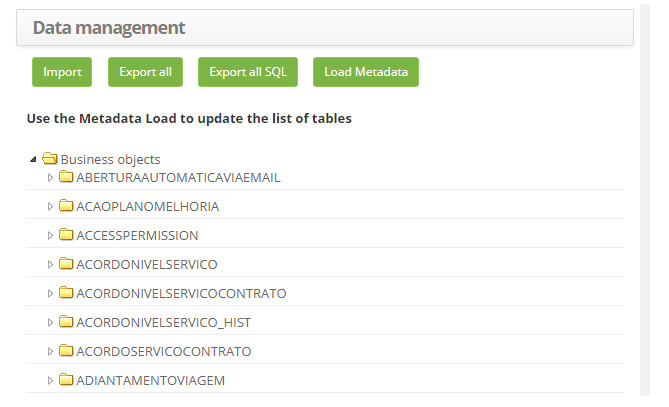
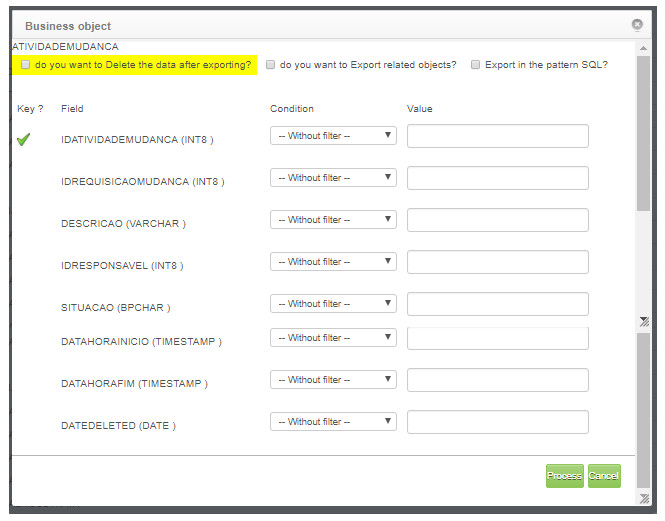
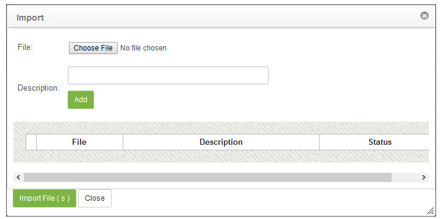

title: Data Management (import and export)
Description: The goal is to generate export and import data from the system tables.
# Data Management (import and export)

The goal is to generate export and import data from the system tables.

How to access
-----------------

1. Access the data management functionality through navigation in the main menu **System > Database > Data Management**.

Data management
-----------------------

1. The **Data Management** screen containing a listing of the system tables will be displayed, as shown in the figure below:

    
    
    **Figure 1 - Data management**
    
2. To generate export of the system tables in ".XML" format, simply click the *Export all* button, where all the system tables will 
be exported in the relevant format.

3. To generate export of the system tables in ".SQL" format, simply click the *Export all SQL* button, where all the system tables 
will be exported with the SQL commands.

4. If you want to export a table, proceed as follows:

    - Double-click the desired table;
    - A window will open displaying the data in the table (see figure below);
    - If you want to delete the table after export, check the referring field;
    - If you want to export related objects, check the referring field;
    - If you want to export the table in the SQL standard, check the referring field;
    - If necessary, you can enter a condition and value for the table fields;
    - Click the *Edit* button to perform the table export.
    
    
    
    **Figure 2 - Business object configuration screen**
    
5. If you want to export a field from a table, proceed as follows:

    - Click the table icon  to display the table fields;
    - Double-click in the table field;
    - A business object screen will be opened for the table field identical to the previous figure.
    - If you want to delete the field after export, check the referring field;
    - If you wanted to export related objects, check the referring field;
    - If you want to export the field in the SQL standard, check the referring field;
    - Click the *Edit* button to perform the table field export.
    
6. To perform the data import, click on the *Import* button, where a window will be displayed to upload files;

    
    
    **Figure 3 - Import**
    
    - Click the *Choose File* button;
    - Select the file, which was exported;
    - Please provide a description for it, if necessary;
    - Click *Add*, and then click *Import File (s)*.
    
!!! tip "About"

    <b>Product/Version:</b> CITSmart | 7.00 &nbsp;&nbsp;
    <b>Updated:</b>03/09/2019 – Larissa Lourenço
