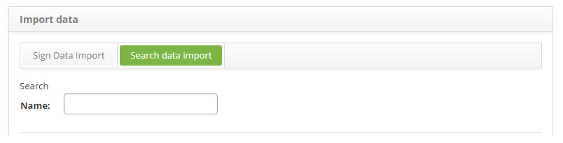
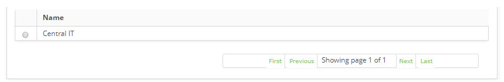
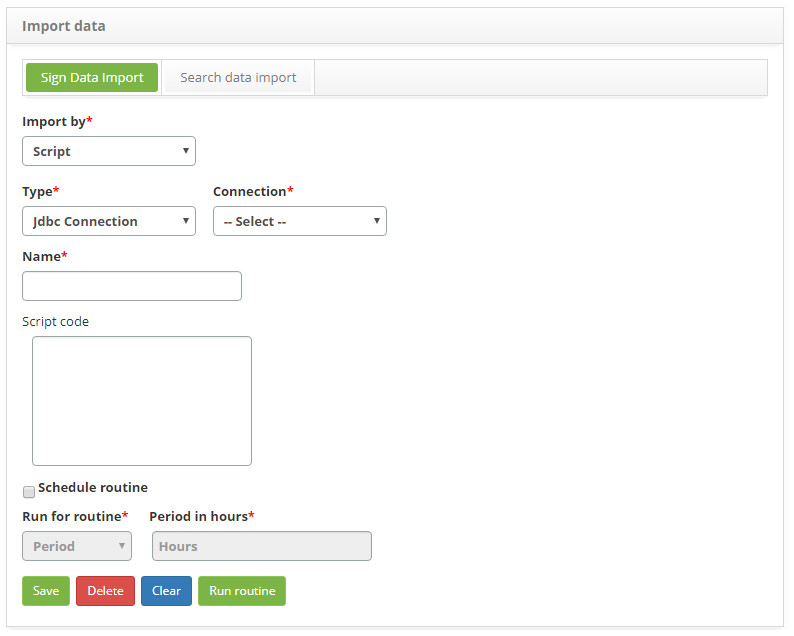
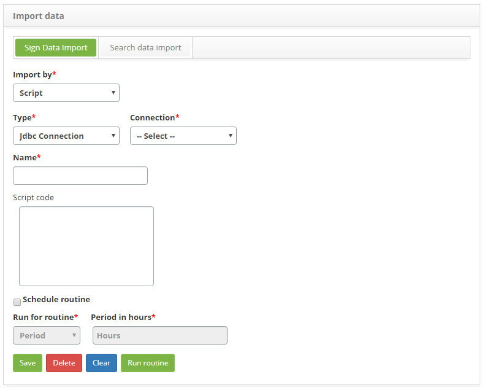
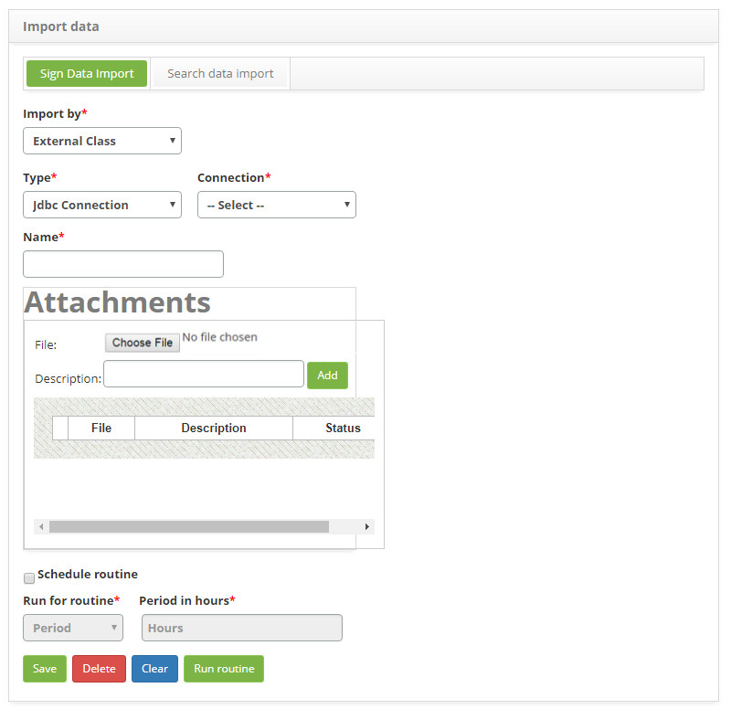
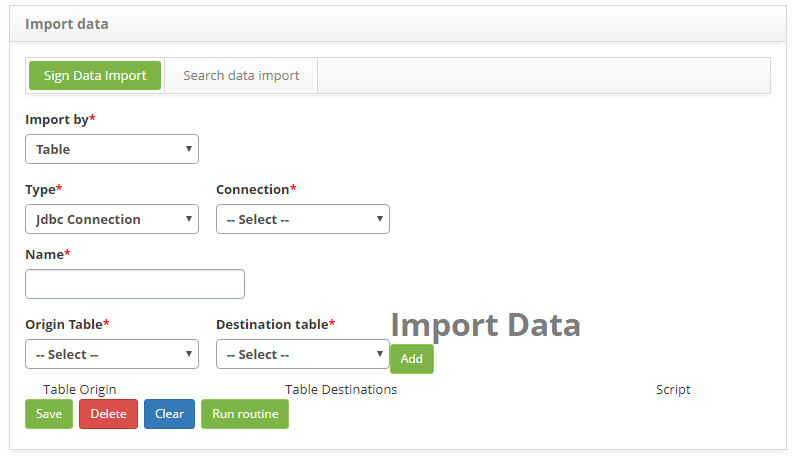

title: Data import registration and search
Description: The purpose of this functionality is to perform the import of data from another database to the CITSmart database.
# Data import registration and search

The purpose of this functionality is to perform the import of data from another database to the CITSmart database.

How to access
----------------

1. Access the data import feature by navigating in the main menu **System > Import and Data load > Import Data**.

Preconditions
---------------

1. Knowledge in programming and database;

2. Sign up for an external link (see knowledge [External database connections setup guide](/en-us/citsmart-platform-7/plataform-administration/database/register-external-connections.html)).

Filters
------------

1. The following filter enables the user to restrict the participation of items in the standard feature listing, making it easier 
to find the desired items:

    - Name.
    
2. On the **Data Import** screen, click the **Data Import Search** tab, the search screen will be displayed as shown in the figure 
below:

    
    
    **Figure 1 - Data import search screen**
    
3. Perform data import search;

4. Enter the name of the data import you want to search and click the *Search* button. After this, the record will be displayed 
according to the name entered. If you want to list all the view records, simply click the *Search* button directly.

Items list
--------------------

1. The following cadastral field is available to the user to facilitate the identification of the desired items in the standard 
feature listing: **Name**.

    
    
    **Figure 2 - Data import listing screen**
    
2. After searching, select the desired record. Once this is done, it will be directed to the registration tab displaying the 
contents of the selected record;

3. To change the import data record data, simply modify the desired information and click on the *Save* button.

Filling in the registration fields
------------------------------------

1. This, the **Data Import** screen for the data import register will be displayed, as shown in the figure below:

    
    
    **Figure 3 - Data import by script**
    
2. In the **Import By** field, select the import form, which can be **Script, External Class** or **Table**;

3. If the form of import is by **Script**, proceed according to the steps described below:

    
    
    **Figure 4 - Data import by script**
    
    - **Type**: select the type of import;
    - **Connection**: select the connection;
    - **Name**: enter the name of the import;
    - **Script code**: enter the javascript code based on the technology specification of Mozilla Rhino;
    
4. If desired, select the option to **Schedule Routine**, where you can perform this routine for the period or time informed;

5. If the form of importation is by **External Class**, proceed according to the steps described below:

    
    
    **Figure 5 - Importing data by external class**
    
    - **Type**: select the type of import;
    - **Connection**: select the connection;
    - **Name**: enter the name of the import;
    
6. In the **Attachments** screen: through *Choose file*, choose one or more files of type .jar and name it with a Description, 
after clicking *Add*, remembering that the files will be executed according to the insertion order;

7. If desired, select the option to **Table**, where you can perform this routine for the period or time informed;

8. If the form of importation is by **Table**, proceed according to the steps described below:

    
    
    **Figure 6 - Import of data by table**
    
    - **Type**: select the type of import;
    - **Connection**: select the connection;
    - **Name**: enter the name of the import;
    - **Origin table**: select the source table, that is, the table of the selected connection that contains the data that will be 
    imported;
    - **Destination Table**: select the destination table, that is, the table that will receive the migration information;
    
9. After choosing the tables, your data should be added for import, and if necessary, through the field Script can treat the 
columns if they are not of the same data type;

10. Click the *Run routine* button to run the data import;

11. Click the *Save* button to register, in which case the date, time and time will be automatically stored for a future audit.

!!! tip "About"

    <b>Product/Version:</b> CITSmart | 7.00 &nbsp;&nbsp;
    <b>Updated:</b>09/03/2019 – Larissa Lourenço
