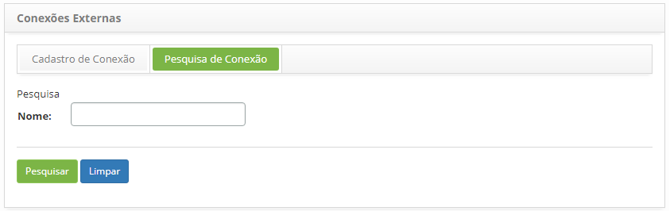
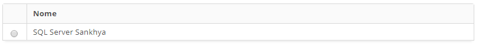
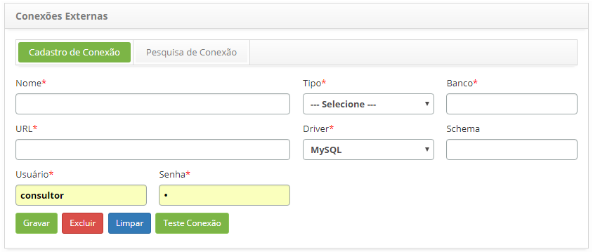

title: Manual de configuração de conexões externas de banco de dados
Description: Finalidade: Permitir a criação de conexões com outros bancos de dados seja ele interno ou externo.
# Manual de configuração de conexões externas de banco de dados

Finalidade: Permitir a criação de conexões com outros bancos de dados seja ele interno ou externo.

Como acessar
--------------

1. Acesse a funcionalidade de conexão externa através da navegação no menu principal **Sistema > Conexões Externas**.

Pré-condições
----------------

1. Não se aplica.

Filtros
----------

1. O seguinte filtro possibilita ao usuário restringir a participação de itens na listagem padrão da funcionalidade, facilitando a 
localização dos itens desejados:

    - Nome.
    
2. Na tela de **Conexões Externas**, clique na guia **Pesquisa de Conexão**, será apresentada a tela de pesquisa conforme ilustrada
na figura abaixo:

    
    
    **Figura 1 - Tela de pesquisa de conexão externa**
    
3. Realize a pesquisa de conexão externa;

4. Informe o nome da conexão externa que deseja pesquisar e clique no botão "Pesquisar". Após isso, será exibido o registro
conforme o nome informado. Caso deseje listar todos os registros de conexões externas, basta clicar diretamente no botão "Pesquisar".

Listagem de itens
-------------------

1. O seguinte campo cadastral está disponível ao usuário para facilitar a identificação dos itens desejados na listagem padrão da 
funcionalidade: **Nome**.

    
    
    **Figura 2 - Tela de listagem de conexão externa**
    
2. Após a pesquisa, selecione o registro desejado. Feito isso, será direcionado para a aba de cadastro exibindo o conteúdo 
referente ao registro selecionado;

3. Para alterar os dados do registro da conexão externa, basta modificar as informações desejadas e clicar no botão "Gravar".

Preenchimento dos campos cadastrais
-------------------------------------

1. Será apresentada a tela **Conexões Externas**, para realização do cadastro de conexão externa, conforme ilustrada na figura 
abaixo:

    
    
    **Figura 3 - Tela de cadastro de conexões externas**
    
2. Preencha os campos conforme orientações abaixo:

    - **Nome**: informe a nome da conexão;
    - **Tipo**: selecione o tipo de conexão:
        - JDBC;
    - **Banco**: informe o nome do banco de dados;
    - **URL**: informe a URL do banco de dados;
    - **Driver**: informe o driver do banco de dados:
        - MySQL;
        - Oracle;
        - MS-SQLServer;
        - PostgreSQL.
    - **Schema**: informe o esquema do banco de dados;
    - **Usuário**: informe o usuário para login no banco de dados;
    - **Senha**: informe a senha para login no banco de dados.
    
3. Após o preenchimento dos campos, clique no botão "Teste Conexão" para verificar se a conexão foi estabelecida com sucesso;

4. Clique no botão "Gravar" para efetuar o registro, onde a data, hora e usuário serão armazenados automaticamente para uma 
futura auditoria.

    !!! note "NOTA"
    
        É  apresentado a seguinte mensagem caso os dados do campo Url, Usuário e Senha não forem válidos: "Dados incorretos e/ou 
        Banco inacessível! Deseja salvar assim mesmo?".
        
5. Será exibida uma mensagem confirmando o sucesso do registro da conexão externa.

!!! tip "About"

    <b>Product/Version:</b> CITSmart | 7.00 &nbsp;&nbsp;
    <b>Updated:</b>07/22/2019 - Larissa Lourenço
