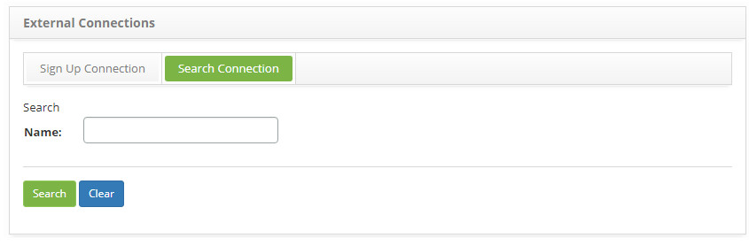
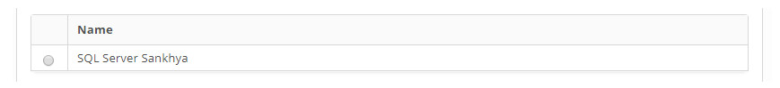
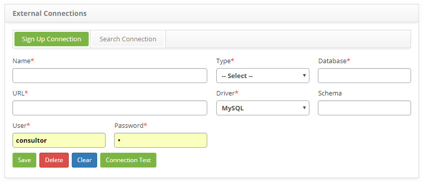

title: External database connections setup guide
Description: The purpose of this functionality is to allow the creation of connections to other (internal or external) databases.
# External database connections setup guide

The purpose of this functionality is to allow the creation of connections to other (internal or external) databases.

How to access
-----------------

1. Access the external connection functionality through navigation in the main menu **System > External Connections**.

Preconditions
----------------

1. Not applicable.

Filters
----------

1. The following filter enable the user to restrict the participation of items in the standard feature listing, making it easier to 
locate the desired items as shown in the figure below:

    - Name.
    
2. On the External Connections screen, click the Connection Search tab, the search screen will be displayed as shown in the figure 
below:

    
    
    **Figure 1 - External connection search screen**
    
3. Perform the external connection search;

4. Enter the name of the external connection you want to search and click the *Search* button. After this, the record will be 
displayed according to the name entered. If you want to list all external connection records, simply click the *Search* button 
directly;

Items list
-------------------

1. The following cadastral field is available to the user to make it easier to identify the desired items in the standard feature 
listing: **Name**.

    
    
    **Figure 2 - External connection listing screen**
    
2. After searching, select the desired record. Once this is done, it will be directed to the registration tab displaying the 
contents of the selected record;

3. To change the external connection registration data, simply modify the desired information and click the *Save* button.

Filling in the registration fields
-------------------------------------

1. The **External Connections** screen will be displayed, to perform the external connection register, as shown in the figure 
below:

    
    
    **Figure 3 - External connections registration screen**
    
2. Fill in the fields as directed below:

    - **Name**: enter the name of the connection;
    - **Type**: select the connection type:
        - JDBC;
    - **Database**: enter the name of the database;
    - **URL**: report to database link;
    - **Driver**: enter the driver:
        - MySQL;
        - Oracle;
        - MS-SQLServer;
        - PostgreSQL.
    - **Schema**: enter the database schema;
    - **User**: inform the database login user;
    - **Password**: enter the database login password;
    
3. After completing the fields, click the *Connection Test* button to verify that the connection is established successfully;

4. Click the *Save* button to register, where the date, time and user will be stored automatically for a future audit.

    !!! note "NOTE"
    
        The following message is displayed if the data in the Url, User and Password field are not valid: "Incorrect data and/or 
        database inaccessible! Do you want to save anyway?".
        
5. A message confirming the successful registration of the external connection will be displayed.

!!! tip "About"

    <b>Product/Version:</b> CITSmart | 7.00 &nbsp;&nbsp;
    <b>Updated:</b>09/03/2019 - Larissa Lourenço
