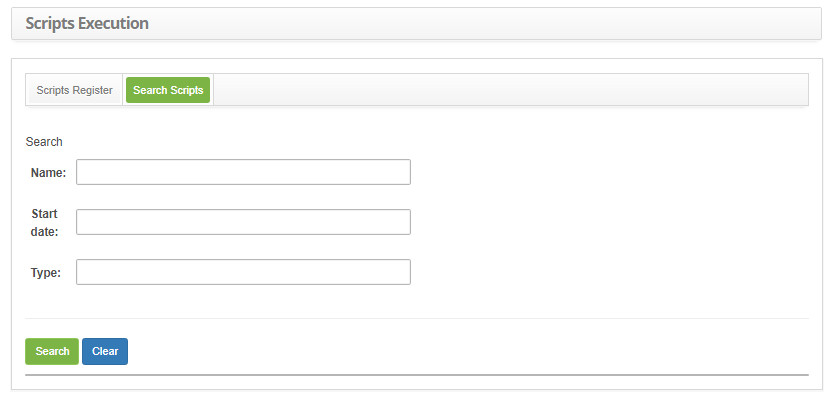
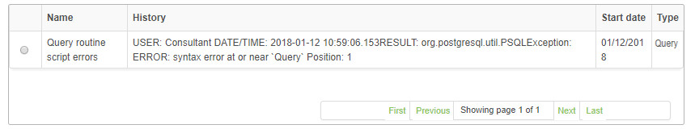
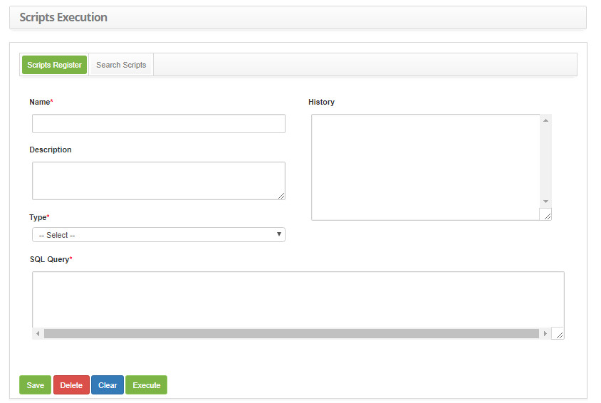

title: Script Registration and Search
Description: The goal is to keep track of scripts for running them on the system.
# Script Registration and Search

The goal is to keep track of scripts for running them on the system.

How to access
--------------

1. Access the scripting functionality by navigating in the main menu **System > Database > Scripts Execution**.

Preconditions
----------------

1. Not applicable.

Filters
----------

1. The following filters enable the user to restrict the participation of items in the standard feature listing, making it easier 
to locate the desired items as shown in the figure below:

    - Name;
    - Start date;
    - Type.
    
2. On the **Scripts** screen, click the **Scripts Search** tab, the search screen will be displayed as shown in the figure below:

    
    
    **Figure 1 - Scripting search screen**
    
3. Perform scripting search;

    - Enter the name, start date and/or type of the script and click the *Search* button. After that, the record will be displayed 
    according to the data entered.
    - If you want to list all the script records, simply click the *Search* button directly.
    
Items list
-------------------

1. The following cadastral fields are available to the user to make it easier to identify the desired items in the standard feature 
listing: **Name, History, Start date** and **Type**.

    
    
    **Figure 2 - Scripts listing screen**
    
2. After searching, select the desired record. Once this is done, it will be directed to the registration tab displaying the 
contents of the selected record;

3. To change the script template data, simply modify the information you want and click the *Save* button.

Filling in the registration fields
-------------------------------------

1. The **Script Registration** screen will be displayed, as shown in the figure below:

    
    
    **Figure 3 - Scripting registration**
    
2. Fill in the fields as directed below:

    - **Name**: enter the name of the Script;
    - **Description**: enter the description of the Script;
    - **Type**: enter the type of Script to run;
    - **SQL Query**: enter the SQL command;
    
3. Click the *Save* button to register, where the date, time and user will be saved automatically for a future audit;

4. After registering the Script, click the *Execute* button to execute the Script, where you will see the execution result in the 
**History** field.

!!! tip "About"

    <b>Product/Version:</b> CITSmart | 7.00 &nbsp;&nbsp;
    <b>Updated:</b>09/03/2019 – Larissa Lourenço
