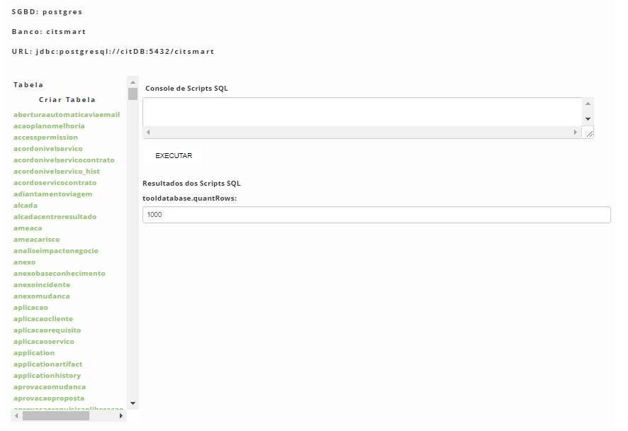
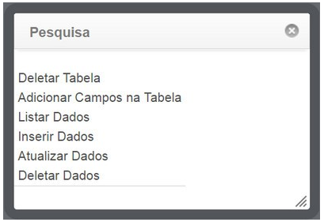

title: Ferramenta de base de dados (criação de tabelas e campos)
Description: O objetivo é manter registro de scripts para a execução dos mesmos no sistema.
# Ferramenta de base de dados (criação de tabelas e campos)

O objetivo é manter registro de scripts para a execução dos mesmos no sistema.

Como acessar
--------------

1. Acesse a funcionalidade de ferramenta de base de dados através da navegação no menu principal 
**Sistema > Banco de Dados > Ferramenta Base Dados**.

Ferramenta de base de dados
-----------------------------

1. Será apresentada a Ferramenta de Base de Dados contendo as informações do SGBD, Banco e URL em que está sendo utilizado e uma
listagem das tabelas do sistema, conforme ilustrada na figura abaixo:

    
    
    **Figura 1 - Ferramenta base dados**
    
2. Com essa ferramenta é possível criar e associar novas tabelas e campos ao sistema.

Criando tabela
----------------

1. Na Ferramenta Base Dados, clique em "Criar Tabela";

2. Será inserida uma linha de comando SQL na área de Console de Scripts SQL para criação da tabela;

3. Informe os dados necessários e clique no botão "Executar";

4. Será exibido o resultado da execução da criação da tabela na área de Resultados scripts SQL.

Adicionando campos na tabela
------------------------------

1. Na **Ferramenta Base Dados**, clique sobre a tabela que deseja inserir um campo;

2. Será exibida uma janela apresentando as ações que podem ser realizadas:

    
    
    **Figura 2 - Ações**
    
    - Clique em "Adicionar Campos na Tabela";
    - Será inserida uma linha de comando SQL na área de **Console de Scripts SQL** para inserção do campo na tabela;
    - Informe os dados necessários e clique no botão "Executar";
    - Será exibido o resultado da execução da adição do campo na tabela, na área de **Resultados scripts SQL**.
    
!!! tip "About"

    <b>Product/Version:</b> CITSmart | 7.00 &nbsp;&nbsp;
    <b>Updated:</b>07/22/2019 – Anna Martins

