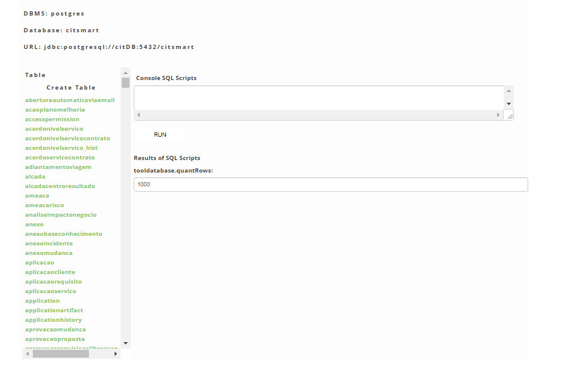
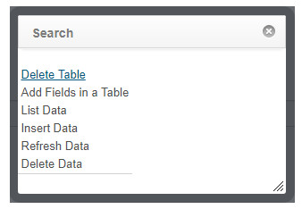

title: Database tool (creation of tables and fields)
Description: The goal is to keep track of scripts for executing them on the system.
# Database tool (creation of tables and fields)

The goal is to keep track of scripts for executing them on the system.

How to access
------------------

1. Access the database tool functionality by navigating in the main menu **System > Data base > Data base Tool**.

Database tool
-----------------------------

1. The Data base Tool will be displayed containing the DBMS, Data base and URL information in which it is being used and a listing 
of the system tables, as shown in the figure below:

    
    
    **Figure 1 - Data base tool**
    
2. With this tool you can create and associate new tables and fields with the system.

Creating table
----------------

1. In the Data Base Tool, click *Create Table*;

2. An SQL command line will be inserted in the SQL Scripts Console area to create the table;

3. Enter the required data and click the *Run* button;

4. The result of the creation of the table in the Results area of SQL scripts is displayed.

Adding fields to the table
------------------------------

1. In the **Data base Tool**, click on the table you want to insert a field;

2. A window will appear showing the actions that can be performed;

    
    
    **Figure 2 - Actions**
    
    - Click *Add Fields to Table*;
    - An SQL command line will be inserted in the **SQL Scripts Console** area to insert the field into the table;
    - Enter the required data and click the *Run* button;
    - You will see the result of executing the addition of the field in the table in the **Results area of SQL scripts**.
    
!!! tip "About"

    <b>Product/Version:</b> CITSmart | 7.00 &nbsp;&nbsp;
    <b>Updated:</b>09/03/2019 – Larissa Lourenço

