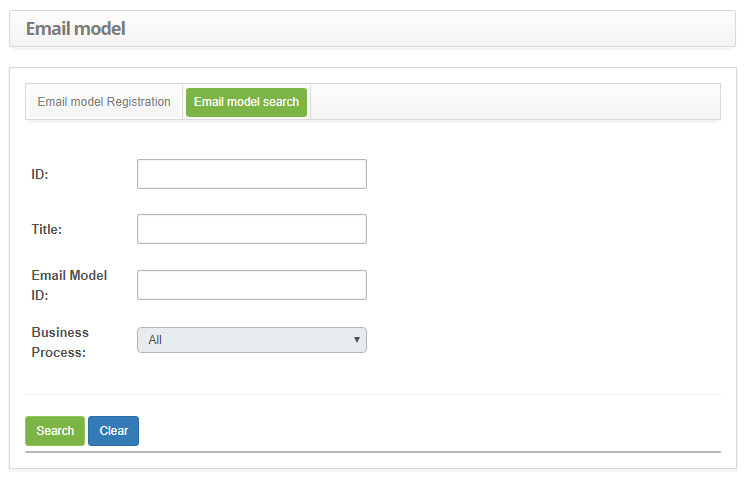

title: E-mail template configuration registration and search
Description: This feature is intended to create e-mail templates for system notifications.
# E-mail template configuration registration and search

This feature is intended to create e-mail templates for system notifications.

How to access
-----------------

1. Access the e-mail template functionality by navigating in the main menu **System > Settings > E-mail Model**.

Preconditions
---------------

1. No applicable.

Filters
---------

1. The following filters enables the user to restrict the participation of items in the standard feature listing, making it easier 
to find the desired items:

    - ID;
    - Title;
    - E-mail Model;
    - Business Process.
    
2. In the **E-mail Template** screen, click the **E-mail Template Search** tab, the search screen will be displayed as shown in the 
figure below:

    
    
    **Figure 1 - E-mail template search screen**
    
3. Perform e-mail template search;

    - Enter the ID, title, identifier and/or business process of the e-mail template and click the *Search* button. After this, the 
    record will be displayed according to the data entered.
    
    - If you want to list all the e-mail template records, simply click the *Search* button directly.
    
Items list
------------------

1. The following cadastral fields are available to the user to facilitate the identification of the desired items in the standard 
feature listing: **ID, Title, E-mail Model ID** and **Business Process**.

    
    
    **Figure 2 - E-mail template listing screen**
    
2. After searching, select the desired record. Once this is done, it will be directed to the registration tab displaying the 
contents of the selected record;

3. To change your e-mail template data, simply change the information you want and click the *Save* button.

Filling in the registration fields
-------------------------------------

1. The **E-mail Template Registration** screen will be displayed, as shown in the figure below:

    
    
    **Figure 3 - E-mail template registration**
    
2. Fill in the fields as directed below:

    - **Title**: enter the title of the e-mail template;
    - **Situation**: enter the status of the e-mail template by checking one of the options: active or inactive;
    - **Text**: describe the e-mail template;
    - **E-mail Template ID**: enter the e-mail template identifier;
    - **Link Process**: enter the process for the e-mail template;
    
3. If you want to add an image to the e-mail template being created, do the following:

    - On the **Image Gallery** screen, select the category in which the image was added. Once this is done, click the Image URL 
    button to display the image address;
    - Copy the image address, close the gallery screen;
    - On the **E-mail Template** screen, in the **Text** field, click the  for image insertion;
    - A screen will appear to enter the URL of the image you want to add in the e-mail template, as shown in the figure below:
    
    
    
    **Figure 4 - Insertion of image in e-mail model**
    
    - In the **URL** field, paste the image address, which was copied from the image in the image gallery. After that, the image 
    will be displayed in the **Preview** field;
    - If necessary, enter alternative text for image;
    - Click *OK* to perform the operation;
    - The image will be inserted in the e-mail template, as shown in the figure below:
    
    
    
    **Figure 5 - Image e-mail template**
    
4. After defining the e-mail template, click the *Save* button to register, where the date, time and user will be saved 
automatically for a future audit.

Creating a new e-mail model from HTML
---------------------------------------------------

If the e-mail template was made in HTML, simply follow the steps below to transcribe it in the **Text** field:

1. Copy (ctrl + C) the HTML content;

2. Click on the button ;

3. Paste (ctrl + V) the content;

4. Click the button  again;

5. Verify if the final result was as expected.

!!! note "NOTE"

    All the other orientations described on the previous sections are equally valid in this scenario.
    
!!! tip "About"

    <b>Product/Version:</b> CITSmart | 7.00 &nbsp;&nbsp;
    <b>Updated:</b>09/03/2019 – Larissa Lourenço
