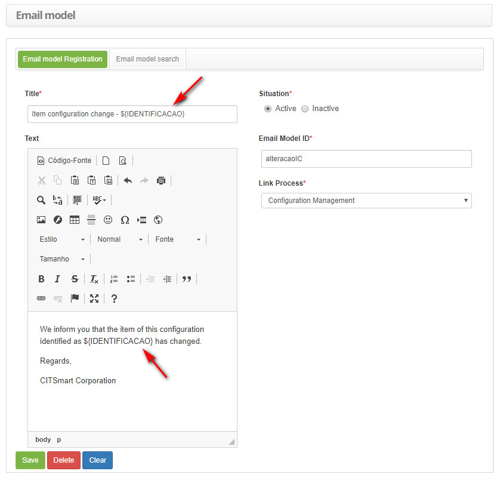
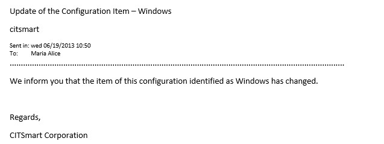
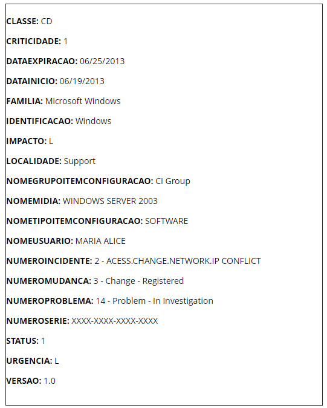

title: Configuration Item e-mail key fields
Description: Provide the list of available key fields for the e-mail template registration related to the configuration item.
# Configuration Item e-mail key fields

Provide the list of available key fields for the e-mail template registration related to the configuration item.

Key fields
-----------------

The key fields available for insertion in the e-mail template file related to the configuration item are listed below:

| Key Field                    | Description                                                                                                              |
|------------------------------|--------------------------------------------------------------------------------------------------------------------------|
| ${CLASSE}                    | Configuration Item Class (IC). 
Reports the class description of the configuration item.                                  |
| ${CRITICIDADE}               | Criticity of Service. 
It informs the identification of the criticality of the service related to the configuration item. |
| ${DATAEXPIRACAO}             | Expiration date. 
Informs the expiration date of the configuration item.                                                  |
| ${DATAINICIO}                | CI Record Initial Date. 
Informs the date when the configuration item registration was performed.                         |
| ${FAMILIA}                   | Configuration Item Family. 
Tells the family description of the configuration item.                                       |
| ${IDENTIFICACAO}             | Identification of the Configuration Item (CI). 
Informs the identification of the configuration item.                     |
| ${IMPACTO}                   | Impact of Configuration Item (CI). 
Informs the identification of the impact of the configuration item.                   |
| ${LOCALIDADE}                | Location of the Configuration Item (CI). 
Informs the description of the location of the configuration item.              |
| ${NOMEGRUPOITEMCONFIGURACAO} | CI Group. 
Informs the description of the configuration item group.                                                       |
| ${NOMEMIDIA}                 | Media. 
Reports the media description related to the setup item.                                                          |
| ${NOMETIPOITEMCONFIGURACAO}  | Configuration Item Type (CI). 
Informs the description of the configuration item type.                                    |
| ${NOMEUSUARIO}               | Contributor (User). 
Informs the name of the employee who registered the configuration item.                              |
| ${NUMEROINCIDENTE}           | Incident / request. 
Informs the incident / request description related to the configuration item.                        |
| ${NUMEROMUDANCA}             | Change. 
Reports the description of the change request related to the configuration item.                                 |
| ${NUMEROPROBLEMA}            | Problem. 
Informs the description of the problem related to the configuration item.                                       |
| ${NUMEROSERIE}               | CI Serial Number. 
Informs the serial number of the configuration item.                                                   |
| ${STATUS}                    | CI Status. 
Informs the status identification of the configuration item.                                                  |
| ${URGENCIA}                  | Urgency. 
Informs the identification of the urgency of the configuration item.                                            |
| ${VERSAO}                    | CI version. 
Informs the version description of the configuration item.                                                   |                                                    |

**Table 1 - Key fields List**

Use of key fields
-----------------------------

The following is an example of using the key fields available for insertion into the e-mail template file related to the 
configuration item.

**Figure 1 - Example of insertion of key fields in the e-mail model**

**Figure 2 - Example of the sending result of the e-mail template**

**Figure 3 - Examples of key fields displayed in e-mail**

!!! tip "About"

    <b>Product/Version:</b> CITSmart | 7.00 &nbsp;&nbsp;
    <b>Updated:</b>09/03/2019 – Larissa Lourenço
