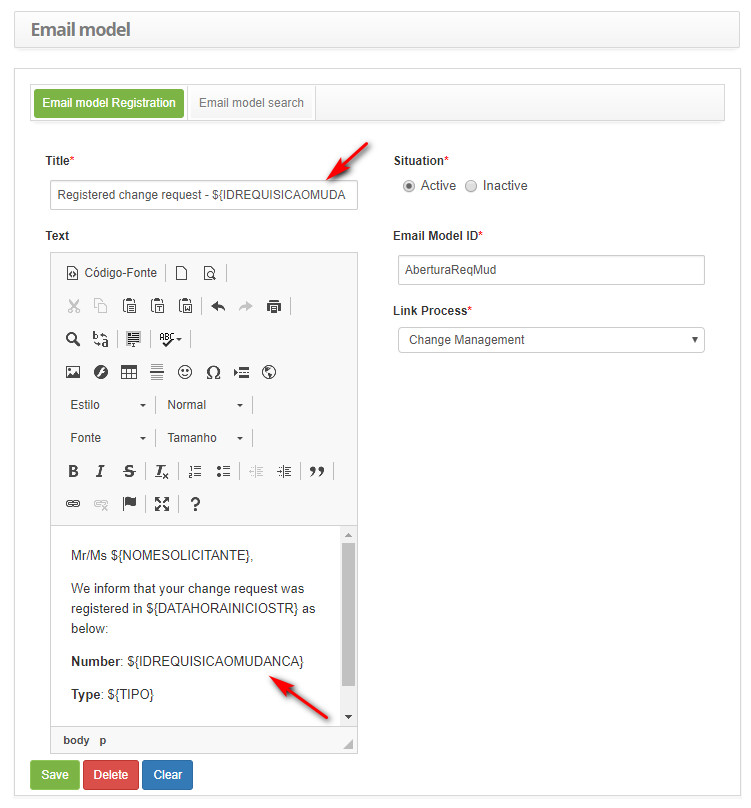
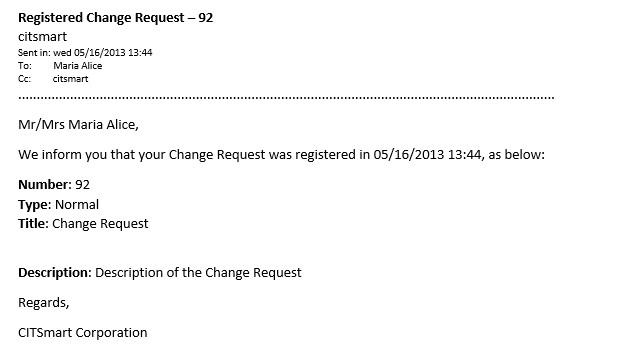
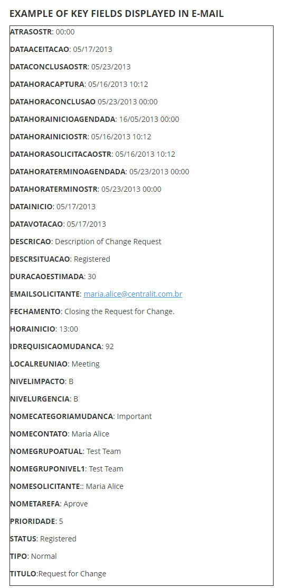

title: Change e-mail key fields
Description: This document is intended to provide the list of key fields available for the change template-related e-mail template.
# Change e-mail key fields

This document is intended to provide the list of key fields available for the change template-related e-mail template.

Key fields list
----------------------------

The following key fields are listed below for insertion into the change template-related e-mail template:

| Key Field                  | Description                                                                                                              |
|----------------------------|--------------------------------------------------------------------------------------------------------------------------|
| ${ATRASOSTR}               | Delay time.Reports the delay time of the request for change request.                                                     |
| ${DATAACEITACAO}           | Date of Acceptance.Informs the date of acceptance of the change request.                                                 |
| ${DATACONCLUSAOSTR}        | Date of the conclusion.Informs the date of completion of the request for change request.                                 |
| ${DATAHORACAPTURA}         | Date and Time of request Capture.Informs the date and time of the capture of the change request.                         |
| ${DATAHORAINICIOSTR}       | Request Record Date and Time.Reports the date and time the change request was recorded.                                  |
| ${DATAHORAINICIOAGENDADA}  | Scheduled Start Date and Time.Informs the start date and time of the attendance of the change request that was scheduled |
| ${DATAHORASOLICITACAOSTR}  | Request Record Date and Time.Reports the date and time the change request was recorded.                                  |
| ${DATAHORATERMINOAGENDADA} | Scheduled End Date and Time.Informs the date and time of the end of the change request that has been scheduled.          |
| ${DATAHORATERMINOSTR}      | Limit date.Informs the deadline to meet the request for change.                                                          |
| ${DATAINICIO}              | Meeting Start Date.Reports the start date of the scheduled meeting.                                                      |
| ${DATAVOTACAO}             | Date of Voting.Informs the date of the vote to approve the change request.                                               |
| ${DESCRICAO}               | Description of Change Request.Reports the description of the change request.                                             |
| ${DESCRSITUACAO}           | Situation.Informs the status of the change request.                                                                      |
| ${DURACAOESTIMADA}         | Estimated duration.Reports the estimated duration of the scheduled meeting.                                              |
| ${EMAILSOLICITANTE}        | Applicant's e-mail address.Inform the requestor's e-mail of the change request.                                          |
| ${FECHAMENTO}              | Closing.Informs the description of the closing of the change request.                                                    |
| ${HORAINICIO}              | Meeting Start Time.Reports the start time of the scheduled meeting.                                                      |
| ${IDREQUISICAOMUDANCA}     | Change Request Number.Informs the identification number of the change request.                                           |
| ${NIVELIMPACTO}            | Impact.Reports the impact of the change request.                                                                         |
| ${LOCALREUNIAO}            | Place of the Meeting.Informs the location of the scheduled meeting.                                                      |
| ${NIVELURGENCIA}           | Urgency.Informs the urgency of the request for change.                                                                   |
| ${NOMECATEGORIAMUDANCA}    | Category of Change.Reports the change request category.                                                                  |
| ${NOMECONTATO}             | Contact name.Enter the name of the requester to contact.                                                                 |
| ${NOMEGRUPOATUAL}          | Current Group.Informs the current group responsible for meeting the request for change.                                  |
| ${NOMEGRUPONIVEL1}         | Level 1 Group.Informs the level 1 group configured to meet the change request.                                           |
| ${NOMESOLICITANTE}         | Name of Applicant.Informs the name of the requestor of the change request.                                               |
| ${NOMETAREFA}              | Assignment.Reports the current job of the change request.                                                                |
| ${PRIORIDADE}              | Priority.Informs the priority of the change request.                                                                     |
| ${STATUS}                  | Status of Change.Reports the status of the change request.                                                               |
| ${TIPO}                    | Type of Request for Change.Informs the type of change request that has been registered.                                  |
| ${TITULO}                  | Title of Change.Informs the title of the change request that has been registered.                                        |

**Table 1 - List of key fields**

Use of key fields
------------------------------

The following is an example of using the key fields available for insertion into the change template-related e-mail template.

**Figure 1 - Example of insertion of key fields in the e-mail model**

**Figure 2 - Example of the e-mail template send result**

**Figure 3 - Example**

!!! tip "About"

    <b>Product/Version:</b> CITSmart | 7.00 &nbsp;&nbsp;
    <b>Updated:</b>09/03/2019 – Larissa Lourenço
