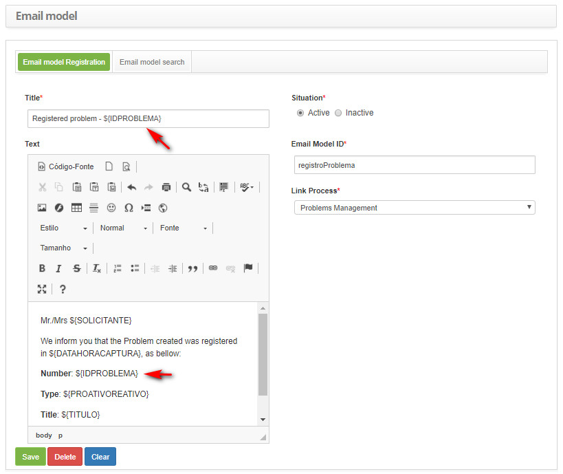
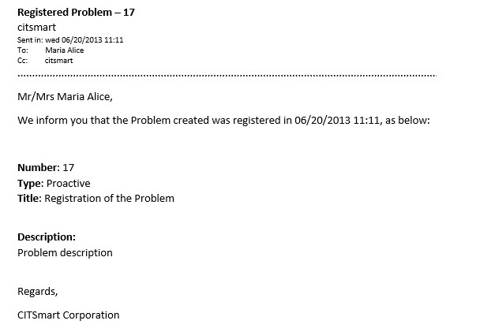
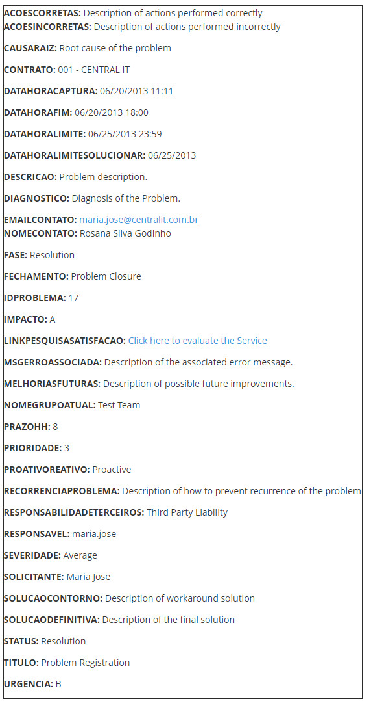

title: Problem e-mail key fields
Description: This document is intended to provide a list of the key fields available for the problem-related e-mail template.
# Problem e-mail key fields

This document is intended to provide a list of the key fields available for the problem-related e-mail template registration.

Key fields list
----------------------------

The following key fields are listed below for insertion into the problem-related e-mail template record:

| Key field                    | Description                                                                                                                        |
|------------------------------|------------------------------------------------------------------------------------------------------------------------------------|
| ${ACOESCORRETAS}             | Actions Taken Correctly.Informs the description of the actions performed correctly regarding the review of serious problem.        |
| ${ACOESINCORRETAS}           | Actions Taken Incorrectly.Informs the description of actions performed incorrectly regarding serious problem review.               |
| ${CAUSARAIZ}                 | Root cause of the problem.Tells you the root cause of the problem.                                                                 |
| ${CONTRATO}                  | Contract agreement.Informs the name of the contract regarding the problem record.                                                  |
| ${DATAHORACAPTURA}           | Date and Time of Starting the Problem Log.Informs the date and time the problem was logged.                                        |
| ${DATAHORAFIM}               | Date and Time of Problem Completion.Informs the date and time when the problem was terminated.                                     |
| ${DATAHORALIMITE}            | Limit Time to Answer the Problem.Informs the deadline (date and time) to attend to the problem.                                    |
| ${DATAHORALIMITESOLUCIONAR}  | Deadline to Solve / Work around the problem.Report the deadline to solve / work around the problem.                                |
| ${DESCRICAO}                 | Problem description.Informs the description of the problem.                                                                        |
| ${DIAGNOSTICO}               | Diagnosis of the Problem.Reports the description of the problem diagnosis.                                                         |
| ${EMAILCONTATO}              | Contact E-mail.Inform the contact's e-mail address.                                                                                |
| ${FASE}                      | Situation of the Problem.It informs the situation (phase) in which problem is.                                                     |
| ${FECHAMENTO}                | Closing the Problem.Reports the description of the problem closure.                                                                |
| ${IDPROBLEMA}                | Issue Identification Number.Informs the identification number of the problem record.                                               |
| ${IMPACTO}                   | Impact of the Problem.Informs the identification of the impact of the problem.                                                     |
| ${LINKPESQUISASATISFACAO}    | Link to satisfaction survey.Inform the link to evaluate the problem.                                                               |
| ${MELHORIASFUTURAS}          | Possible Future Improvements.Informs the description of possible future improvements regarding serious problem review.             |
| ${MSGERROASSOCIADA}          | Associated Error Message.Reports the associated error message that was described in the evaluation and diagnosis of the problem.   |
| ${NOMECONTATO}               | Contact name.Please provide the name of the requestor for contact.                                                                 |
| ${NOMEGRUPOATUAL}            | Executor Group.Informs the name of the executing group of the problem.                                                             |
| ${PRAZOHH}                   | Deadline (hours) for Answering the Problem.Informs the deadline for attending to the problem.                                      |
| ${PRIORIDADE}                | Priority.Informs the priority of the problem.                                                                                      |
| ${PROATIVOREATIVO}           | Problem Management.Informs problem management (proactive or reactive).                                                             |
| ${RECORRENCIAPROBLEMA}       | Recurrence of the Problem.Informs the description of how to prevent recurrence of the problem concerning the major problem review. |
| ${RESPONSABILIDADETERCEIROS} | Liability of Third Parties.Informs the description of third party liability regarding serious problem review.                      |
| ${RESPONSAVEL}               | Responsible for the Problem Answer.Informs the person in charge of the problem.                                                    |
| ${SEVERIDADE}                | Severity of the problem.Informs the description of the severity of the problem.                                                    |
| ${SOLICITANTE}               | Name of Applicant.Informs the name of the requestor of the problem record.                                                         |
| ${SOLUCAOCONTORNO}           | Description of the workaround solution.Informs the description of the workaround solution of the problem.                          |
| ${SOLUCAODEFINITIVA}         | Description of the Definitive Solution.Tells the description of the definitive solution of the problem.                            |
| ${STATUS}                    | Status of the Problem.Tells you the status of the problem.                                                                         |
| ${TITULO}                    | Problem Title.Informs the title of the problem that was registered.                                                                |
| ${URGENCIA}                  | Urgency of the Problem.Informs the identification of the Problem Urgency.                                                          |

**Table 1 - Meaning of key fields**

Use of key fields
----------------------------

Below are examples of using the key fields available for insertion into the problem-related e-mail template record.

**Figure 1 - Example of insertion**

**Figure 2 - Example of shipping result**

Example of key fields displayed in e-mail
---------------------------------------------

**Figure 3 - Examples of key fields**

!!! tip "About"

    <b>Product/Version:</b> CITSmart | 7.00 &nbsp;&nbsp;
    <b>Updated:</b>09/03/2019 – Larissa Lourenço
