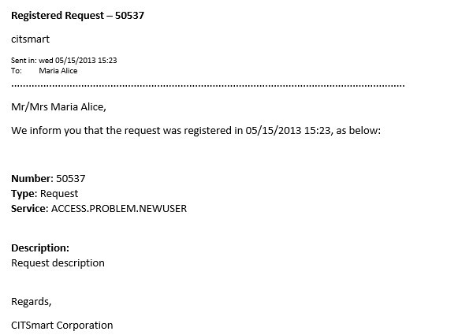

title: Request e-mail key fields
Description: This document is intended to provide the list of key fields available for the Service Request e-mail.
# Request e-mail key fields

This document is intended to provide the list of key fields available for the Service Request e-mail template registration.

List of key fields
----------------------------

The key fields available for insertion in the e-mail template file related to the Service Request are listed below:

| Key Field                 | Description                                                                                                         |
|---------------------------|---------------------------------------------------------------------------------------------------------------------|
| ${ATRASOSLASTR}           | SLA Delay Time.Reports the SLA (Service Level Agreement) delay time.                                                |
| ${CONTRATO}               | Contract of the Request.Informs the name of the contract regarding the service/incident request.                    |
| ${DATAHORAINICIO}         | Start date and time of request record.Informs the date and time the service/incident request was recorded.          |
| ${DATAHORAFIM}            | End date of the Request.Informs the date the service/incident request was completed.                                |
| ${DATAHORAINICIOSLASTR}   | SLA start date and time.Informs the start date and time of SLA (Service Level Agreement).                           |
| ${DATAHORALIMITESTR}      | Deadline for request.Informs the deadline (date and time) to attend the request.                                    |
| ${DATAHORASOLICITACAOSTR} | Date and time of request.Informs the date and time of service of the service/incident request.                      |
| ${DEMANDA}                | Type of Request.Informs the type of request (Incident or Request).                                                  |
| ${DESCRICAO}              | Description of the Request.Informs the description of the service request.                                          |
| ${DESCRSITUACAO}          | Description of the Request Status.It informs the description of the Situation in which the Request is.              |
| ${DETALHAMENTOCAUSA}      | Detail of the Cause of the Incident.Informs the details of the cause of the incident.                               |
| ${EMAILCONTATO}           | Applicant's E-mail for Contact.Inform the e-mail of the applicant.                                                  |
| ${FASEATUAL}              | Current Phase of the Request.Reports the current phase of the service request.                                      |
| ${GRUPOATUAL}             | Current Attendance Group.Informs the current group, responsible for the service request.                            |
| ${GRUPONIVEL1}            | Level 1 Group.Informs the Level 1 group configured to fulfill the request.                                          |
| ${IDSOLICITACAOSERVICO}   | Request Number.Informs the service request number.                                                                  |
| ${IMPACTO}                | Impact of Service Request/Incident.Informs the identification of the impact of the service request.                 |
| ${LINKPESQUISASATISFACAO} | Link to satisfaction survey.Informs the link to evaluate the service request.                                       |
| ${LINKSOLICITACAOSERVICO} | Link to the service request.Reports the link to view the service request record.                                    |
| ${NOMECONTATO}            | Name of Applicant for Contact.Please provide the name of the requestor for contact.                                 |
| ${NOMEGRUPOATUAL}         | Returns the description of the Group Name in whichthe service request is currently located.                         |
| ${NOMESERVICO}            | Service Name.Informs the name of the requested service.                                                             |
| ${NOMEUNIDADERESPONSAVEL} | Responsible Unit.Informs the unit of the person responsible for registering the service request.                    |
| ${NOMEUNIDADESOLICITANTE} | Applicant's Unit.Informs the applicant's unit.                                                                      |
| ${OBSERVACAO}             | Applicant Contact Notice.Informs the notice described in the service request.                                       |
| ${ORIGEM}                 | Origin of the Request.Informs the source of the service request.                                                    |
| ${PRIORIDADE}             | Priority of the Request of the Request.Informs the priority of service request fulfillment.                         |
| ${RESPONSAVEL}            | Responsible for the Registration of the Request.Informs the person responsible for registering the service request. |
| ${RESPOSTA}               | Description of the Closing of the Request.Informs the description of the closing of the service request.            |
| ${SERVICO}                | Service Requested.Enter the name of the service you requested.                                                      |
| ${SITUACAO}               | Status of the Request;Informs the situation where the service request is.                                           |
| ${SLAACOMBINAR}           | SLA "To Combine".Informs if the SLA is to match.                                                                    |
| ${SOLICITANTE}            | Name of Applicant.Please state the name of the applicant.                                                           |
| ${SOLICITANTEUNIDADE}     | Name of Applicant and Unit.It informs the name of the applicant and the unit in which it is allocated.              |
| ${TELEFONECONTATO}        | Applicant's Telephone for Contact.Please provide the contact's telephone number for contact.                        |
| ${URGENCIA}               | Urgency of the Request.Informs the identification of the urgency of the service request.                            |

**Table 1 - List of Key Fields**

Use of key fields
------------------------------

The following is an example of using the key fields available for insertion into the e-mail template associated with the Service 
Request.

**Figure 1 - Example of insertion of key fields in the e-mail model**

**Figure 2 - Example of the sending result of the e-mail template**

**Figure 3 - Example of key fields filled in**

!!! tip "About"

    <b>Product/Version:</b> CITSmart | 7.00 &nbsp;&nbsp;
    <b>Updated:</b>09/03/2019 – Larissa Lourenço
