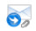

title: E-mail box registration and search
Description: This feature is designed to configure the sending and receiving of e-mail from different servers for each contract
# E-mail box registration and search

This feature is designed to configure the sending and receiving of e-mail from different servers for each contract, so a same 
CITSmart can serve several different clients and each with its own e-mail box.

How to access
-----------------

1. Access the feature by navigating the main menu **Parameterization > E-mail box**.

Preconditions
---------------

1. No applicable.

Filters
---------

1. The following filter enables the user to restrict the participation of items in the standard feature listing, making it easier 
to find the desired items:

    - Server.
    
    
    
    **Figure 1 - E-mail box search screen**
    
Items list
------------------

1. The following cadastral fields are available to the user to make it easier to identify the desired items in the default listing 
of the functionality: **ID** and **Server**.

    
    
    **Figure 2 - E-mail box listing screen**
    
2. There are action buttons available to the user for each item in the listing, they are: *Edit* and *Delete*.

Filling in the ragistration fields
-------------------------------------

1. Click the *New* button. An e-mail box registration screen will be displayed, as shown below:

    
    
    **Figure 3 - E-mail box registration screen**
    
2. Fill in the fields, as indicated below:

    - **Description**: e-mail box Description - the e-mail box can be either Inbox or Outbox, so the description is required on 
    both types;
    - **Type**:
        - **Inbox**: choosing this option means that the user will parameterize a route where the e-mails that need to be read by 
        the system will arrive (hence called inbox). New registration fields will be opened when choosing this option, they are:
        
    
    
    **Figure 4 - Input type e-mail box register screen**
    
    - **Server**: name of the mail server;
    - **Server port**: is the channel where the server will send the information (e.g.: 25);
    - **User**: name or user login for authentication on the mail server;
    - **Password**: unique identification for incoming mail server;
    - **Provider**: type of e-mail provider;
    - **Inbox folder**: describe the name of the inbox. Exemplified in the figure below:
    
    
    
    **Figure 5 - Example of an e-mail box**
    
    - **Outbox**: by choosing this option, it means that the user will parameterize a route where the e-mails that need to be sent 
    from the system will exit (hence called the outbox). New registration fields will be opened when choosing this option, they 
    are:
        
    
    
    **Figure 6 - Outgoing e-mail box register screen**
    
    - **Requires TLS/SSL authentication?**
        - Secure Sockets Layer (SSL) certificates are part of site security. When you access a site with SSL, the site's SSL 
        certificate allows you to encrypt the data you send.
        - Transport Layer Security (TLS), as well as its predecessor Secure Sockets Layer (SSL), is a security protocol that 
        protects telecommunications over the Internet for services such as e-mail (SMTP), page navigation (HTTPS), and other types 
        of data transfer.
    - **Requires user authentication?**
        - Yes - Checking Yes means that the ISP will identify the sender of the e-mail. In this case you will need to enter the 
        user and password fields;
        - No - Checking No means that your ISP may not identify the sender of the e-mail. In this case it will not be necessary to 
        enter the user and password fields;
    - **Server**: server address (e.g 127.0.0.1);
    - **Server port**: is the channel where the server will send the information (e.g: 25);
    - **User**: name or user login for authentication on the mail server;
    - **Password**: unique identification for incoming mail server;
    - **Sender**: e-mail address that will be used as sender, more than one e-mail can be registered.
    
3. Once this is done, the next step will be to identify in which contracts will be used the e-mail box information, for this the 
user must access the Contract Register screen.

Linking e-mail box to contract
-----------------------------------------

1. Access the functionality through navigation in the main menu 
**ITIL Processes > Portfolio and Catalog Management > Contract Registration**. (see knowledge [Contract registration and search][1]);

2. Locate the contract (new or preexisting) that you want to link to the registered e-mail box and select it;

3. In the E-mail Outbox field, the user can select the following options:

    - **Standard** (already parameterized) - (see knowledge [Parameterization rules - E-mail][2]);
    - **Other e-mail boxes parameterized as outbox** (see previous section) - Used in cases where the user has more than one outbox 
    per contract, the system will use the server and registered information in the screen **Parameterization > E-mail box**;
    
    
    
    **Figure 7 - E-mail box link to the contract screen**
    
4. Once this is done, the user can identify different outgoing e-mail boxes that will be used in the workflow that are loaded 
during service requests.

Linking e-mail box to a flow
----------------------------------------

!!! note "NOTE"

    This step is not required. This functionality is only necessary if during the flow register the user feels the need to direct 
    the e-mail to an output box other than the default one. The system's default outgoing e-mail will continue to work, even if you 
    do not configure this setting.
    
1. Access the functionality through navigation in the main menu **System > Flow maintenance** (see knowledge [Request approval via e-mail][3]);

2. When registering a *New* flow:

    
    
    **Figure 8 - New flow screen**
    
3. When editing an existing flow, locate the  on the flow, click to edit and the following screens 
will be displayed:

    
    
    **Figure 9 - E-mail outbox configuration screen**
    
    - In the E-mail Outbox Setup option, select the *Contract* option to use the e-mail box configured in the contract;
    
    
    
    **Figure 10 - E-mail outbox setup screen**
    
    - In the E-mail Outbox Setup option, select the *Specific* option, this way the system opens the 'E-mail Outbox' field with the 
    registered outboxes;
    
4. Complete the flow parameterization, including the selected *Recipients*;

5. The use of different outgoing e-mail boxes can be noticed after a service request is opened, which has parameterized the flow 
that has the selected e-mail box.

!!! tip "About"

    <b>Product/Version:</b> CITSmart | 7.00 &nbsp;&nbsp;
    <b>Updated:</b>09/03/2019 – Larissa Lourenço

[1]:/en-us/citsmart-platform-7/additional-features/contract-management/use/register-contract.html

[2]:/en-us/citsmart-platform-7/plataform-administration/parameters-list/parametrization-email.html

[3]:/en-us/citsmart-platform-7/processes/tickets/approve-request.html
